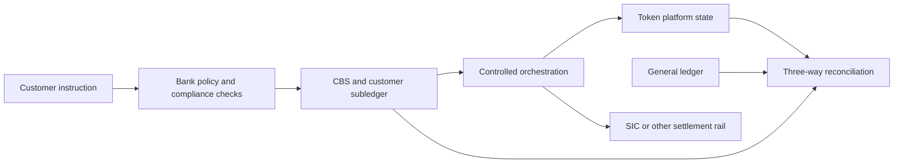

# Executive Summary: Swiss Tokenized Deposits

**Research cut-off:** 24 August 2026 
**Audience:** banking, product, legal, risk, operations, and technology readers 
**Status:** research summary; not legal, accounting, audit, or tax advice

## The short version

A tokenized deposit is still a claim on a commercial bank. Token technology can change how that claim is represented, transferred, and connected to programmable workflows, but it does not by itself change the debtor, the economics of the deposit, or the need for the bank's books to be correct.

For a first Swiss implementation, this research recommends a **CBS-authoritative mirrored deposit**:

- the core banking system (CBS) and general ledger remain the bank's authoritative books;
- a controlled token platform represents an eligible portion of a customer's deposit;
- every token event is authorized through bank controls and reconciled with the customer subledger and general ledger;
- cross-bank transfers settle through an agreed interbank mechanism, normally involving central-bank money in SIC;
- legal, accounting, prudential, depositor-protection, and settlement conclusions are approved before production.

This is a design recommendation, not a statement that Swiss law requires one particular ledger architecture.

### Proposed first-pilot decision record

The recommendation is deliberately narrow. It is a **bank-issued CHF deposit**, owed by the issuing bank to an identified customer, with the CBS/customer subledger and GL remaining authoritative. The token is a controlled representation of the selected balance, not an additional asset and not a public stablecoin reserve claim. The first stage is limited to verified customers, bank-managed recoverable wallets, low limits, same-bank transfer, and one objective conditional-payment workflow.

| Decision | First-pilot position | What would reopen it |
|---|---|---|
| Debtor and issuer | The issuing Swiss bank | Shared issuer, foreign branch/subsidiary, or non-bank issuer |
| Authoritative record | CBS/customer subledger and GL | Proposal to make a DLT or platform the legally constitutive record |
| Token role | Controlled mirror of an eligible deposit balance | Payment-instruction-only, bearer-like, or native-liability model |
| Holder and access | Identified customer using a bank-managed recoverable wallet | External/self-custody wallet or unrestricted secondary transfer |
| First settlement scope | Same-bank; interbank only after a documented SIC and liability model | Second bank, new settlement asset, or cross-border corridor |
| Out of scope | Retail CBDC, public stablecoin issuance, anonymous use, native platform authority, cross-border production | A separate product, legal, accounting, and governance decision |

The bank should approve or reject this decision record before technical procurement. A later shared-ledger or platform-authoritative model remains possible, but it is a new product decision rather than a technology upgrade.

The central idea is that one economic claim may appear in several technical records without becoming several liabilities. A customer's balance may be displayed in an app, represented on a token ledger, recorded in a CBS subaccount, and controlled through the general ledger. These records must agree, but they do not all have the same legal or accounting function. The design must name which record controls each fact and how discrepancies are corrected.

## The forms of money are different

The issuer matters because it identifies the debtor and the balance sheet on which the money sits. It also affects the applicable insolvency regime, the method of settlement, and the protection available to the holder. Denomination alone is insufficient: two instruments labelled “CHF” can expose their holders to different institutions and different legal arrangements.

| Form | Issuer or debtor | What the holder has | Typical settlement role |
|---|---|---|---|
| Banknotes | Swiss National Bank | Central-bank money | Cash payment |
| Coins | Swiss Confederation; distributed through the SNB | Statutory coin | Cash payment |
| Sight deposits at the SNB | Swiss National Bank | Central-bank account balance | Interbank settlement |
| Ordinary bank deposit | Commercial bank | Contractual claim on that bank | Retail and wholesale payment |
| Tokenized bank deposit | Commercial bank | Bank deposit claim represented or operated using token technology | Programmable retail or wholesale payment |
| Stablecoin | Depends on the structure | Claim, redemption right, property interest, or other arrangement | Crypto-market payment or settlement |
| Wholesale CBDC | Central bank | Tokenized central-bank liability | Wholesale settlement on DLT platforms |

The SNB describes banknotes as its responsibility and explains separately that coins are issued by the Confederation and put into circulation through the SNB ([SNB banknotes](https://www.snb.ch/en/services-events/digital-services/faq-overview/qas_noten), [SNB coins](https://www.snb.ch/en/the-snb/mandates-goals/cash/coins)).

In an ordinary transfer from a Bank A customer to a Bank B customer, the payer uses a commercial-bank deposit, the two banks may settle between themselves in central-bank money, and the recipient normally receives a new claim against Bank B. Tokenization can coordinate these steps, but it does not make the two commercial-bank liabilities or the central-bank settlement asset interchangeable.

## The Swiss payment baseline and current landscape

Tokenized deposits must prove a benefit beyond an already capable Swiss payments system. SIC5 supports instant account-to-account payments in less than ten seconds, 24/7. Since August 2024, more than 100 institutions representing more than 95% of Swiss customer-payment volume have been able to receive them; the remaining relevant institutions are due to follow by the end of 2026 ([SIX Instant Payments](https://www.six-group.com/en/products-services/banking-services/billing-and-payments/instant-payments.html)). A tokenized-deposit use case is therefore not justified merely by speed or continuous availability.

It must instead demonstrate a measurable advantage in programmable shared state, conditional reservation/release, synchronized cash-and-asset or FX exchange, cross-border path coordination, or reduction of a specific reconciliation problem that SIC, an account API, card authorization, or ordinary escrow cannot address as well.

| Initiative | What it is testing or operating | What it does **not** prove for this project |
|---|---|---|
| SIC / SIC Instant Payments | Existing Swiss central-bank-money settlement and 24/7 customer instant-payment baseline | A customer's tokenized deposit or a DLT cash leg |
| SBA Deposit Token work | Industry models; 2025 PoC of on-chain payment instructions triggering off-chain bank-account payments | A native on-chain deposit liability or production multi-bank scheme |
| UBS Digital Cash / UBS–Ant | Multi-currency corporate payment, treasury, and tokenized-deposit exploration | A public Swiss multi-bank deposit-token service |
| Project Helvetia / BX Digital | wCBDC and synchronized SIC settlement for tokenized securities; BX Digital's RTGS link in production infrastructure | A retail CBDC or approval of a commercial-bank tokenized deposit |
| SNB digital repos | Feasibility of DLT repo settlement with wCBDC and the resulting fragmentation/collateral challenges | A general production readiness conclusion |
| Project Agorá | Controlled, multi-currency wholesale cross-border workflows with tokenized deposits and reserves | Swiss production rulebook, resilience, or bank-specific legal approval |
| CHF stablecoin sandbox | An adjacent issuer/reserve model being tested by Swiss banks and Swiss Stablecoin AG | A deposit-token model; holders may face a different debtor and protection structure |

The SBA's 2025 PoC, UBS Digital Cash, the CHF stablecoin sandbox, Helvetia, BX Digital, and Agorá should be compared as distinct initiatives, not treated as one Swiss tokenized-money product. The dedicated [Agorá chapter](08-project-agora-and-cross-border-tokenized-deposits.md) contains the current cross-border analysis.

## What is actually tokenized?

The word “token” can refer to several different designs:

- **A controlled representation of an existing deposit:** the CBS remains authoritative and the token mirrors an earmarked or recorded balance.
- **A platform-authoritative deposit:** the platform is the authoritative record for the tokenized portion, while the bank reconciles its internal books to it.
- **A bearer-like or freely circulating instrument:** the holder controls value through possession of a key or token, potentially changing legal, custody, AML, and insolvency questions.

These designs must not be treated as interchangeable. The first one is the recommended starting point because it preserves familiar bank-book controls while allowing programmable transfer experiments.

### A simple example

Alice has CHF 1,000 in an ordinary account at Bank A and converts it into tokenized form.

1. Bank A moves or earmarks CHF 1,000 in Alice's CBS account as a token-enabled deposit balance.
2. After the bank's controls succeed, its authorized service creates 1,000 Bank A CHF units in Alice's verified wallet.
3. The units and the CBS token-enabled balance represent the same bank liability. Alice does not now own CHF 2,000.
4. If Alice pays Bob at Bank A, the bank reallocates its liability from Alice to Bob; its total liabilities remain unchanged.
5. If Bob banks at Bank B, the banks need an agreed interbank model. Bank A's claim cannot silently become Bank B's claim merely because an address received a token.

This example is why the phrase “backed one-for-one” is not precise enough on its own. The design must say whether the token mirrors an existing liability, is itself the authoritative liability record, or is backed by a separate reserve pool.

The diagram follows the same claim through authorization, bank booking, token execution, and reconciliation. The arrows do not mean that every system becomes authoritative at the same moment. They show the controlled dependencies that must be completed and evidenced before the bank tells the customer that the transaction has reached its defined final state.

In this recommended model, tokenization changes how the customer can use the deposit and how several systems coordinate its movement. It does not create a second CHF 1,000 asset for Alice, remove Bank A as debtor, or prove that an interbank obligation has legally settled. Those conclusions come from the account terms, approved books, settlement-system rules, and applicable law.

### What tokenization changes - and what it does not

Tokenization can add:

- shared, machine-readable workflow state across several parties;
- conditional locking and release;
- programmable delivery-versus-payment or payment-versus-payment;
- a common audit trail and fewer reconciliation hand-offs.

It does not automatically:

- turn commercial-bank money into central-bank money;
- make different banks' CHF liabilities identical;
- provide depositor protection;
- complete AML and sanctions checks;
- create legal finality;
- make a system resilient or production-ready.

## Retail and wholesale uses

Retail and wholesale products share the same need for a clear bank liability and reliable records, but their product requirements differ.

| Dimension | Retail deposits | Wholesale and corporate deposits |
|---|---|---|
| Primary value | Always-available programmable payments, merchant settlement, escrow, embedded finance | Treasury automation, conditional payments, securities settlement, cross-border liquidity |
| User protection | Plain terms, recoverable access, fraud handling, privacy, complaints, depositor-protection clarity | Participant rules, credit limits, settlement finality, liquidity, bilateral and network governance |
| Identity | Natural-person onboarding and device/wallet recovery | Legal-entity ownership, signatory powers, role-based entitlements |
| Likely pilot | Closed group with low limits and recoverable wallets | Named institutions or corporates with controlled nodes and transaction limits |
| Main danger | Turning a deposit into a confusing or less recoverable customer product | Assuming technical atomicity resolves credit, liquidity, or legal-finality questions |

The strongest early use cases are those where programmability or shared workflow removes real reconciliation and coordination costs. A token is a poor solution when an ordinary account API or instant-payment instruction produces the same result more simply.

## Regulation: the main questions

There is no single “tokenized deposit regulation.” The bank must map the exact product and operating model across existing regimes:

- banking and deposit-taking law;
- contract terms and the identity of the debtor and creditor;
- AML, sanctions, payment transparency, and onboarding;
- financial-market-infrastructure rules where a system performs multilateral clearing, settlement, or DLT trading;
- accounting, disclosure, capital, leverage, liquidity, and large exposures;
- depositor protection, insolvency, recovery, and resolution;
- operational resilience, outsourcing, cyber risk, data protection, and bank secrecy;
- custody rules if the bank or a third party controls customer keys or third-party cryptoassets.

FINMA's current crypto-services index still lists Guidance 02/2019 for blockchain payments and adds newer guidance on stablecoins, annual-report disclosure, and custody ([FINMA crypto-services index](https://www.finma.ch/en/documentation/dossier/dossier-fintech/auf-einen-blick-aufstellung-der-krypto-dienstleistungen/)). Their relevance depends on the product: guidance about custody assets or guaranteed stablecoins cannot automatically determine the treatment of a bank's own deposit liability.

Several recent changes matter to the implementation horizon:

- revised AML legislation and the new beneficial-owner transparency regime enter into force on **1 October 2026** ([Federal Council, 12 June 2026](https://www.efd.admin.ch/en/newnsb/x3sKLxCJ6S3dQJtfvy0Tb));
- FINMA's new risk-diversification and liquidity ordinances enter into force on **1 January 2027**, replacing specified circulars ([RDO-FINMA](https://www.finma.ch/en/news/2026/05/20260520-mm-rvv-finma/), [LiqO-FINMA](https://www.finma.ch/en/news/2026/07/20260707-mm-liqv-finma/));
- proposed Swiss licences for payment-instrument and crypto institutions remained consultation proposals at the research cut-off and are not current law ([SIF consultation](https://www.sif.admin.ch/en/newnsb/x4TMWQ1SWofNoFx7XyHhY)).

## Settlement and “atomicity”

Three different concepts must stay separate:

- **Workflow atomicity:** all required steps commit, or the workflow cancels and releases reservations.
- **Technical finality:** a ledger considers its state irreversible under its protocol and governance.
- **Legal settlement finality:** applicable law and binding rules determine when obligations are discharged and what survives insolvency.

An interbank token transfer could use burn-settle-issue, a coordinated pending instruction, or continued circulation of the original issuing bank's claim. The correct model depends on customer terms, network rules, liquidity, insolvency treatment, and the legal meaning of each ledger event.

## Project Agorá: useful evidence, not a production template

The BIS Project Agorá prototype connects tokenized commercial-bank deposits on a unifying ledger with tokenized central-bank reserves on jurisdictional ledgers. It demonstrates coordinated validation, locking, and settlement workflows, privacy techniques, and cross-border path discovery.

It also differs from this research's starting architecture: Agorá treats platform balances and transactions as the authoritative “golden source” for tokenized deposits. The report explicitly does not validate production cybersecurity, resilience, throughput, latency, failover, live CBS/RTGS integration, or a complete legal rulebook. See [the dedicated Agorá chapter](08-project-agora-and-cross-border-tokenized-deposits.md).

## Practical conclusion

A credible pilot should begin with a narrow product, named customers, low limits, a documented legal claim, CBS-authoritative records, deterministic recovery, and continuous reconciliation. It should not begin by choosing a blockchain vendor.

This deliberately conservative starting point isolates the value of shared state and programmability without simultaneously replacing the bank's customer ledger, reporting model, recovery procedures, and resolution data. A later platform-authoritative model remains possible, but it would require a fresh legal, accounting, operational, and governance decision.

The next decisions are:

1. define the legal and accounting model;
2. select one retail and one wholesale use case;
3. agree the record of authority and settlement point;
4. design controls and failure recovery;
5. obtain counsel, auditor, and regulatory feedback;
6. only then build a bounded pilot.

Continue with [01 - Tokenized bank deposits: foundations and product types](01-tokenized-bank-deposits-foundations-and-product-types.md).
