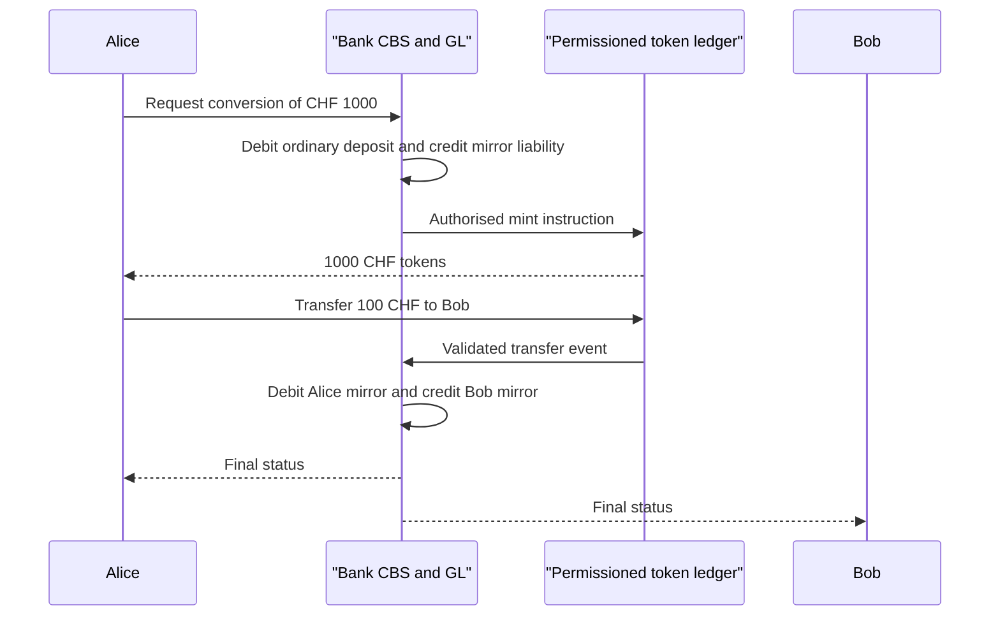
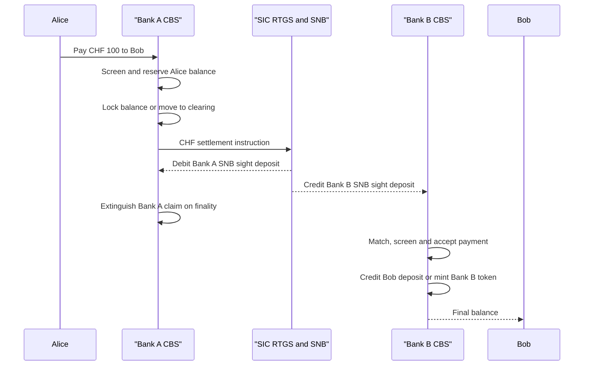

# 01 — Swiss tokenized deposits: legal, booking, prudential and CBS deep dive

**Research date:** 13 August 2026  
**Scope:** a FINMA-authorised Swiss bank considering CHF-denominated tokenized deposits for identified customers and participating banks.  
**Status:** research and design basis; not a legal opinion, accounting opinion, FINMA approval or production runbook.

## Executive design position

The lowest-risk first production model is a **CBS-authoritative mirrored tokenized deposit**. The bank's contractual customer account and general ledger remain the legal, regulatory and operational source of truth. A permissioned token network records a tightly controlled representation and supplies programmability. Minting is possible only after a CBS reservation and accounting posting; burning is required before a conventional balance is released. Every token event carries a bank, customer, wallet, contract-version and correlation identifier.

This is distinct from the Swiss Bankers Association (SBA) 2025 proof of concept. The PoC used a token as a reusable payment instruction and kept the underlying deposit and mirror-account movements off-chain. It is an excellent reference for flows and controls, but it does not settle the legal or accounting treatment of a native token that itself is the bank liability.

## Foundations: what is being tokenized?

### Three kinds of money that must not be confused

The word “money” hides three different legal and economic things:

1. **Central-bank money.** A Swiss bank's sight-deposit balance at the Swiss National Bank (SNB) is a claim on the SNB. It is the settlement asset used by banks in SIC. It is not a retail customer deposit and it is not created by a commercial bank's smart contract.
2. **Commercial-bank money.** A customer's CHF account balance is the customer's contractual claim against the commercial bank. The bank records a liability and normally uses the funds in its banking business. Most money used by households and companies is this kind of bank money.
3. **Private payment instruments and stablecoins.** A token issued by a bank, fintech or other entity may be a deposit, a payment instruction, a security, a claim backed by segregated assets or a different contractual instrument. Its label does not determine its legal classification.

Tokenization is a way of recording one of these claims or instructions in a machine-readable ledger. It does not, by itself, move money to the SNB, create a new deposit, transfer legal title or make a transaction irreversible. The contract, accounting entries, operating rules and the applicable law still determine what the holder owns and who owes it.

### Ledger, token, wallet and core-banking system

- A **ledger** is a record of balances and transactions. A DLT is a ledger replicated across several authorised or unauthorised nodes; a conventional bank ledger is normally controlled by one bank.
- A **token** is a ledger entry that can be transferred according to the token contract. The token can represent value, a claim, a right to request payment or a security.
- A **wallet** is a signing and address-control mechanism. In a permissioned bank network, a wallet is normally an allow-listed customer account controlled by a bank-managed key, a customer key or a regulated custodian. Possession of a private key is not automatically the same thing as legal ownership of a deposit.
- The **core-banking system (CBS)** maintains customer identity, account status, available and booked balances, holds, interest, fees, statements, regulatory attributes and the general-ledger (GL) entries. A “subledger” is a more detailed transaction record that rolls up to the GL. A “mirror account” is a CBS subledger account that reflects token holdings but is not normally accessible as an ordinary current account.

The central design question is therefore: **which ledger is authoritative for the legal balance?** The recommended first model keeps the CBS/GL authoritative and uses DLT as a controlled representation. Moving authority to DLT is a separate product, legal and resolution decision, not a technical upgrade.

### What “mirrored deposit” means in plain language

Suppose Alice has CHF 1,000 in an ordinary account. The bank creates a tokenized version as follows:

1. The CBS decreases Alice's ordinary available deposit by CHF 1,000 and credits a tokenized-deposit or mirror liability for CHF 1,000.
2. After the posting and AML/limits checks succeed, the bank's authorised minting service creates 1,000 CHF tokens in Alice's allow-listed wallet.
3. The CBS remains the legal record of Alice's claim. The token balance is a representation that must reconcile one-for-one with the mirror liability.
4. To go back to ordinary money, the bank disables or burns 1,000 tokens and posts the reverse CBS entry. Alice receives CHF 1,000 back in her ordinary account.

If Alice pays Bob at the same bank, the bank debits Alice's mirror liability and credits Bob's mirror liability. Total bank liabilities are unchanged; only the customer attribution changes. If Alice pays a customer of another bank, a central-bank settlement leg is needed before the receiving bank creates its own customer liability. “Mirrored” therefore means **one bank liability represented in two coordinated records**, not two separate CHF 1,000 deposits.

The diagram deliberately shows the token ledger asking the CBS to post the transfer. In a native on-chain design the arrows would be reversed, and the bank would need a legally approved process for treating the DLT event as the authoritative balance change.

## A complete taxonomy of token representations

The following designs are economically different even if a user interface displays the same CHF token symbol. The bank should select one design, document its legal effect and prohibit marketing language that implies a different design.

### 1. Payment-instruction token

The token is an instruction to a paying bank to transfer value from a named payer to a named payee. The underlying deposit remains an ordinary CBS account. The SBA PoC selected this approach under the Swiss Code of Obligations payment-instruction provisions (Articles 466ff).

**Transfer mechanics.** The payer signs or sends the token; the paying bank verifies the payer, balance, AML and instruction terms; on acceptance it debits the payer and credits or pays the beneficiary. Before acceptance, the token may be only an instruction and not a deposit claim held by its possessor. An unconditional acceptance can create an independent claim against the paying agent under the payment-instruction contract.

**Benefits.** It is closest to existing payments, requires the least change to the CBS, and preserves the bank's ability to reject an instruction before acceptance. It can still support programmable conditions and a shared audit trail.

**Risks.** A secondary-market holder may not know whether the bank has accepted it, who owes the holder, or whether the underlying deposit is protected. It is not a bearer deposit merely because the token is transferable. The legal terms must specify whether a token can be copied, revoked, expired or presented by someone other than the original beneficiary.

### 2. CBS-authoritative mirrored deposit (recommended first model)

The token represents an amount in a separate tokenized-deposit product; the bank promises redemption at par and books a corresponding liability in the CBS/GL. The token can be account-based, wallet-based or a hybrid, but every unit is linked to an identified customer and an issuer.

**Transfer mechanics.** The DLT records a proposed movement, while a bank orchestration service reserves funds and posts the authoritative customer debit and credit. Mint and burn are the controlled entry and exit points. The DLT balance must never exceed the liability control account.

**Benefits.** It preserves depositor records, ordinary bank controls, accounting, liquidity measurement, sanctions controls and resolution processes. The bank can replace the DLT provider or rebuild the token ledger from the CBS/event log.

**Risks.** The user may misunderstand which record is final. A DLT outage, CBS outage or mismatch requires a defined pending state. The product contract must say whether the token is itself the claim, a record of the claim, or a payment instruction. A mirrored model can still become a deposit-like liability and therefore remains subject to ordinary banking, AML, liquidity and deposit-protection analysis.

### 3. Native on-chain commercial-bank deposit

The DLT is the authoritative balance ledger and the token contract itself contains the bank's promise to redeem at par. The CBS receives or sends legally binding events but is no longer the sole source of truth.

**Transfer mechanics.** A valid token transfer directly changes the creditor recorded in the token ledger. If the token is issued by one bank, the recipient normally obtains a claim on that same bank. If the recipient must become a customer of another bank, the scheme needs a burn-and-issue or central settlement process; a simple address transfer does not automatically transfer the debtor from Bank A to Bank B.

**Benefits.** Composability, atomic delivery-versus-payment, direct smart-contract integration and potentially fewer reconciliation steps.

**Risks.** Legal finality, insolvency treatment, correction of errors, privacy, key loss, contract upgrades, depositor-list production, reporting and CBS integration are much harder. An immutable public ledger may conflict with lawful freezes or data-erasure duties. A native model should be treated as a new regulated banking infrastructure rather than an extension of a payment API.

### 4. Ledger-based security or deposit certificate

The instrument is structured as a security, certificate or ledger-based security rather than a normal deposit. The holder may have a claim against an issuer, but the instrument can be subject to securities issuance, transfer, trading, settlement, prospectus, market-abuse, custody and DLT-trading-facility rules. The legal holder and redemption terms need a separate securities analysis.

This route can be useful for wholesale funding or collateral but should not be called a retail deposit without a legal opinion. A security token can also create market-price or transfer restrictions that are inappropriate for everyday par-value payments.

### 5. Bank-issued stablecoin or token backed by a segregated pool

The issuer promises redemption against cash or other assets held in a reserve or at a guarantor bank. If the issuer is not the bank holding the customer's account, the holder may have a claim on the issuer or guarantor, not on the commercial bank whose funds back the arrangement. FINMA Guidance 06/2024 describes the deposit, guarantee, AML and transfer-restriction questions for stablecoins; its treatment must not be copied mechanically to a bank's own deposit-token liability.

This model can separate the token operator from the deposit-taking bank, but adds reserve governance, guarantee enforceability, redemption, bankruptcy-remoteness and concentration risk. A bank guarantee is not the same as Swiss depositor protection.

### 6. Non-bank stablecoin

A fintech or other non-bank issues a payment token. It may rely on segregated assets, a bank guarantee, a trust-like structure or a contractual redemption promise. Swiss banking, payment-services, AML and financial-market-infrastructure questions depend on the precise structure. The holder normally does not have a direct deposit claim against every bank that accepts the token. Treat this as a separate product and counterparty exposure, not as a deposit token issued by the bank.

### 7. Wholesale central-bank money token (wCBDC)

Wholesale CBDC is a central-bank liability restricted to eligible financial institutions; it is not a customer deposit. In Project Helvetia, the SNB is testing both tokenised central-bank money on a DLT platform and a synchronised link between DLT and SIC. The SNB states that the pilot is exploratory and is not a commitment to introduce permanent wholesale CBDC. A bank may use wCBDC or SIC balances to settle an interbank leg, but cannot present a commercial-bank token as SNB money.

### Account-based, bearer-like and hybrid tokens

- **Account-based:** the system checks the holder's identity and account record. A transfer is valid only if the ledger and bank recognise the account. This fits FINMA's identified-customer and Travel Rule expectations.
- **Bearer-like:** control of the private key is enough to transfer the token, similar to physical cash. It can work offline or across institutions but makes KYC, sanctions, lost-key recovery and deposit-protection aggregation difficult. A bearer-like commercial-bank liability may also move to an unknown creditor without the bank's knowledge.
- **Hybrid:** customers use wallets and token addresses, but the issuer retains an identity registry, allow-list, freeze/recovery and redemption process. This is the practical pattern for a regulated bank: cryptographic control is convenient, while legal ownership and customer identity remain in the bank's records.

Permissioned DLT is not automatically safer, but it makes identity, governance, transfer limits, privacy and operator accountability enforceable. Permissionless deployment can be considered only after the bank can meet the same controls without assuming that an anonymous address is a customer.

### Other representation choices that change the risk profile

The labels above describe the main legal models. A product team must also make several independent representation choices:

- **On-chain master versus off-chain master:** the DLT can be the authoritative balance record, or it can be a representation that must ask the CBS to post. An on-chain event log is not the same thing as an on-chain legal master.
- **Direct claim versus indirect/wrapped claim:** the token can give the holder a direct claim on Bank A, or it can be a receipt/wrapper whose holder first claims against a custodian, scheme operator or stablecoin issuer. The latter adds an intermediary and insolvency exposure.
- **One issuer versus multi-issuer scheme:** one bank can issue all units, or each bank can issue units carrying an issuer identifier. A shared token symbol without issuer identity can obscure who owes the holder.
- **Fungible versus uniquely identified units:** a fungible token treats each CHF unit as interchangeable; a uniquely identified certificate can carry holder, maturity, purpose or legal restrictions. Non-fungible design can be useful for conditional claims but is less suitable for ordinary deposits.
- **Account transfer versus burn-and-issue:** a transfer can change the holder of one bank's claim, or it can destroy Bank A units and create Bank B units after settlement. The latter makes the debtor change explicit.
- **Fully backed reserve versus ordinary bank funding:** a tokenized deposit normally represents a bank liability; it does not imply that the bank holds one CHF of cash in a segregated wallet for every token. A bank may use ordinary banking assets and liquidity management, subject to Swiss reserve, capital, liquidity and depositor-protection rules. A separate 1:1 reserve-backed stablecoin is a different product.
- **Single-currency versus multi-currency:** a CHF token cannot become a EUR claim simply because it is transferred to a EUR wallet. FX and a new local-currency liability are required unless the contract explicitly creates a different cross-currency claim.

These choices should appear in the product term sheet, smart-contract specification, accounting policy and supervisory submission. They should not be left as an implementation detail.

## Product models and the decision that comes first

| Model | What the customer legally owns | Official record | Main advantage | Main unresolved risk |
|---|---|---|---|---|
| Payment-instruction token | A payment instruction; the bank-account claim stays off-chain | CBS | Smallest change and closest to SBA PoC | Token may have no deposit claim before bank acceptance; benefit is mainly orchestration |
| Mirrored tokenized deposit | A claim on the issuing bank, represented by a controlled token and CBS liability | CBS/GL, reconciled token subledger | Preserves banking and resolution controls | Contract must define whether token is claim, instruction or trigger |
| Native on-chain deposit | A claim whose authoritative balance is on the DLT | DLT with regulatory/CBS integration | Maximum composability | Finality, insolvency, corrections, reporting, privacy and recovery become materially harder |
| Non-bank stablecoin backed or guaranteed by a bank | Claim on a separate issuer | Issuer ledger | Different business model and distribution | Banking licence, default guarantee, AML, reserve and deposit-insurance distinctions |

FINMA applies substance over form. A fixed-CHF, par-redeemable claim tends toward a deposit; a payment-instruction structure can avoid making the token itself a deposit; a ledger-based security invokes a different Swiss legal regime. Product documents must choose one structure explicitly and must not use “tokenized deposit” as a substitute for that analysis.

## Transfer mechanics by relationship

### Same-bank transfer: Alice pays Bob at the same bank

**Mirrored CBS-authoritative model.**

1. Alice signs a payment request from wallet A to wallet B. The bank resolves both wallets to verified customer accounts.
2. The bank checks available tokenized balance, holds, sanctions, transaction limits, smart-contract version and any conditional-payment rules.
3. The CBS atomically (or through a durable saga with a finality lock) decreases Alice's tokenized-deposit liability by CHF 100 and increases Bob's liability by CHF 100.
4. The token ledger records the transfer and the bank records the CBS journal ID, customer IDs, wallet IDs and DLT transaction hash.
5. Both customers receive a final status only after the CBS and token records reconcile.

No SNB money moves and the bank's total customer-deposit liability is unchanged by the transfer: Alice's liability falls by CHF 100 and Bob's rises by CHF 100. There is no interbank credit risk, but there is still bank operational, fraud and liquidity risk if Bob immediately redeems.

**Payment-instruction model.** The token is presented to the bank, which checks and accepts the instruction. The bank then posts the ordinary account transfer. Until acceptance, Alice's account and the token's legal status follow the instruction contract, not a free-floating deposit claim.

**Native model.** The DLT transfer can change the recorded holder directly, but the bank still needs an off-chain identity and GL mapping. A chain-confirmed transfer must not be spendable if CBS is unavailable unless the bank has deliberately approved a DLT-authoritative design and a tested recovery process.

### Interbank transfer in Swiss francs: Bank A to Bank B

The phrase “Bank A's claim is burned and Bank B's claim is created” describes one specific burn-and-issue settlement model. It is not a universal property of token transfers.

**Conservative burn-and-issue flow.** Alice has a CHF tokenised deposit at Bank A and pays Bob, a customer of Bank B:

1. Bank A validates Alice, Bob's destination and the transfer instruction; it reserves or locks Alice's balance and sends the required Travel Rule data.
2. The scheme must choose when the legal Bank-A claim is extinguished. The conservative option keeps it reserved until SIC finality and burns it then. A design that burns before SIC must replace the claim with a clearly documented, bankruptcy- and return-tested interbank payable/clearing claim; it must not leave the customer without either a deposit claim or a defined settlement claim.
3. Bank A sends a CHF payment through SIC. The settlement asset is Bank A's SNB sight-deposit balance. In SIC RTGS, finality occurs when the settlement account is debited under the system rules.
4. Bank B receives the final SIC payment, matches it to the token transfer and performs its own sanctions, account and fraud checks.
5. Bank B credits Bob's ordinary or tokenized deposit liability and, if the scheme uses Bank-B tokens, mints the corresponding Bank-B units to Bob's wallet.
6. The scheme marks the transaction final only after the SIC reference and Bank-B acceptance are recorded. If Bank B rejects before acceptance, the rulebook specifies a return payment or a controlled repair; it does not silently recreate Alice's balance.

The economic reason for the central-bank leg is that Bank A and Bank B are separate legal debtors. A token that Bank A issues is a claim on Bank A; it does not become a claim on Bank B merely because the address changed. SIC moves central-bank money between the banks and allows Bank B to fund the new customer liability.

**Numerical example.** Before payment, Alice has a CHF 1,000 Bank-A deposit and Bob has no Bank-B tokenized deposit. After a CHF 100 final transfer, Bank A has (i) CHF 100 less owed to Alice and (ii) CHF 100 less in its SNB sight-deposit balance. Bank B has (i) CHF 100 more in its SNB sight-deposit balance and (ii) CHF 100 more owed to Bob. The customer-liability and central-bank-asset movements are separate but linked. The token event is a representation and control record; it is not itself the SIC settlement asset.

If a step fails, the scheme must keep the amount in a named pending or clearing state and apply the return/repair rule. The bank must not report both Alice's original token and Bob's new Bank-B token as final liabilities for the same CHF 100. Product terms, accounting policy and insolvency advice must agree on whether the token is burned before or after the SIC debit; the diagram is a process model, not a substitute for that legal choice.

**Alternative: Bank-A token accepted by Bank B.** Bank B could accept the token as a claim on Bank A, hold it as an interbank asset or correspondent balance and pay Bob from its own liquidity. This preserves the original debtor but creates Bank-A counterparty, settlement and redemption risk for Bank B. The model needs a redemption/settlement timetable, limits, collateral, legal assignment/novation analysis and a treatment of Bank A insolvency. It is not equivalent to Bank B issuing a deposit.

**Shared multi-bank ledger.** A consortium can represent each bank liability with an issuer field and use a shared settlement contract. A transfer may atomically burn Bank-A units, move central-bank money and mint Bank-B units. This reduces messaging but does not remove each bank's licence, AML, liquidity and insolvency obligations. The operator's rulebook must specify who controls the ledger, who can pause it and which jurisdiction's insolvency law governs a disputed transfer.

### Interbank settlement choices

1. **SIC/RTGS link (synchronised settlement).** The token or asset moves on the DLT only when a linked SIC payment is final. SNB's Helvetia work describes an RTGS link that coordinates the two platforms. This leaves central-bank money in the established RTGS system but requires reliable messaging, timeouts and rollback rules.
2. **Wholesale CBDC on the same DLT (integrated settlement).** The SNB issues a tokenised central-bank liability to eligible banks on the platform. Commercial-bank token and central-bank money can then settle atomically. This can reduce reconciliation but requires central-bank governance, participant eligibility, platform controls and a permanent legal/operational framework; Helvetia remains a pilot.
3. **Correspondent or prefunded account.** A bank or settlement agent keeps a balance and nets or settles obligations periodically. This is simpler for corridors with no direct SIC access but introduces credit, liquidity, intraday and concentration risk.
4. **Netting or batch settlement.** Individual token transfers become obligations and are settled in a later batch. It lowers liquidity needs but weakens immediacy and increases the amount at risk if a participant fails before settlement.

**SIC terminology.** Swiss Interbank Clearing is the Swiss payment system operated by SIX on behalf of the SNB. In its RTGS service, a participant's SNB settlement account is debited and the payment becomes final under the SIC rules. SIC Instant Payments provides immediate, final retail payments around the clock, but it is still a payment-system transfer in central-bank money; it does not turn a customer deposit token into central-bank money. A bank without direct SIC access normally uses a settlement or correspondent bank, which adds a contractual and liquidity dependency.

## Cross-border transfers and foreign exchange

### Why a cross-border payment is harder

When Alice pays CHF and Bob needs EUR, there are at least two bank liabilities, two currencies, two settlement systems and a compliance decision in each jurisdiction. The payment must determine the exchange rate, identify the parties, screen sanctions, fund both legs, settle foreign exchange and provide legal finality. Tokenizing only the CHF leg does not eliminate the EUR leg or the FX counterparty.

### Model A: tokenised instruction over existing correspondent banking

The token is a richer message and workflow while the actual payment uses existing nostro/vostro accounts, SWIFT/ISO 20022 messages, local RTGS systems and correspondent banks:

1. Bank A debits or reserves Alice's CHF deposit.
2. Bank A or its CHF correspondent pays the CHF leg through SIC or another domestic system.
3. An FX provider or correspondent quotes and accepts the CHF/EUR trade, often with pre-funding or a credit line.
4. The EUR correspondent pays Bank B through the local euro RTGS/payment system.
5. Bank B credits Bob's EUR account and the token workflow closes.

This can improve data quality, pre-screening and reconciliation while preserving existing legal and liquidity arrangements. It still has multiple hand-offs, operating-hour mismatches, prefunding and principal-risk windows. The BIS discussion of next-generation correspondent banking highlights these exact frictions and explores tokenised coordination as a remedy.

### Model B: interoperable tokenised deposits with PvP

Bank A issues a CHF deposit token and Bank B issues a EUR deposit token. A regulated FX venue or shared platform matches the trade and locks both balances. **Payment-versus-payment (PvP)** means the CHF leg and EUR leg settle only if both settle; neither bank delivers one currency while waiting for the other.

An atomic flow can be:

1. Both customers and banks pass KYC/AML, sanctions, eligibility and limits checks.
2. The agreed exchange rate, amount, expiry and settlement asset are locked.
3. Bank A locks CHF token and Bank B locks EUR token; liquidity is reserved in the relevant settlement assets.
4. The programmable settlement contract burns or transfers the CHF token and EUR token simultaneously, or invokes linked RTGS payments that settle atomically.
5. Each bank books its new customer liability and FX gain/loss; confirmations and finality evidence are distributed.

This can reduce principal risk, messaging and reconciliation, but only if the two ledgers recognise each other's finality, legal contracts, data rules, sanctions controls and insolvency treatment. The BIS 2026 Project Agorá prototype demonstrates atomic multi-currency settlement of tokenised commercial-bank deposits and tokenised central-bank reserves on a permissioned shared platform. It remains an experimental public-private prototype, not a production licence or regulatory approval for a Swiss bank.

### Model C: cross-border wholesale-CBDC or central-bank settlement

Each central bank can issue or expose wholesale CBDC to eligible banks. The CHF and EUR wholesale tokens settle on a shared or linked platform, while customer deposits remain liabilities of their commercial banks. Project Jura explored CHF and EUR wholesale CBDC and a tokenised euro commercial paper transaction between Swiss and French institutions. This is potentially safer for bank-to-bank cash settlement because the settlement asset is a central-bank liability, but it depends on central-bank mandates, access rules, platform governance, monetary-law permissions and foreign-exchange arrangements.

### Model D: bridge, wrapped token or global stablecoin rail

A bridge can lock a token on one network and mint a wrapped representation on another. A global stablecoin can act as the intermediate settlement asset. These designs may reach more corridors quickly, but the bridge or stablecoin issuer becomes a critical dependency. Risks include reserve mismatch, bridge-key compromise, insolvency, opaque redemption, AML/sanctions evasion, fragmented liquidity and the possibility that the received token is not a claim on either bank. Use only with a clear issuer, reserve, redemption, governing law and supervisory perimeter; do not call it a cross-border deposit transfer without a legal analysis.

### FX, liquidity and risk controls

The FX component must specify the rate source, quote validity, market-hours policy, spread, failed-trade handling, collateral, netting, settlement limits and who bears market movement if one leg is delayed. A token platform can automate FX but does not remove market risk. For 24/7 corridors, treasury needs weekend liquidity, intraday limits, prefunded nostro balances or central-bank settlement access. The bank must stress a one-sided currency run, an FX venue outage, a de-pegging event, a sanctions hold after one leg is locked and a time-zone mismatch.

### Cross-border legal perimeter

For each destination, obtain local advice on deposit-taking, payment services, stablecoin and e-money rules, securities laws, foreign-exchange controls, AML/Travel Rule, sanctions, data localisation, bank secrecy, consumer disclosures, tax, insolvency and recognition of electronic records. A Swiss bank may trigger a foreign licence by marketing a token to residents or operating a local wallet service. A foreign bank holding a Swiss token may need its own permission to accept deposits, provide custody or operate a payment system. Contractual governing law cannot override mandatory local rules.

“Same bank” also needs a legal-entity check. A transfer between a Swiss head office and its foreign branch may remain a claim on one legal entity, but local payment, foreign-exchange, data, sanctions, booking-location and branch-resolution rules still apply. A transfer between a Swiss bank and its separately incorporated foreign subsidiary is an intercompany/interbank transfer: the subsidiary is a different debtor and must issue or credit its own local-currency claim after settlement. A shared brand or common CBS does not remove that distinction.

## Benefits and risks by design choice

### Potential benefits

- **Programmability:** payment can be conditional on delivery, collateral, identity or a verified business event.
- **Atomic settlement:** two legs can settle all-or-nothing, reducing principal and replacement risk.
- **Fewer reconciliations:** a shared event and identifier can reduce duplicated messages and manual matching.
- **Near-real-time availability:** customers and treasuries can receive status and finality evidence faster.
- **Better controls at the point of transfer:** allow-lists, limits, sanctions and contract conditions can be checked before value moves.
- **New liquidity and collateral uses:** tokenised deposits may be used in regulated securities or collateral workflows, subject to eligibility and haircut rules.

These are design possibilities, not guaranteed outcomes. A mirrored token that merely sends a message may reduce little if the bank still performs all legacy steps.

### Principal risks

- **Legal ambiguity:** the token holder, debtor, acceptance point and insolvency status are unclear.
- **Singleness and fragmentation:** different banks' tokens may trade at different risk-adjusted values unless redemption and settlement are robust.
- **Run speed:** 24/7 transfer and instant redemption can move deposits faster than treasury controls were designed for.
- **Operational concentration:** one DLT operator, cloud, key custodian, bridge or smart-contract version can become a single point of failure.
- **Cyber and key risk:** theft or loss of signing authority can create unauthorised issuance or transfers.
- **Privacy and bank secrecy:** public addresses and immutable data may reveal relationships or be impossible to erase.
- **Smart-contract and upgrade risk:** a code bug or uncoordinated upgrade can freeze or duplicate value.
- **Interoperability and bridge risk:** different identity, finality and data policies can make ledgers unsafe to connect.
- **Compliance fragmentation:** sanctions, Travel Rule and customer due diligence can fail at a cross-border boundary.
- **Resolution and depositor protection:** a receiver must identify creditors and return or convert balances even if the token network is unavailable.

The recommended first model deliberately gives up some theoretical composability to keep these risks observable and reversible through CBS controls.

## Legal and regulatory framework

### Classification, issuer and creditor

FINMA Guidance 06/2024 says holders of stablecoins generally have a payment claim against the issuer. Depending on who bears the risk of underlying assets, that claim is usually a deposit or a collective-investment claim; AMLA normally applies. FINMA's 2019 ICO supplement similarly treats a fixed one-token/one-franc redemption claim as an indicator of a deposit, while emphasising case-by-case analysis.

For a native bank-liability design, the bank is the debtor from issuance until redemption or a legally effective interbank liability transformation. For a payment instruction, the SBA's civil-law analysis is different: under CO Articles 466ff the token is a tripartite instruction, the paying agent's obligation arises on acceptance, and unconditional acceptance creates an independent payee claim. It is not an assignment of the payer's bank claim. Consequently, a cross-bank flow must not silently treat Bank A's liability as Bank B's liability. The system must record when Bank A's claim is extinguished, when SIC settles, and when Bank B accepts and creates its own claim.

### Transfer finality and insolvency timing

“On-chain confirmed” is a technical state, not a complete legal conclusion. The scheme rulebook should define:

- the point at which a customer instruction cannot be revoked;
- the point at which the payer's CBS balance is debited or irrevocably reserved;
- the point at which an interbank payment is final in SIC; and
- the point at which the receiving bank accepts and credits the recipient.

For the conservative model, a same-bank transfer is final only after the CBS debit/credit and token event are both committed. A cross-bank transfer is final only after SIC settlement in central-bank money and receiving-bank acceptance. SNB's SIC System Disclosure states that RTGS payments are individually irrevocable and final when the settlement account is debited; SIC Instant Payments are immediate and final around the clock. FINMA/Fedlex system-protection rules apply only where the relevant payment system and rules satisfy the statutory conditions. A private DLT confirmation alone should not be represented to customers as insolvency-proof finality.

### Wallets, AML and transfer restrictions

FINMA's blockchain-payment guidance requires the Swiss Travel Rule information and does not relax AML. Until a compliant information exchange exists, supervised institutions may send to or receive from an external wallet only under tightly controlled conditions, including proof that the wallet belongs to the identified customer. For stablecoin issuance by supervised institutions, FINMA expects every holder to be adequately identified by the issuer or a supervised intermediary and expects contractual and technological transfer restrictions.

The pilot should therefore use allow-listed wallets, continuous customer-to-wallet linkage, beneficial-owner records, sanctions screening and transaction monitoring. Self-custody is not categorically impossible, but a bearer token that can circulate among unidentified holders is inconsistent with the supervisory risk identified by FINMA. Wallet addresses should be treated as potentially personal data and bank-secrecy-sensitive information.

### Freezes, reversals and administrative powers

The bank needs contractual and technical powers to block minting, outbound transfers, redemption and wallet access for sanctions, AML, court orders, insolvency, security incidents and operational mismatches. These powers require documented authority, due process and customer disclosures. A legally final payment should not be “edited” on-chain. A mistaken or fraudulent transfer should instead use a scheme-approved compensating payment, recovery request or freeze of unspent value, with dual control and an audit trail. Emergency pause, key rotation and upgrade powers must be limited, time-bound where possible and tested.

### Payment-system and FMI perimeter

FinMIA defines a payment system as an entity or system that clears and settles payment obligations under uniform rules and procedures. FinMIA Article 4(2) generally makes a separate FINMA authorisation unnecessary where the payment system is operated by a bank, but the exemption is not a blanket exemption from supervision. A consortium operator, non-bank scheme company, systemically important arrangement or DLT trading/settlement venue may trigger additional FINMA and/or SNB analysis. FINMA's stablecoin guidance indicates that a significant payment system may require an FMIA licence.

The bank should send a preliminary enquiry to FINMA and, for a multi-bank or systemic scheme, seek a joint FINMA/SNB perimeter discussion. The submission should include legal terms, flow diagrams, operator and participant roles, settlement asset, finality rule, wallet policy, AML controls, liquidity model, outsourcing, resolution and accounting.

### Material change and outsourcing

There is no public rule saying that every bank token product automatically needs a new licence. FINMA expects changes to licence-relevant facts and assesses material changes case by case. A DLT payment rail can be material because it changes business model, ICT dependencies, AML exposure, liquidity speed and operational risk. Treat it as potentially material and obtain written preliminary feedback before production.

FINMA Circular 2018/3 applies where a provider performs a significant outsourced function. The bank remains responsible, must keep an inventory and risk analysis (including subcontractors and concentration), and must preserve audit and FINMA access, security, cross-border and orderly-exit rights. This should cover the DLT operator, cloud nodes, HSM/MPC provider, CBS integrator, smart-contract auditor and settlement gateway.

### Insolvency, resolution and deposit protection

Eligible deposits at an authorised Swiss bank are privileged/protected up to CHF 100,000 per customer and bank. Banking Ordinance rules require balances to be attributable to the depositor in the bank's records and require infrastructure capable of producing the depositor list quickly. Several wallets belonging to one customer do not create several CHF 100,000 allowances; conventional and tokenized eligible deposits must be aggregated.

This protection belongs to the qualifying bank-account claim, not automatically to a token label. In the SBA payment-instruction model, the underlying off-chain deposits remain ordinary bank deposits; a token held before the paying bank accepts it may not itself give the holder a protected deposit claim. Custody segregation rules for customer-held cryptobased assets are a different legal category and should not be confused with a bank's own deposit liability.

The resolution design must be able to freeze token movement, export a customer/wallet-to-CBS mapping, calculate protected balances, convert or redeem balances to ordinary payout rails and produce evidence within the statutory depositor-list and payout processes. The DLT must never be the only place where the legal creditor identity exists.

## Booking and accounting model

### Chart of accounts and accounting policy

FINMA Accounting Ordinance and Circular 2020/1 provide the Swiss bank recognition and disclosure framework; they do not prescribe a tokenized-deposit chart. A legally binding, par-redeemable own-bank claim should normally map to the “amounts due in respect of customer deposits” balance-sheet category, with a management subcategory for tokenized deposits and a product/wallet subledger. A payment-instruction token leaves the ordinary deposit liability in place; token movements are controlled payment or memo events.

Do not place a bank's own deposit liability in a client-custody cryptoasset line. FINMA's 2025 cryptobased-asset disclosure guidance concerns custody assets and does not create a tokenized-deposit line. The bank should document its policy, obtain auditor agreement and confirm regulatory-reporting mapping with FINMA.

### Double-entry model — mirrored bank liability

Assume the token is a CHF claim on the same bank, redeemable at par, and the CBS remains authoritative.

| Event | Debit | Credit |
|---|---|---|
| New funding | SNB sight deposit / cash / settlement asset | Customer tokenized-deposit liability |
| Convert conventional deposit | Conventional customer-deposit liability | Tokenized-deposit liability / mirror account |
| Redeem token | Tokenized-deposit liability | Conventional customer deposit or cash payable |
| Same-bank transfer | Payer token liability | Payee token liability |
| Bank A cross-bank leg | Payer token liability | Due-to-SIC / settlement payable or SNB settlement movement |
| Bank B cross-bank leg | SNB/SIC settlement asset | Recipient token liability |
| Interest | Interest expense | Accrued tokenized-deposit liability |
| Fee taken from balance | Customer token liability | Fee income (plus tax payable where applicable) |

The exact account names depend on the bank's chart and settlement timing. Pending DLT states should not create a second deposit liability. Use suspense/clearing accounts only for controlled, time-limited settlement states with deterministic reversal or repair.

### Prudential and treasury treatment

The token does not remove ordinary bank liabilities from minimum reserves, liquidity, capital or leverage calculations. A CHF sight tokenized deposit should be classified by currency, maturity, cancellability, holder and legal claim for SNB minimum-reserve, LCR, NSFR, leverage and regulatory reporting.

The Basel Framework's cryptoasset standard says a qualifying tokenized bank claim must have the same legal rights as the traditional claim, be redeemable at par and be supported by the bank's creditworthiness/asset-liability profile. Own-issued token liabilities are unsecured funding. For LCR/NSFR, use the earliest contractual redemption date and the holder's counterparty type. Even where the holder is identified, Basel says an issuer must not automatically use the most favourable “stable retail deposit” treatment; an unidentified holder is generally treated as unsecured wholesale funding. Swiss implementation must be mapped to the current Liquidity Ordinance/FINMA rules, and the FINMA LiqV-FINMA transition effective 1 January 2027 must be monitored.

Treasury should stress 24/7 redemptions, instant interbank flows, weekend and holiday peaks, mass conversion between conventional and token balances, chain or SIC outages, settlement queues and concentration by holder/wallet. Faster movement is an operational and liquidity characteristic, not proof that the liability is a high-quality liquid asset.

Interest, fees, dormant assets and tax follow the underlying deposit contract and Swiss tax rules. Keep one customer identity across ordinary and token accounts for statements, CRS/AEOI, withholding-tax records, accrued interest and dormant-asset handling. Obtain a Swiss tax ruling where token features could make the instrument security-like or alter fee/stamp-duty treatment.

## CBS, settlement and operating architecture

### Authority model

The CBS contract account and GL are authoritative for legal balance, customer identity, interest, fees, holds, depositor protection and reporting. The token ledger is a controlled representation and event log. A future native model would require a new legal, accounting and resolution approval; it should not be reached by quietly moving authority into a smart contract.

### Durable transaction state machine

Use a durable, idempotent orchestration record:

`REQUESTED → FUNDS_RESERVED → AML_APPROVED → DLT_PENDING → SIC_SETTLED → RECEIVER_ACCEPTED → FINAL`

Failure states are explicit: `REJECTED`, `EXPIRED`, `REPAIR_REQUIRED`, `RETURNED`, `REVERSED` and `FROZEN`. Each transition has an owner, timestamp, authorization, retry policy, compensating entry and customer-visible status. No balance is spendable solely because a DLT transaction has confirmations.

### Three-way reconciliation

Continuously reconcile:

1. valid token supply by issuer, contract and version;
2. customer token/mirror subledger (available, reserved, frozen and pending); and
3. GL control balance plus SNB/SIC settlement records.

Also check customer identity aggregation, duplicate correlation IDs, wallet allow-list, contract role, chain finality and message completeness. On a mismatch, automatically stop minting and outbound transfers, preserve inbound funds, alert operations/risk, replay from the event log under dual control and restart only after two-person approval and evidence capture.

### Failure handling

- **Mint:** reserve and post first; if DLT mint fails, release the reservation or move to repair; never mint against stale available balance.
- **Burn:** disable or burn first; release the conventional balance only after final burn evidence; otherwise keep the customer in pending status.
- **Same-bank transfer:** commit CBS debit/credit and token event through one orchestrated finality process; compensate explicitly if one side fails.
- **Cross-bank transfer:** hold sender funds, screen both sides, settle SIC, credit receiving-bank mirror, then finalize token state. Rejects use an explicit return/compensating payment.
- **Chain fork/reorg or contract halt:** stop affected operations, use a finality threshold, compare authoritative CBS state, and reconcile before restart.
- **Key compromise/loss:** revoke the role, pause relevant wallets, rotate keys, investigate, and use a documented recovery wallet and legal authorization.

### Governance and key control

Separate platform administration, bank authority, bank operator, deployer, AML approver and recovery roles. Use HSM or MPC, four-eyes approval, offline recovery material, least privilege, rotation, tamper-evident logs, timelocked upgrades, storage-migration checks and a tested pause procedure. Smart-contract immutability must not prevent lawful freezes, resolution or correction; administrative power must not become an unbounded unilateral reversal right.

### Resilience and audit

FINMA Circular 2023/1 requires critical-function tolerances, dependency inventories, severe-but-plausible testing, incident management, access monitoring, BCP/DRP and provider coordination. FINMA does not prescribe one universal RTO/RPO number. Set targets through a business-impact analysis; authoritative balances and events should have no data loss, and service recovery must match the bank's disruption tolerance. Test CBS outage, DLT outage, SIC unavailability, AML dependency failure, duplicate/replay, mass redemption, provider loss, key compromise, upgrade and resolution.

Auditors should be able to reproduce one payment from customer instruction through KYC/AML decision, CBS reservation and GL journal, ISO 20022 message, SIC reference and timestamp, DLT transaction hash/block/finality, receiving-bank acceptance and customer statement. Store immutable correlation IDs and exportable evidence; retain independent reconciliation and contract-audit results.

## Core-banking system assessment

The relevant capability is not “blockchain support.” It is the ability to provide atomic reservations, customer-linked token subaccounts, real-time events, ISO 20022/SIC integration, idempotent posting, statements, controls, reconciliation and rebuild. Official vendor material shows integration capabilities but is not evidence of FINMA compliance or native deposit-token support.

- Avaloq publishes API catalogue, adapters and data streaming.
- Temenos publishes deposit/account/payment APIs and event interfaces, and has public tokenized-deposit/CBDC proofs of concept; those are vendor demonstrations, not Swiss production evidence.
- Finstar publishes Swiss OpenAPI and a digital-asset platform; tokenized-deposit capability must be demonstrated in the bank's installed version.
- Finnova and ERI OLYMPIC have integration/message capabilities; public material does not establish native deposit-token support.
- Mambu is an API-first international alternative, not a Swiss regulatory conclusion.

The RFP should require a live demonstration of mint, burn, same-bank and cross-bank flows, failed-step repair, ISO 20022, three-way reconciliation, event replay, 24/7 failover, key governance, contract upgrade/fork recovery, depositor-list export and FINMA outsourcing clauses.

## Coverage of the original design questions

| Topic | Covered conclusion |
|---|---|
| Legal form | Choose payment instruction, mirrored claim or native claim explicitly; substance over form |
| Debtor after transfer | Bank A remains liable until extinguishment; Bank B becomes liable only on its acceptance/issuance |
| Finality | Define CBS, SIC and receiving-bank events; DLT confirmation alone is insufficient |
| Self-custody | Possible only with continuous identity/ownership and transfer controls; permissioned wallets preferred |
| Freeze/reversal | Contractual, AML/legal and dual-control pause/recovery; no silent edits to final payments |
| FinMIA perimeter | Bank-operated exemption may apply, but multi-bank/systemic schemes require FINMA/SNB assessment |
| Insolvency/protection | Map token/wallet to CBS depositor; CHF100k is per customer/bank, not per wallet |
| FINMA approval | No blanket rule; treat as potentially material and seek preliminary review |
| Financial-statement line | Normally customer-deposit liability for a legal deposit; payment-instruction token remains a payment event |
| GL presentation | Separate management subcategory mapped to statutory customer-deposit line unless written policy says otherwise |
| Other-bank tokens | Apply legal-claim, credit, large-exposure, liquidity and Basel cryptoasset analysis; do not assume cash |
| 24/7 liquidity | Stress redemptions and intraday peaks; classify LCR/NSFR by redemption and holder |
| Interest/fees/tax/dormancy | Follow underlying account contract and Swiss tax/reporting rules with unified customer identity |
| CHF100k aggregation | Aggregate eligible conventional and tokenized balances by verified customer and bank |
| Authoritative ledger | CBS/GL for initial model; DLT is reconciled representation |
| Continuous posting | Required for safe mint/transfer; batch-only cores need a controlled real-time subledger |
| Failure entries | Explicit state machine, suspense/repair and compensating entries; never silent edits |
| Forks/upgrades/keys/errors | Permissioned roles, HSM/MPC, pause, timelock, recovery and tested migration |
| Mismatch | Stop mint/outbound, preserve funds, alert, replay and dual-control repair |
| RTO/RPO | Set by FINMA-aligned business-impact analysis; authoritative balances target zero data loss |
| Admin authority | Separated roles, four-eyes, least privilege and logged emergency controls |
| Auditor traceability | Correlation ID across customer, CBS/GL, AML, ISO/SIC, DLT and finality evidence |

## Source register

- [FINMA Guidance 06/2024 — Stablecoins](https://www.finma.ch/en/~/media/finma/dokumente/dokumentencenter/myfinma/4dokumentation/finma-aufsichtsmitteilungen/20240726-finma-aufsichtsmitteilung-06-2024.pdf)
- [FINMA Guidance 02/2019 — blockchain payments](https://www.finma.ch/en/~/media/finma/dokumente/dokumentencenter/myfinma/4dokumentation/finma-aufsichtsmitteilungen/20190826-finma-aufsichtsmitteilung-02-2019.pdf)
- [FINMA Circular 2023/1 — operational risks](https://www.finma.ch/en/~/media/finma/dokumente/dokumentencenter/myfinma/rundschreiben/finma-rs-2023-01-20221207.pdf)
- [FINMA Circular 2018/3 — outsourcing](https://www.finma.ch/en/~/media/finma/dokumente/rundschreiben-archiv/2018/rs-18-03/rs-18-03-letzte-aenderung-20191031.pdf?sc_lang=en)
- [FINMA depositor protection](https://www.finma.ch/en/supervision/banks-and-securities-firms/depositor-protection/)
- [FINMA bank legal basis](https://www.finma.ch/en/documentation/legal-basis/laws-and-ordinances/banks/)
- [FINMA financial-market-infrastructure legal basis](https://www.finma.ch/en/documentation/legal-basis/laws-and-ordinances/financial-market-infrastructures/)
- [Swiss Financial Market Infrastructure Act (FinMIA), SIF](https://www.sif.admin.ch/en/financial-market-infrastructure-act-finmia)
- [Financial Market Infrastructure Ordinance (FinMIO), English information translation](https://lex.weblaw.ch/lex.php?lex_id=29019&norm_id=958.11&q=&source=SR&use_lang=en)
- [SBA Deposit Token PoC report (2025)](https://www.swissbanking.ch/_Resources/Persistent/7/9/e/a/79ea024daa9834c99fc299db5d5f69c4317525a2/20250916_Ergebnisbericht%20PoC%20Deposit%20Token_EN_FINAL.pdf)
- [SBA Deposit Token white paper (2023)](https://www.swissbanking.ch/_Resources/Persistent/9/4/1/1/941178de59b98030206fc15ac8c99012f65df30b/SBA_The_Deposit_Token_EN_2023.pdf)
- [SNB SIC System Disclosure](https://www.snb.ch/public/asset/en/www-snb-ch/publications/sicsystem-disclosure/sicsystem-disclosure-all/sicsystem_disclosure_2023/publications0_en/sicsystem_disclosure_2023.en.pdf)
- [SIX ISO 20022 standards](https://www.six-group.com/en/products-services/banking-services/payment-standardization/standards/iso-20022.html)
- [BIS Basel cryptoasset standard, SCO60](https://www.bis.org/basel_framework/chapter/SCO/60.htm?inforce=20260101)
- [BIS Annual Economic Report 2025, Chapter III](https://www.bis.org/publ/arpdf/ar2025e3.htm)
- [BIS Bulletin 87 — Next-generation correspondent banking](https://www.bis.org/publ/bisbull87.htm)
- [BIS Project Rialto — instant cross-border payments and central-bank settlement](https://www.bis.org/publ/othp91.htm)
- [BIS Project Agorá report (2026)](https://www.bis.org/publ/othp110.htm)
- [SNB Project Helvetia — questions and answers](https://www.snb.ch/en/services-events/digital-services/faq-overview/qas_helvetia)
- [SNB multilateral cooperation — Projects Jura and Agorá](https://www.snb.ch/en/the-snb/mandates-goals/international-cooperations/multilateral)
- [SIF stablecoin consultation](https://www.sif.admin.ch/en/newnsb/x4TMWQ1SWofNoFx7XyHhY)
