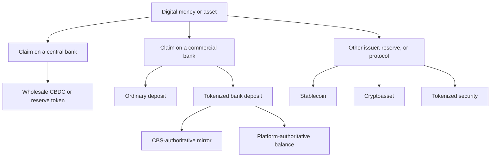

# Tokenized Bank Deposits: Foundations and Product Types

**Research cut-off:** 24 August 2026 
**Purpose:** establish the vocabulary and product boundaries used throughout this collection

## 1. A deposit is a relationship before it is a technology

A bank deposit is an amount the bank owes its customer under the account relationship. Tokenization can supply a new representation, transfer mechanism, or programmable interface, but the product remains a bank deposit only if the holder's enforceable economic claim remains against the issuing bank.

An ordinary deposit is already digital in the everyday sense: the bank records a balance in its systems and the customer instructs the bank to change that balance. If Alice pays Bob at the same bank, the bank reduces the amount owed to Alice and increases the amount owed to Bob. If Bob uses another bank, Bank A and Bank B also need to settle the resulting obligation between themselves. A tokenized deposit changes how these instructions, balances, or shared workflows are represented; it does not start from physical cash being placed inside a token.

This distinction explains why the legal relationship must come first. A technical transfer can move control of a ledger object, but the account terms and operating model determine whether that movement changes the bank's creditor, merely submits a payment instruction, or has no effect until another record is updated.

Five layers should be described separately:

| Layer | Question | Example answer in the recommended pilot |
|---|---|---|
| Legal claim | Who owes what to whom? | Bank A owes the verified customer CHF at par. |
| Representation | How is the claim recorded or referenced? | A controlled CHF token balance mirrors an eligible CBS balance. |
| Settlement asset | What discharges an interbank obligation? | Sight deposits at the SNB transferred through SIC. |
| Customer interface | How does the customer instruct and recover access? | Bank app, API, or recoverable bank-managed wallet. |
| Technical ledger | Where are token events executed? | Permissioned DLT or controlled shared ledger. |

Calling all five layers “the token” hides important legal and operational choices.

In practice, four components are often confused:

- A **ledger** records balances and events. A DLT replicates agreed state across nodes; a CBS ledger is normally controlled by one bank.
- A **token** is a transferable ledger state governed by contract and platform rules. It can represent a claim, security, instruction, or other right.
- A **wallet** holds or accesses signing credentials and addresses. Control of a key is not automatically legal ownership of a bank deposit.
- A **mirror account** is a CBS subaccount or control record associated with token holdings. Its exact legal and accounting role must be documented.

The decisive question is not which component looks most innovative. It is which record establishes how much the bank owes each customer when systems disagree.

## 2. Product taxonomy

The products below can be grouped by their principal function. Some tokens carry an instruction to an existing account system. Some represent a commercial-bank liability and may themselves become part of the authoritative balance record. Others are separate settlement, investment, or custody assets. The label, visual appearance, and currency symbol do not establish which group applies.

| Product | Issuer or debtor | Value mechanism | Typical legal focus | Is it a tokenized bank deposit? |
|---|---|---|---|---|
| Ordinary account deposit | Commercial bank | Bank's promise to repay at par | Banking, contract, AML, depositor protection | No token layer |
| Mirrored tokenized deposit | Commercial bank | Token represents an existing or earmarked deposit balance | Same deposit claim plus ledger, control, and settlement questions | Yes |
| Platform-authoritative deposit | Commercial bank | Platform is authoritative for the tokenized balance | Bank-books integration, rulebook, operational and insolvency effect | Yes, if the claim remains a bank deposit |
| Stablecoin backed by assets or guarantee | Issuer identified by structure | Redemption mechanism or reserve/guarantee | Banking, collective investment, AML, guarantee, insolvency | Usually no |
| Tokenized security | Security issuer | Security entitlement and market value | Code of Obligations, FinSA, FinMIA, custody | No |
| Custodied cryptoasset | External cryptoasset issuer or protocol | Market price or protocol rules | Custody, segregation, operational and investor risk | No |
| Wholesale CBDC | Central bank | Central-bank liability | Central-bank mandate and wholesale settlement rules | No |

FINMA's [2024 stablecoin guidance](https://www.finma.ch/en/news/2024/07/20240726-m-am-06-24-stablecoins/) addresses stablecoin structures and bank default guarantees. It is useful comparative material, but it does not convert an own-bank deposit liability into a guaranteed third-party stablecoin.

The taxonomy matters because two interfaces can display the same “CHF token” while giving the holder very different rights. Product design and marketing should therefore name the issuer, claim, redemption promise, and record authority rather than relying on the symbol or technology.

For example, a merchant receiving a payment-instruction token may still depend on Bank A accepting the instruction. A merchant receiving a valid Bank A deposit token may become Bank A's creditor under the product terms. A merchant receiving a stablecoin may instead have rights against a separate issuer, reserve arrangement, or guarantor. The screens can look identical while the credit, recovery, and insolvency positions differ materially.

### Payment-instruction token

A payment-instruction token represents an instruction to a paying bank rather than a balance that is itself the bank's authoritative deposit record. The customer's ordinary deposit remains in the CBS until the bank validates and accepts the instruction. This is close to existing payment processing and can still support programmable conditions or a shared audit trail.

Its main benefit is incremental change: the bank can preserve existing account, booking, and rejection controls. Its main risk is ambiguity for a later holder. The terms must explain whether the token has been accepted, whether it can expire or be revoked, who may present it, and whether the holder has an independent claim or only evidence of an instruction.

The 2025 Swiss Bankers Association Deposit Token proof of concept is important evidence for this category. It used tokenized payment instructions on a public blockchain to trigger off-chain transfers of bank-account money. Its legal analysis considered variants with and without automatic off-chain settlement and did not treat the instruction token itself as the underlying deposit. This makes the PoC relevant to programmable payment design, but it should not be cited as proof that a native or mirrored deposit claim was placed on-chain ([SBA results report, especially Appendix B](https://www.swissbanking.ch/_Resources/Persistent/7/9/e/a/79ea024daa9834c99fc299db5d5f69c4317525a2/20250916_Ergebnisbericht%20PoC%20Deposit%20Token_EN_FINAL.pdf)).

### CBS-authoritative mirrored deposit

In a mirrored model, the bank records a token-enabled deposit liability in the CBS and represents that amount on a token ledger. Suppose Alice converts CHF 1,000:

1. the CBS reduces Alice's ordinary available balance or reclassifies it into a token-enabled subaccount;
2. after the booking, policy, and limits checks succeed, the controlled issuer service mints 1,000 units to Alice's verified wallet;
3. the token supply and token-enabled liability reconcile one-for-one;
4. redemption burns or disables the units before the ordinary available balance is released under the approved workflow.

This creates two coordinated records of one liability, not two deposits. It preserves familiar statements, reporting, sanctions controls, interest and fee processing, and the ability to rebuild the token view from bank-controlled evidence. The cost is the need for strict orchestration: neither ledger may race ahead in a way that creates spendable value or loses a valid customer claim.

### Platform-authoritative or native on-chain deposit

Here, a valid platform event directly changes the authoritative creditor and balance for the tokenized portion. The CBS consumes that legally meaningful event rather than authorizing every movement first. This can reduce duplicated processing and improve composability with delivery-versus-payment or other shared workflows.

It also changes the bank's control problem. The platform must support depositor-list production, lawful freezes, corrections, upgrades, privacy, key recovery, regulatory reporting, insolvency, and resolution with the reliability expected of a bank ledger. Moving from a CBS-authoritative mirror to this model is therefore a separate product and governance decision, not a later technical optimization.

### Ledger-based security or deposit certificate

A bank may issue a tokenized bond, certificate, or ledger-based security that represents bank funding without being an ordinary account deposit. Such an instrument can be appropriate for wholesale funding or collateral, but securities issuance, trading, custody, market infrastructure, pricing, and transfer rules may apply. It should not be marketed as an everyday retail deposit merely because redemption is denominated in CHF.

### Bank-issued or non-bank stablecoin

A stablecoin normally uses reserves, a guarantee, an issuer promise, or another stabilization arrangement to target a reference value. The holder's risk can include the issuer, reserve custodian, guarantor, redemption agent, and legal structure. That differs from an ordinary bank account where the issuing bank is directly the debtor.

A licensed bank could issue both a deposit token and a stablecoin, but the bank's identity does not make the products equivalent. The documentation must explain whether customer money appears as a bank deposit, segregated backing, an off-balance-sheet custody asset, or another claim.

### Wholesale central-bank money

A wholesale CBDC or tokenized reserve balance is a liability of a central bank and is intended for eligible financial-market participants. It can settle the cash leg between banks or securities participants. It is not a retail customer's commercial-bank deposit and cannot be created by the commercial bank's token contract.

The map below should be read from the debtor outward. The first branch identifies whether the holder's claim is against a central bank, a commercial bank, or another issuer or protocol. Only after that distinction is clear does it make sense to discuss the ledger, wallet, or programmability features.

The important boundary is between the money used by customers and the asset used to settle obligations between institutions. A commercial bank can issue its own tokenized deposit, but it cannot create central-bank money. Likewise, using central-bank money to settle an interbank transfer does not turn the customer's original deposit into a CBDC.

## 3. Account-based, bearer-like, and hybrid designs

The same economic claim can be exposed through different control models:

- **Account-based:** the bank validates the identity and authority of the party requesting a transfer. The account record, not possession of an object, establishes the claim.
- **Bearer-like:** control of a private key appears sufficient to move the token. This improves direct transfer but makes identity, theft, recovery, sanctions, and insolvency treatment harder.
- **Hybrid:** keys initiate transactions, but transfers are restricted to verified participants and the bank retains entitlement, freeze, and recovery records.

For retail and most regulated-bank pilots, a hybrid model provides useful signing and programmability without making key loss equivalent to loss of the deposit. Wholesale networks may allow institutions more direct key control, but authority still needs to follow legal mandates and participant roles.

Authentication, signing power, and legal entitlement should therefore be treated separately. Alice may authenticate through her banking app, use a device-held key to sign an instruction, and remain the legal creditor recorded by the bank. If she loses the device, the bank can revoke that technical endpoint and bind a new one without transferring the deposit. Similarly, if a corporate signatory leaves a company, possession of an old key must not override the company's updated mandate and entitlement records.

Other representation choices also change risk:

- **Balance versus UTXO:** an account balance is intuitive for bank integration; a UTXO/commitment model can improve privacy and locking but complicates aggregation.
- **Public versus permissioned ledger:** public verification can improve interoperability but exposes metadata and governance dependencies; permissioning narrows participants but does not eliminate outsourcing or cyber risk.
- **Transferable versus non-transferable:** a token usable only in a named workflow is closer to a controlled payment feature than a freely circulating instrument.
- **Upgradeable versus fixed contracts:** upgrades support legal and security change, but the authority and process to change customer rights must be tightly governed.

## 4. Deposit claim versus token record

The claim and the token normally move together in a well-designed system, but they are not conceptually identical. Keeping them separate makes it possible to answer difficult cases: a key is lost, a ledger forks, a legal attachment is served, a bank posting fails, or an interbank payment settles while token issuance does not.

| Question | Deposit claim | Token record |
|---|---|---|
| Source | Account contract and applicable law | Platform rules, software, keys, and events |
| Debtor | Issuing bank | The token contract is not itself the debtor |
| Holder identification | Bank's customer records and terms | Address, wallet, participant, or privacy-state mapping |
| Amount | Authoritative bank record | Token balance or unspent state |
| Transfer effect | Determined by contract, books, and law | Executes technical transition; legal effect must be specified |
| Recovery | Account and bank procedures | Key recovery, wallet reassignment, correction, or controlled reissue |
| Insolvency | Banking and insolvency rules | Depends on whether token evidence follows, replaces, or merely mirrors the bank record |

**Design recommendation:** in the first pilot, a wallet address should be an authenticated operating endpoint, not the sole evidence of legal ownership. The bank should be able to suspend and recover access without silently changing the economic owner.

Consider a discrepancy in which the CBS records CHF 100 of token-enabled liability for Alice while the token platform shows 120 spendable units. The bank cannot simply select the larger or more recent number. It must determine which event was authorized, whether a booking or mint was duplicated, whether value has moved to another holder, and which correction is legally and operationally permitted. The pre-agreed record authority and audit evidence determine the repair path.

That recommendation also protects the customer experience. A retail user who loses a phone and a corporate user whose authorized signatory leaves the company should not lose the deposit merely because a signing credential changes. The bank needs a controlled process that re-binds access while preserving the same creditor and balance.

## 5. Core properties

### Par redemption

The customer should be able to convert one CHF tokenized deposit unit into CHF 1 of ordinary deposit value under clearly defined conditions. Restrictions such as cut-off times, freezes, limits, or legal holds must be disclosed rather than hidden behind the phrase “always redeemable.”

### Fungibility

Two units are economically fungible only if they carry the same issuer risk, currency, legal terms, transfer restrictions, and redemption rights. CHF deposits issued by Bank A and Bank B are not the same liability merely because both are denominated in CHF.

### Transferability

Transferability may range from:

- transfers only between a customer's own accounts;
- transfers among customers of one bank;
- transfers among participating banks and identified customers;
- broader circulation to eligible addresses;
- bearer-like transfer controlled primarily by a key.

Each step changes AML, sanctions, customer-protection, operational, and settlement requirements.

### Programmability

Programmability can reside in several places:

- the customer interface;
- a bank workflow engine;
- an orchestration service shared by participants;
- a smart contract on the ledger.

Placing logic on-chain is justified when several parties require a shared, deterministic rule. A conventional API or bank workflow is often simpler for single-bank automation.

### Finality

“Final” must always be qualified. A token event may be technically confirmed while the corresponding accounting entry, interbank payment, or legal discharge remains pending. [Chapter 06](06-tokenized-deposit-issuance-transfers-redemption-and-settlement.md) defines the finality layers.

## 6. Records-of-authority models

The record-of-authority choice determines which system resolves a disagreement. In normal operation all records should agree, so the distinction may appear theoretical. During a partial failure or insolvency, however, it decides whether the bank corrects the token ledger from the CBS, corrects the CBS from the platform, or treats a token transfer as independently constitutive.

| Model | Authoritative balance | Strength | Main concern |
|---|---|---|---|
| CBS-authoritative mirror | CBS/customer subledger | Familiar control, reporting, statements, and recovery | Requires strict orchestration and reconciliation; token cannot outrun books |
| Platform-authoritative | Shared ledger | Common state and programmable settlement | Bank must make platform state legally and operationally authoritative |
| Token-native/bearer-like | Token ownership state | Direct transfer and composability | Key loss, holder identity, legal characterization, custody, and recovery |

Project Agorá is an example of the second model for its prototype. The SBA deposit-token proof of concept provides Swiss industry evidence for multi-bank experimentation. Neither determines the production model for an individual bank.

For a first pilot, retaining the CBS as authoritative limits the number of simultaneous changes to customer statements, regulatory reporting, interest and fee processing, legal holds, and resolution operations. The architecture still needs to prove that a customer cannot spend the CBS balance and token representation twice and that every partial failure reaches a controlled state.

## 7. Working glossary

These are working definitions for this collection. Industry documents may use the same words differently, so product documents and participant rules should define them rather than assume a universal meaning.

| Term | Working meaning in these notes |
|---|---|
| CBS | Core banking system holding customer account and product records. |
| DLT | Distributed ledger technology; it does not imply a public or permissionless network. |
| GL | General ledger used for the bank's financial books. |
| Mint | Create token units after the required authorization and accounting conditions are met. |
| Burn | Permanently remove token units under controlled rules. |
| Reservation | Prevent specified funds from being spent while a workflow is pending. |
| Reconciliation | Compare token supply, customer subledger, GL control, and settlement evidence. |
| SIC | Swiss Interbank Clearing payment system. |
| Tokenized deposit | A commercial-bank deposit claim represented or operated using token technology. |
| Wallet | Technical and operational interface controlling an address or private state; not automatically the legal owner. |
| wCBDC | Wholesale central-bank digital currency for eligible financial-market participants. |

## What this means for the bank

The product decision cannot be reduced to “which blockchain?” The bank must first define the claim, authoritative record, eligible holder, transfer effect, redemption right, and interbank settlement model. Those definitions drive every later legal, accounting, and technical decision.

Next: [02 - Retail and wholesale tokenized-deposit use cases](02-retail-and-wholesale-tokenized-deposit-use-cases.md).
