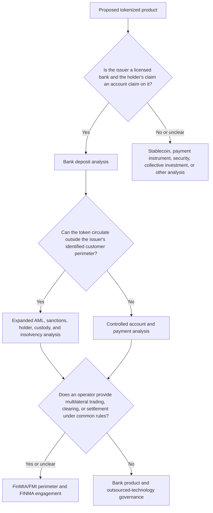

# Swiss Laws and FINMA Rules for Tokenized Deposits

**Research cut-off:** 24 August 2026 
**Status:** legal research, not a legal opinion

## 1. The basic legal idea in plain language

A bank deposit is a legal promise: the bank owes the customer money, and the customer can demand repayment under the account contract. A token is a way of representing, controlling, or moving something. It may represent the deposit claim itself, an instruction to move a conventional deposit, or an unrelated claim against another issuer. Those are different legal products even if all are described informally as “deposit tokens.”

The first legal test is therefore not which blockchain is used. It is what the token holder can claim, against whom, under which terms, and at what point in the transaction. That classification drives the analysis under banking, contract, AML, sanctions, payment-system, insolvency, depositor-protection, accounting, prudential, and liquidity frameworks.

The following terms are particularly useful when reading the legal analysis:

- **Account-based claim:** the bank's records identify the customer and the balance. A transfer normally changes the creditor recorded by the bank or creates a new claim after the required interbank settlement and receiving-bank acceptance.
- **Bearer-style token:** possession of a private key appears sufficient to control and transfer the asset. Anonymous or uncontrolled bearer-style transfer is not recommended for the proposed Swiss-bank pilot because the bank would need a compliant identity, entitlement, recovery, AML, sanctions, and transfer-control model.
- **Mirror account:** a CBS subaccount or control record associated with a token balance. Depending on the approved legal and accounting model, it may record the token-enabled deposit liability or support reconciliation between a conventional deposit and its token representation. The name alone does not determine its legal status.
- **Mint and burn:** creation and permanent destruction of token units. In a bank model, minting must follow the approved customer-liability or payment-instruction conditions; burning must disable the corresponding units without losing the customer's valid claim or duplicating value elsewhere.
- **Settlement:** completion of a payment or exchange leg under the relevant books and rules. For an interbank CHF payment, settlement commonly involves transferring sight deposits at the SNB through SIC. **Finality** is the point at which the applicable law and binding system or contract rules treat the transfer or obligation as irrevocable or discharged.
- **CBS:** the core banking system that normally maintains contractual customer accounts, postings, reservations, interest, fees, statements, and regulatory attributes.
- **DLT:** distributed ledger technology. It is a technical method for maintaining agreed state, not a legal classification by itself.

These terms describe different layers of the product. For example, a DLT may record a mint, a CBS may record the deposit liability, and SIC may settle an interbank obligation. Calling all three events “the token payment” would conceal the legal distinctions the bank needs to approve.

## 2. Regulatory method

Swiss regulation applies to the legal relationships and activities in the product, not to the label “tokenized deposit.” Classification therefore starts with the actual terms, records, participants, and flows.

A practical review asks five questions in order:

1. Who owes the money before and after each transaction?
2. What enforceable right does the customer or participant obtain?
3. Who can technically and legally dispose of that right?
4. Which entity issues the token, operates the ledger, holds keys, or coordinates settlement?
5. Which event changes the creditor or discharges an obligation under the applicable terms and rules?

These questions prevent the technology from deciding the legal analysis by accident. A smart contract can execute a transition, but it does not identify the debtor, create depositor protection, or establish insolvency finality unless the legal framework gives it that effect.

The decision tree below is a perimeter screen. It starts with the bank deposit relationship, then widens the analysis as transferability, external custody, or multilateral operation is added. Reaching a box does not itself provide a legal conclusion; it identifies the work and external confirmation required.

Three examples show how the same diagram applies differently:

- **Own-bank mirror:** Bank A owes an identified customer, the CBS remains authoritative, and the token operates inside Bank A's controlled perimeter. The central questions are customer terms, booking, AML, operational resilience, outsourcing, and the legal effect of the token event.
- **External wallet or custodian:** the same Bank A liability may be visible through infrastructure controlled by another party. Key control, custody characterization, outsourcing, foreign insolvency, data access, and responsibility for transfers become more important.
- **Multi-bank platform:** Bank A and Bank B place issuer-specific liabilities into a shared workflow. The analysis must also address the operator, common participant rules, interbank settlement, finality, and whether the platform performs regulated FMI functions.

### How the legal sources fit together

- **Legislation and ordinances** establish binding rights, duties, licences, prudential requirements, and insolvency rules.
- **FINMA circulars** describe FINMA's supervisory practice when applying financial-market legislation. They must be read with the superior law and their stated addressees.
- **FINMA guidance and public communications** communicate supervisory expectations or risk observations. Their relevance depends on the product and activity addressed.
- **Licences and institution-specific decisions** show that a particular structure was accepted for a particular applicant; they do not automatically approve another product.
- **Industry papers and prototypes** provide design and operational evidence, not binding law or regulatory approval.
- **Legal opinions, auditor conclusions, and formal supervisory engagement** apply the general framework to the bank's exact terms and architecture.

## 3. Core legal classification

The table separates the principal objects and activities that can coexist in one technical service. Its classifications are working research positions for the recommended model, not a formal ruling on an unspecified token.

| Object or activity | Working classification | Principal framework | Important qualification |
|---|---|---|---|
| Customer's CHF balance owed by issuing bank | Bank deposit claim | Banking Act (BA), Banking Ordinance (BO), account contract | Confirm that token terms do not replace the claim with a different issuer or reserve structure. |
| Token record mirroring that balance | Evidence and operating representation | Contract, banking books, DLT and evidentiary rules | Technical transfer has only the legal effect assigned by terms and applicable law. |
| Third-party cryptoasset held for customer | Potential custody asset if statutory conditions are met | BA Art. 16 no. 1bis, insolvency and custody rules | Different from the bank's own deposit liability. |
| Tokenized share, bond, or other security | Potential ledger-based right/DLT security | Code of Obligations, FinSA, FinMIA | A payment token does not become a security merely because DLT is used. |
| Multilateral trading or common settlement facility | Possible regulated FMI activity | FinMIA, FinMIO, FinMIO-FINMA | Requires analysis of function, participant rules, and thresholds. |
| Bank outsourcing ledger or key operation | Outsourcing/operational arrangement | FINMA Circular 2018/3 and Circular 2023/1 | The bank remains accountable for regulated obligations. |

The starting legal sources are FINMA's current [legal basis for banks](https://www.finma.ch/en/documentation/legal-basis/laws-and-ordinances/banks/) and [legal basis for financial-market infrastructures](https://www.finma.ch/en/documentation/legal-basis/laws-and-ordinances/financial-market-infrastructures/). Official consolidated texts should be checked in [Fedlex](https://www.fedlex.admin.ch/en/home) on the date of the decision.

The classification table should be read horizontally. A customer deposit, its token representation, and a custody service may appear in one product journey while remaining legally distinct objects or activities. The bank should document each row that applies rather than select a single label for the entire technical platform.

### Material-claim evidence matrix for the recommended first pilot

The following matrix prevents a general legal source from being used as if it settled the exact product. `Source` identifies the controlling framework or exact provision to be checked in the consolidated official text; `decision still required` identifies the conclusion that cannot be made by technology or a generic research note.

| Material claim | Controlling source to verify | What the source establishes | Decision still required |
|---|---|---|---|
| Bank A owes the customer a CHF deposit | Banking Act/Banking Ordinance framework; account terms | The banking-law perimeter for an own-bank deposit and public-deposit activity | Whether the final terms preserve that direct claim at every token lifecycle point |
| A token representation is not a second liability | Approved accounting policy, CBS/GL records, account terms | The relevant booking and evidence framework | Which record prevails and how a discrepancy is corrected |
| Customer-held third-party cryptoassets may be segregated | Banking Act art. 16 no. 1bis and applicable insolvency rules | The statutory custody-asset framework | Whether a particular wallet/control chain satisfies segregation conditions |
| Eligible deposits are aggregated and protected | Banking Act arts. 37a–37k; Banking Ordinance arts. 42a–44a; [esisuisse legal overview](https://www.esisuisse.ch/en/deposit-insurance/questions-and-answers-faq) | Statutory deposit-insurance and preference framework | Whether token-enabled balances, pending flows, and holder types qualify and aggregate as assumed |
| A shared platform may enter the FMI perimeter | FinMIA/FinMIO consolidated text; participant rules and actual functions | The regulated-FMI framework | Whether the selected operator, admission, matching, clearing, or settlement activities meet the perimeter |
| A blockchain payment needs payment-information controls | AMLA/AMLO; FINMA Guidance 02/2019; FATF Recommendation 16 | The applicable AML/CFT and payment-transparency framework | Exact Travel Rule, intermediary, wallet, sanctions, and corridor treatment |
| The bank may outsource a ledger or key service but retains responsibility | FINMA Circular 2018/3 and Circular 2023/1 | Outsourcing and operational-resilience expectations | Whether the provider, data access, audit, exit, and concentration controls meet the bank's arrangement |
| Shared-ledger data must preserve confidentiality and privacy | FADP and its implementing ordinance; Banking Act art. 47; contract and outsourcing controls | The governing privacy and bank-client confidentiality perimeter | Permitted data fields, foreign access, retention, disclosure, and regulator-access design |
| A final ledger event discharges an obligation | FinMIA/system rules, customer terms, participant rulebook, Swiss counsel opinion | The framework in which protected settlement finality can arise | The legal effect and insolvency treatment of each event in the selected flow |

This matrix is a control document, not legal advice. The product cannot move to an external pilot while a row that changes the debtor, customer balance, finality, or protection position lacks a named decision owner and linked evidence.

## 4. Banking law and customer terms

The Banking Act and Banking Ordinance regulate banks, public deposits, organization, prudential safeguards, and insolvency. Using a permissioned ledger does not remove an own-bank repayable claim from that framework. Conversely, a token issued by a non-bank or backed by a separate asset pool is not a bank deposit merely because it targets CHF 1.

Apply practical classification tests before drafting terms:

- Who is the issuer: a licensed bank, fintech licence holder, overseas entity, or consortium?
- Is the holder's claim directly against the bank and redeemable at par?
- Does the holder bear only bank credit risk, or also reserve, custodian, guarantor, or investment risk?
- Is the token a deposit record, a payment instruction, a security, or a redemption claim?
- Can the token move to someone who is not an identified customer or participant?
- What happens to a pending holder if an issuer, intermediary, or settlement participant becomes insolvent?

The product terms must answer, without relying on technical jargon:

- Which bank is the debtor?
- Is each unit redeemable at par, and under what limits or suspension conditions?
- When does a transfer change the creditor recorded by the bank?
- Does the recipient obtain a claim on the sender's bank or on its own bank?
- Which record prevails if CBS, token platform, and statement disagree?
- What happens after key loss, fraud, death, incapacity, attachment, sanctions freeze, or insolvency?
- Which law, forum, dispute process, and network rulebook apply?

**Design recommendation:** the first retail product should not make possession of an unrecoverable private key the sole legal evidence of entitlement. Customer ownership should remain linked to verified bank records.

## 5. AML, sanctions, and payment transparency

AMLA and AMLO-FINMA duties remain central because a tokenized deposit is a payment capability attached to a bank relationship. The control design must address:

- contracting party and beneficial-owner identification;
- ownership and control of legal entities;
- purpose and expected activity;
- higher-risk countries, customers, products, services, and corridors;
- sanctions screening and legally required freezes;
- transaction monitoring across account and token activity;
- MROS escalation and evidence retention;
- originator and beneficiary information for transfers.

FINMA Guidance 02/2019 remains on FINMA's current crypto-services list and sets out FINMA's blockchain-payment practice concerning payment information. It should be applied according to the exact transfer and intermediary model, alongside the current FATF Recommendation 16 framework ([FINMA crypto-services index](https://www.finma.ch/en/documentation/dossier/dossier-fintech/auf-einen-blick-aufstellung-der-krypto-dienstleistungen/), [FATF Recommendations](https://www.fatf-gafi.org/en/publications/Fatfrecommendations/Fatf-recommendations.html)).

FINMA Guidance 04/2026 says the institution's AML risk analysis should define explicit risk tolerance and align excluded countries, customer segments, services, and products with the business model ([FINMA, 4 June 2026](https://www.finma.ch/en/news/2026/06/20260604-mm-am-04-26/)). A new tokenized-deposit product therefore needs an explicit place in the bank's AML risk analysis before pilot approval.

For a controlled pilot, the practical baseline is:

- link every wallet to a verified customer, account, beneficial owner, and risk classification;
- verify control when a wallet is enrolled or changed;
- screen originator, beneficiary, intermediaries, and relevant addresses before release;
- monitor ordinary-account and token activity as one customer behavior;
- retain required payment information with the transaction correlation ID;
- define reject, freeze, return, recall, and law-enforcement hold procedures;
- limit transfers to approved participants and corridors.

An open, anonymous, freely transferable version is not a small extension of that pilot. It changes the holder, monitoring, sanctions, custody, recovery, and possibly licensing analysis.

## 6. Financial-market infrastructure and finality

A bank operating its own product is not automatically operating a regulated payment system or DLT trading facility. The perimeter becomes more important where a separate operator:

- admits multiple institutions or retail participants under common rules;
- matches or executes multilateral transactions;
- centrally clears or settles obligations;
- holds DLT securities in central custody;
- connects the cash and asset legs of a trading venue.

FINMA's 2025 licence for BX Digital is useful adjacent evidence: the licensed DLT trading facility is aimed at supervised participants, uses Ethereum for DLT securities, and connects to SIC for the payment leg. It is not approval of tokenized deposits or a general template for bank money ([FINMA, 18 March 2025](https://www.finma.ch/en/news/2025/03/20250318-mm-dlt-handelssystem/)).

Legal finality cannot be inferred from a ledger's consensus. The terms and any platform rulebook must specify when obligations are discharged, how insolvency affects pending instructions, which record proves completion, and how mistakes or invalid instructions are treated.

### Finality and insolvency timing

The rulebook should distinguish four events:

1. the customer instruction is authenticated;
2. funds become reserved and the instruction becomes irrevocable under specified conditions;
3. the interbank or asset settlement leg becomes final under its system rules;
4. the receiving bank accepts and credits its customer.

A DLT hash can prove that an event occurred on a ledger. It does not by itself establish that a payment order is protected from insolvency challenge or that the receiving bank has become the customer's debtor. Same-bank and interbank transactions may therefore have different finality points even when the user interface shows both as a token transfer.

Consider an interbank payment initiated at 10:00. The customer's instruction may be authenticated at 10:00:01, the amount reserved at 10:00:02, the token locked at 10:00:03, SIC settlement completed at 10:00:05, and the receiving bank's customer credited at 10:00:07. The ledger may call the lock irreversible before SIC settlement, while the receiving bank may not become debtor until it accepts and books the credit. The rulebook must state the legal meaning of each timestamp and what happens if an insolvency or outage occurs between them.

### Who owes the money after transfer?

- **Same bank:** Bank A is debtor before and after. Its total liability is unchanged; the creditor attribution moves from Alice to Bob.
- **Burn-settle-issue:** Bank A reduces its liability, central-bank money settles between the banks, and Bank B creates a new liability for its customer.
- **Continued Bank A token:** the recipient holds a claim on Bank A even if Bank B provides the interface or custody. Bank B does not become debtor merely by displaying the token.
- **Common issuer or scheme:** a consortium or special issuer may owe the holder, but that is a different legal product requiring its own licence, loss-allocation, reserve, and insolvency analysis.

Marketing, statements, and transaction receipts should name the issuer whenever the network can carry liabilities of more than one bank.

For a CHF 100 payment, the distinction can be expressed numerically:

- In a **same-bank transfer**, Bank A owes Alice CHF 100 less and Bob CHF 100 more. Bank A's total liability is unchanged.
- In **burn-settle-issue**, Bank A's customer liability falls by CHF 100, Bank A transfers CHF 100 of central-bank money to Bank B, and Bank B creates a CHF 100 customer liability.
- If the **Bank A claim continues**, the recipient controls CHF 100 owed by Bank A. Bank B may provide a wallet or custody service, but it does not create a CHF 100 deposit merely by displaying the asset.

These are different legal and accounting events. The contract and system design must not switch between them implicitly when a transfer crosses a bank boundary.

## 7. Custody, keys, and insolvency

FINMA Guidance 01/2026 concerns custody of cryptobased assets, including the operational and legal risks of Swiss and foreign custody arrangements and the responsibility retained by authorized institutions using third parties ([FINMA, 12 January 2026](https://www.finma.ch/en/news/2026/01/20260112-mm-am-01-26/)).

Its direct application to a bank's own tokenized deposit cannot be assumed. The project must analyze separately:

- customer cryptoassets held off balance sheet;
- the bank's own tokenized liabilities;
- customer-controlled versus bank-controlled keys;
- outsourced key infrastructure;
- whether statutory segregation requirements can be satisfied in each custody chain;
- whether a wallet provider can dispose of assets and therefore performs a regulated function.

## 8. Depositor protection and resolution

Depositor protection follows the legally recognized claim and customer relationship, not the number of tokens or wallets. The statutory framework is Banking Act arts. 37a–37k and Banking Ordinance arts. 42a–44a; FINMA and esisuisse provide explanatory material ([FINMA depositor protection](https://www.finma.ch/en/supervision/banks-and-securities-firms/depositor-protection/), [esisuisse FAQ](https://www.esisuisse.ch/en/deposit-insurance/questions-and-answers-faq)). The product needs a written conclusion on eligibility, aggregation with ordinary deposits, accrued amounts, and any excluded holders.

For example, if Alice has CHF 70,000 in an ordinary account and CHF 40,000 in token-enabled form at the same bank, two interfaces or wallets do not create two separate protection limits. The bank must aggregate the legally eligible claims for the same customer and institution. A large corporate or financial institution may face different eligibility or exclusion questions, so wholesale documentation should not reproduce the retail explanation without confirming the holder's status.

The bank should be able to produce one mapping across:

`wallet -> token position -> CBS account -> legal customer -> all deposits at the bank -> protection classification`

In recovery or resolution, the bank must distinguish:

- completed customer deposits;
- pending payment instructions;
- tokenized securities or custody assets;
- other-bank claims;
- frozen or legally attached amounts.

The DLT can be evidence for the depositor list, but it should not be the only list in a CBS-authoritative model. Minting and outbound transfers need a defined freeze point, while valid customer claims and already final settlement obligations must remain identifiable.

## 9. Privacy, data, and bank secrecy

Tokenization can expose identities, balances, counterparties, or behavioral data to additional nodes and service providers. The bank must map:

- controller and processor roles;
- purpose and legal basis for each data flow;
- data minimization and retention;
- cross-border access and storage;
- bank-client confidentiality;
- rights, correction, and deletion constraints;
- linkage risks even where addresses are pseudonymous.

The current Swiss baseline includes the Federal Act on Data Protection (FADP), its ordinance, Banking Act article 47, the outsourcing and operational-risk framework, other secrecy duties, and any applicable foreign law. Relevant FADP provisions include the processing principles, privacy by design/default, data security, processing by a processor, records of processing, disclosure abroad, information duties, access/correction rights, and breach handling. The exact provisions and exceptions must be applied to the selected role and data flow using the consolidated text ([FADP, SR 235.1](https://www.fedlex.admin.ch/eli/cc/2022/491/en); [Data Protection Ordinance, SR 235.11](https://www.fedlex.admin.ch/eli/cc/2022/568/en)).

Banking Act article 47 separately addresses unauthorized disclosure of secrets learned through a banking role. Data that is pseudonymised, encrypted, hashed, committed to a ledger, or visible only to permissioned nodes can still disclose or permit inference of a client relationship or transaction. The product assessment must therefore test bank secrecy independently of the FADP analysis and use the current official-language consolidated Banking Act text ([Banking Act, SR 952.0, art. 47](https://www.fedlex.admin.ch/eli/cc/51/117_121_129/de#art_47)).

| Privacy/secrecy decision | Question the bank must answer | Required design evidence |
|---|---|---|
| Purpose and minimization | Why is each field, event, log, and replica necessary for the approved product purpose? | Data catalogue mapping field → purpose → recipient → retention → legal basis |
| Roles and accountability | Which bank, operator, node host, cloud provider, analytics service, or correspondent is controller, processor, joint participant, or independent recipient? | Role analysis and contracts consistent with actual technical access |
| Shared-ledger content | Can the workflow settle using opaque party references, amounts/commitments, states, deadlines, and attestations instead of customer data? | Contract schema, node visibility test, metadata and re-identification assessment |
| Foreign disclosure and access | Where are nodes, backups, keys, support staff, administrators, logs, and subpoenable entities located? | Country/access map, transfer assessment, safeguards, legal-access and resolution-access analysis |
| Bank secrecy | Could another participant or provider learn or infer the bank-client relationship, balance, activity, pricing, purpose, or counterparty? | Article 47 opinion, need-to-know access, confidentiality controls and customer/authority basis where relevant |
| Outsourcing and supervision | Can the bank, audit firm, and FINMA inspect the function and obtain information needed for Swiss recovery or resolution? | FINMA Circular 2018/3 mapping, subcontractor inventory, audit rights, Swiss-access and exit test |
| Retention and rights | Which records must remain immutable for banking, AML, accounting, audit, disputes, or finality, and which identifiers can be corrected, restricted, or deleted? | Retention schedule, off-ledger correction process, wallet revocation and historical-evidence design |
| Security and breach | How are confidentiality, integrity, availability, key compromise, unauthorized node access, and data leakage detected and handled? | Threat model, encryption/key controls, monitoring, incident and notification decision tree |
| Regulatory and participant access | How can an authority obtain lawful evidence without making all participant data mutually visible? | Selective-disclosure procedure, evidence export, access logging and accountable approval |

FINMA Circular 2018/3 requires the bank to preserve inspection/audit rights for foreign outsourcing and ensure access in Switzerland to information required for restructuring or resolution. Outsourcing responsibility remains with the regulated institution; a ledger operator's contractual confidentiality promise is therefore not a substitute for governance, access, audit, continuity, and exit evidence ([FINMA Circular 2018/3](https://www.finma.ch/en/~/media/finma/dokumente/rundschreiben-archiv/2018/rs-18-03/finma-rs-2018-03---20170921.pdf)).

Technology choices change exposure but do not answer the legal questions:

| Pattern | Privacy advantage | Principal limitation | First-pilot position |
|---|---|---|---|
| Transparent public chain | Broad verifiability and composability | Persistent transaction graph, public metadata, foreign replication, difficult correction and confidentiality perimeter | Do not place customer or transaction-identifying data on-chain; public anchoring requires separate approval |
| Permissioned shared application | Restricted membership and enforceable access rules | Every authorized node may still observe more than it needs; operator and support access remain material | Accept only with field- and role-level minimization |
| Privacy groups / private subledgers | Narrows transaction payload to relevant participants | Membership and timing metadata remain; state synchronization and supervisory access become harder | Evaluate for multi-bank flows after a full visibility test |
| Commitments / zero-knowledge or attestation design | Can prove a condition without disclosing its underlying data | Key/setup, revocation, explainability, performance and long-term cryptographic dependencies | Use selectively where the reduced disclosure justifies the operational complexity |

**Design recommendation:** use a bank-private identity and compliance domain connected to minimum shared workflow state through opaque references and signed outcomes. Customer names, account numbers, documents, screening rationale, source-of-funds evidence, and sensitive pricing remain off-ledger. Transaction amount or counterparty data should also remain private or committed where the shared participants do not need the clear value.

## 10. Material change and cross-border overlays

A tokenized-deposit launch can affect the bank's business model, organization, risk profile, critical functions, outsourcing, and material systems. The bank should assess notification or approval expectations early with its regulatory and audit functions rather than presenting FINMA with a finished technical design.

Cross-border use adds several legal layers:

- foreign rules on deposit-taking, payment services, cryptoassets, and financial promotion;
- local AML, sanctions, and payment-information requirements;
- data transfer and bank-secrecy restrictions;
- consumer and corporate contract rules;
- tax reporting and withholding;
- governing law, jurisdiction, and recognition of finality;
- treatment of foreign branches, affiliates, correspondents, and wallets.

A foreign bank joining a permissioned network is different from a Swiss customer sending a token to a public foreign wallet. The former can be governed by participant rules and bank-to-bank controls; the latter may create an unknown holder and custody/AML perimeter the pilot was not designed to support.

“Same bank” also requires a legal-entity check. A Swiss head office and its foreign branch may belong to one legal entity, but local booking, payment, data, sanctions, foreign-exchange, creditor-protection, and branch-resolution rules can still apply. A separately incorporated foreign subsidiary is a different debtor even if it shares a brand, group policy, or CBS. Moving value between the Swiss bank and that subsidiary is therefore an intercompany or interbank transaction, not a same-bank customer transfer.

## 11. Retail and wholesale differences

The same legal foundation can produce different contractual and control obligations for retail and wholesale holders. The comparison identifies the main emphasis; it does not imply that wholesale participants lose mandatory protections or that retail products avoid finality and liquidity questions.

| Topic | Retail | Wholesale/corporate |
|---|---|---|
| Contract | Plain, transparent product and wallet terms | Negotiated account and network terms; participant rulebook |
| Holder | Natural person and authorized delegates | Legal entity, beneficial owners, signatories, roles |
| Protection | Depositor-protection eligibility, fraud, complaints, accessibility | Eligibility/exclusions, counterparty and concentration risk, dispute forum |
| Transfer | Recipient comprehension, refunds, mistaken payments | Finality, cut-offs, liquidity, bilateral claims, operational repair |
| Data | Personal and behavioral privacy | Commercial positions, pricing, and counterparty confidentiality |

The legal architecture should share common definitions while allowing different terms. Retail clarity and support cannot be replaced by a wholesale rulebook, and negotiated wholesale contracts cannot cure an unclear identity of the issuer or settlement point.

## 12. Regulatory status table

Publication date is not the same as legal status. An older guidance may remain part of FINMA's current published practice, while a newly announced consultation may have no binding effect. For each instrument, the bank must record the current version, amendment history, effective date, addressees, replacement status, and the precise proposition for which it is cited.

| Instrument or development | Status at cut-off | Relevance |
|---|---|---|
| BA, BO, AMLA, FinMIA, DLT Act framework, FADP | In force; verify consolidated Fedlex text | Core legal perimeter |
| FINMA Circular 2018/3 | Supervisory practice, current; verify latest official version | Outsourcing |
| FINMA Circular 2023/1 | Supervisory practice, in force since 2024 | Operational risk and resilience |
| FINMA Guidance 02/2019 | Current listed guidance | Blockchain payment information/Travel Rule practice |
| FINMA Guidance 06/2024 | Supervisory guidance | Stablecoin and guarantee comparison; AML/sanctions risk |
| FINMA Guidance 03/2025 | Supervisory guidance | Disclosure of customer cryptobased custody assets; not own-liability accounting authority |
| FINMA Guidance 01/2026 | Supervisory guidance | Custody and third-party-custodian risk where applicable |
| FINMA Guidance 04/2026 | Supervisory guidance | Product-specific AML risk tolerance and methodology |
| FINMA Guidance 05/2026 | Supervisory guidance | Quantum-computing risk, cryptographic inventory, migration planning, and crypto-agility |
| FINMA Circular 2016/7 | Current version last amended 6 May 2021 | Digital customer onboarding; a 2025/26 partial revision remained pending at cut-off |
| Revised AMLA and Transparency Act | Future effective: 1 October 2026 | Beneficial-owner transparency and related implementation |
| AMLO-FINMA partial revision | Consultation closed 9 June 2026; final text not located at cut-off | Ownership/control, sanctions, correspondent and subaccount proposals |
| New payment-instrument and crypto-institution licences | Consultation/proposal | Possible future adjacent regime; not current authorization path |

The revised AMLA and new Transparency Act enter into force on 1 October 2026 ([Federal Council](https://www.efd.admin.ch/en/newnsb/x3sKLxCJ6S3dQJtfvy0Tb)). FINMA's AMLO-FINMA consultation proposed additional detail on ownership/control, sanctions, correspondent transitory accounts, and beneficial-owner declarations for subaccounts; it must not be cited as final law ([FINMA consultation](https://www.finma.ch/en/news/2026/05/20260512-mm-anh-gwv-finma/)). FINMA also consulted from 16 December 2025 to 27 February 2026 on another partial revision of Circular 2016/7; until final publication, the version last amended on 6 May 2021 remains the current baseline ([FINMA consultation](https://www.finma.ch/en/news/2025/12/20251216-mm-video-online-id/)).

This timing creates a transition obligation rather than permission to choose the preferred text. The pilot must comply with the rules in force when it operates, prepare for finalized future-effective requirements, and treat consultation language as a scenario until it is adopted.

## 13. Required external decisions

The research can identify the decision but cannot replace the decision-maker. Each conclusion below should be recorded against a versioned product description so that a later change in holder eligibility, wallet model, ledger authority, or settlement rail automatically reopens the affected advice.

| Owner | Decision needed before pilot |
|---|---|
| Swiss counsel | Claim and token classification, contract effect, transfer/finality, insolvency, FMI perimeter, data and cross-border law |
| FINMA | Material-change expectations, classification uncertainties, FMI perimeter, proposed controls and reporting |
| External auditor | Accounting recognition, disclosure, prudential mapping, control evidence |
| SNB/SIX | SIC access, message and settlement design, operational dependencies |
| Tax specialists | Stamp, withholding, VAT, AEOI/CRS/CARF applicability by product and customer |

The output should be an approval record, not a collection of informal comments. It should state the assumptions, evidence reviewed, unresolved qualifications, responsible owner, and expiry or review trigger for each conclusion.

## What this means for the bank

The legal work product should be a signed product-classification memo tied to one exact architecture and set of terms. A generic conclusion about “tokens” will not support accounting, prudential, or production decisions.

Next: [04 - Accounting, prudential treatment, and customer protection](04-tokenized-deposit-accounting-prudential-treatment-and-customer-protection.md).
