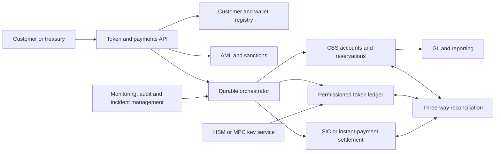

# CBS, settlement and operational-control design

**Research date:** 13 August 2026  
**Scope:** a bank-controlled pilot that can later evolve toward native on-chain settlement.

## Source-of-truth decision

Keep the CBS customer contract account and GL authoritative for the first implementation. The DLT is a permissioned representation and event log. This supports statements, holds, interest, depositor protection, resolution, regulatory reporting and auditor reconstruction. A native DLT master record is a later product decision, not a technical refactor.

## Target architecture

## Responsibilities by component

### CBS and GL

Hold the legal customer account; reserve funds; apply value dates, interest, fees, limits, freezes, powers of attorney and estates; post double-entry journals; produce statements and regulatory/depositor reports; and preserve resolution and tax records.

### Token platform

Maintain allow-listed wallets and smart-contract state; permit mint, burn, freeze and recovery only to authorised roles; expose durable event IDs; support conditional actions; and prevent uncontrolled transfers.

### Orchestrator

Coordinate CBS, AML, DLT and SIC as a durable saga. CBS, DLT and SIC should not be treated as one distributed database transaction. Every command is idempotent, correlated and replayable.

## Transaction state machine

`REQUESTED → FUNDS_RESERVED → AML_APPROVED → DLT_PENDING → SIC_SETTLED → RECEIVER_ACCEPTED → FINAL`

Use explicit `REJECTED`, `EXPIRED`, `REPAIR_REQUIRED`, `RETURNED`, `REVERSED` and `FROZEN` states. Keep customer-visible availability separate from technical completion. A chain confirmation is never sufficient by itself for a cross-bank “final” label.

## Flow controls and journals

- **Mint:** reserve/reclassify in CBS, pass AML, mint, verify token event, then mark final. If mint fails, release or repair the reservation.
- **Burn:** receive/burn or disable token, verify finality, then reclassify or pay out in CBS. Do not make the ordinary balance available early.
- **Same-bank transfer:** debit payer and credit payee in the token subledger/CBS process; commit token event and customer liabilities together.
- **Cross-bank transfer:** reserve sender, screen both parties, submit ISO 20022/SIC payment, wait for settlement, credit receiving-bank mirror, then complete token state.
- **Conditional DvP:** reserve both legs; release only after the independent settlement conditions are satisfied.

Useful Swiss payment messages include pain.001 (customer initiation), pacs.008 (interbank credit transfer), pacs.002 (status), pacs.004 (return) and camt.052/053/054 (reporting). SIC implementation guidelines are binding for participants.

## Reconciliation and mismatch response

Reconcile three layers continuously:

1. token supply by bank, contract and version;
2. customer token/mirror balances and status; and
3. GL plus SNB/SIC settlement records.

Also reconcile wallet ownership, AML decision, event IDs, message IDs, finality timestamps and customer statements. Any mismatch automatically blocks new mint and outbound transfers, keeps inbound funds in a controlled state, alerts operations/risk and starts deterministic event-log replay. Repairs require two-person approval, reason code, compensating entry and evidence retained for audit.

## Failure and recovery matrix

| Failure | Safe action | Forbidden action |
|---|---|---|
| CBS unavailable | Pause mint/outbound; preserve requests; read-only customer status | Mint against stale balance |
| DLT unavailable | Keep CBS reservation pending with timeout/repair | Release spendable balance solely on CBS intent |
| SIC unavailable | Queue or reject cross-bank flow under rulebook; disclose status | Claim interbank finality |
| AML/sanctions hit | Freeze/reject/return under policy and legal authority | Bypass screening to complete a token transfer |
| Duplicate/replay | Idempotency check and single journal | Post a second liability movement |
| Chain fork/reorg | Halt affected contract, apply finality threshold, reconcile | Treat both branches as valid supply |
| Contract upgrade | Timelock, multisig, migration test, pause and audit | Unreviewed production upgrade |
| Key loss/compromise | Revoke role, freeze, rotate, recover under legal authorization | Share emergency private keys informally |
| Erroneous final transfer | Freeze unspent value; compensating recovery/return | Silent on-chain ledger edit |

## Key and smart-contract governance

Separate platform administrator, bank authority, operator, deployer, AML approver and recovery roles. Use HSM/MPC, four-eyes approvals, least privilege, offline recovery keys, rotation, tamper-evident logs, emergency pause and timelocked upgrades. Maintain a contract-version registry, storage-migration runbook, validator/node due diligence and tested key-compromise scenarios.

## Resilience, RTO and RPO

FINMA Circular 2023/1 requires board-approved operational-risk tolerance, critical-function inventories, dependency mapping, severe-but-plausible testing, incident response, privileged-access monitoring and tested BCP/DRP. It does not prescribe one universal RTO/RPO. Set them through a business-impact analysis and include CBS, DLT, SIC, AML, HSM, cloud and vendor dependencies. For authoritative balances and event logs, design for zero data loss; use safe read-only/manual mode while a service is unavailable.

Required tests include CBS outage, DLT outage, SIC unavailability, provider loss, mass redemption, sanctions rejection, duplicate messages, fork/reorg, upgrade, key compromise, customer statement reconstruction and bank resolution.

## Audit evidence

One correlation ID should connect:

`customer instruction → KYC/AML decision → CBS reservation → GL journal → ISO message → SIC reference/timestamp → DLT hash/block/finality → receiving-bank acceptance → customer statement`

Store immutable event records, actor/role, authorization, before/after balances, timestamps, reason codes, retries and compensating entries. Provide independent reconciliation and smart-contract-audit reports.

## CBS capability and vendor assessment

Assess the installed release, not a brochure. Require evidence for:

- real-time reservation and 24/7 posting;
- customer-linked mirror/token subaccounts;
- event streaming, replay and idempotency;
- ISO 20022/SIC integration;
- available/reserved/frozen/pending balances;
- three-way reconciliation and ledger rebuild;
- statements, depositor-list export and regulatory reporting;
- HSM/MPC, role separation and emergency pause;
- multi-entity/currency/value-date handling;
- BCP, 24/7 operations and provider exit; and
- FINMA audit, data-access and outsourcing clauses.

Research candidates include Avaloq, Finnova, Finstar, Temenos Transact, ERI OLYMPIC and Mambu. Official material establishes APIs, events or message integration, not native tokenized-deposit support. Temenos has published tokenized-deposit/CBDC proofs of concept; treat them as vendor demonstrations requiring proof in the bank's environment. Do not select a vendor until it demonstrates all five core flows and every failure path.

## Relevant sources

- [SBA Deposit Token PoC report (2025)](https://www.swissbanking.ch/_Resources/Persistent/7/9/e/a/79ea024daa9834c99fc299db5d5f69c4317525a2/20250916_Ergebnisbericht%20PoC%20Deposit%20Token_EN_FINAL.pdf)
- [FINMA Circular 2023/1](https://www.finma.ch/en/~/media/finma/dokumente/dokumentencenter/myfinma/rundschreiben/finma-rs-2023-01-20221207.pdf)
- [FINMA Circular 2018/3](https://www.finma.ch/en/~/media/finma/dokumente/rundschreiben-archiv/2018/rs-18-03/rs-18-03-letzte-aenderung-20191031.pdf?sc_lang=en)
- [SNB SIC System Disclosure](https://www.snb.ch/public/asset/en/www-snb-ch/publications/sicsystem-disclosure/sicsystem-disclosure-all/sicsystem_disclosure_2023/publications0_en/sicsystem_disclosure_2023.en.pdf)
- [SIX ISO 20022 standards](https://www.six-group.com/en/products-services/banking-services/payment-standardization/standards/iso-20022.html)
- [Avaloq integration](https://www.avaloq.com/platform/integration)
- [Temenos Transact APIs](https://developer.temenos.com/transact-apis)
- [Temenos tokenized-deposit proof of concept](https://www.temenos.com/blog/tokenizing-commercial-bank-deposits-to-facilitate-transactions-settled-with-wholesale-cbdc/)
- [Finstar OpenAPI](https://www.finstar.ch/en/products/api/)
