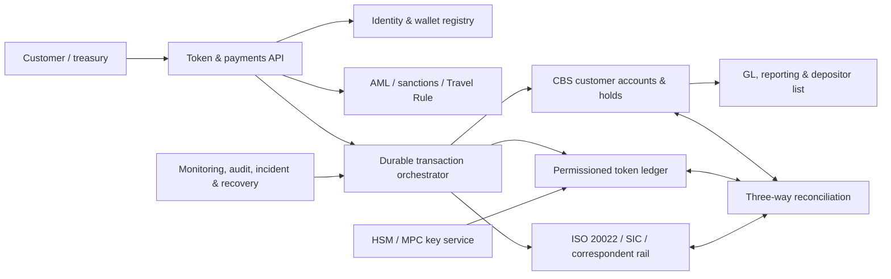

# 04 — CBS, settlement and operational-control design

**Research date:** 13 August 2026  
**Scope:** How a Swiss bank can connect a core banking system (CBS), a permissioned token ledger, AML controls and Swiss/interbank settlement without losing accounting authority, customer protection or auditability.
**Status:** Target operating model and control catalogue, not an implementation specification.

## 1. The concepts in plain language

A **core banking system (CBS)** is the bank’s system of record for customer accounts, balances, postings, holds, interest, fees, statements and product rules. It is normally where the bank proves what it owes each customer.

A **general ledger (GL)** is the accounting system that aggregates detailed customer entries into financial-statement accounts. A **subledger** contains the account-level detail that must reconcile to the GL.

A **token ledger** records units, wallet permissions and transfer events. It may be distributed among authorised nodes, but distribution does not make its records legally authoritative. A smart contract can enforce rules but cannot decide who is the debtor, whether a payment is final, or what insolvency law does.

The safest first implementation keeps the CBS/GL authoritative and uses DLT as a controlled representation and coordination rail. The token platform may be authoritative for a technical event ID or wallet state, but it should not be allowed to create value without a corresponding CBS reservation and legal rule.

## 2. The three architecture choices

### 2.1 CBS-authoritative mirror (recommended pilot)

The bank opens a token subaccount or mirror record for the customer. The DLT token is minted only after the CBS has reserved or reclassified the amount. Transfers are validated by the bank and written back to the CBS. The DLT is useful for shared visibility and programmable conditions, but customer statements, depositor lists, accounting and resolution rely on the bank’s records.

This is the SBA Deposit Token PoC direction: traditional deposits remained off-chain and the token acted as a payment instruction/controlled representation. It reduces migration risk and avoids two independent ledgers claiming to be the legal balance.

### 2.2 DLT-authoritative bank liability

The token contract is the primary balance record and the bank integrates the CBS around it. This may support more native peer-to-peer activity but requires a full legal, accounting, key, recovery, depositor-protection and resolution design. It is not “just an API integration”; it changes the bank’s control framework and failure modes.

### 2.3 Dual-master or eventual consistency

Both CBS and DLT can apparently change a balance and later reconcile. This creates double-spend, replay, fork, outage and correction risk. Do not use it unless the bank can prove a single conflict-resolution authority, deterministic ordering, robust recovery and clear legal terms. A distributed database does not remove the need for one accountable bank ledger.

## 3. Target architecture



### Component responsibilities

**Customer channel/API:** authenticates the customer, displays available/reserved/pending/frozen balances, obtains consent and returns a stable transaction ID. It does not decide finality.

**Identity and wallet registry:** maps customer, beneficial owner, account, wallet, jurisdiction, risk rating, contract version and permitted limits. It records wallet-control evidence and lifecycle status.

**AML/sanctions/Travel Rule:** screens all parties and messages, holds/rejects or releases the flow, stores the decision and makes the decision available to the audit trail.

**Orchestrator:** durable state machine that coordinates CBS, token ledger and settlement. It provides idempotency, retries, timeouts, compensation, manual repair and replay. It must survive process and server restarts.

**CBS/GL:** remains responsible for legal balances, holds, value dates, interest, fees, customer statements, depositor protection, statutory reports and accounting journals.

**Token ledger:** enforces allow-list, mint, burn, transfer, freeze, pause and recovery rules; emits immutable event IDs; exposes contract version and finality evidence.

**Settlement rail:** SIC/SNB, SIC Instant Payments, correspondent bank or a foreign RTGS/payment system. It is the source of cash-finality evidence for the interbank leg.

**Reconciliation and monitoring:** compares DLT supply, customer subledger, GL, wallet registry and settlement messages, and triggers automatic halts on mismatch.

**HSM/MPC key service:** protects mint/burn/admin/validator keys, enforces role separation, signs only approved operations and records key-use evidence.

## 4. Data model and ledger invariants

Minimum customer/token record:

- legal customer and beneficial-owner ID;
- CBS account and legal currency;
- token account, wallet and contract version;
- issuer bank and receiving bank where relevant;
- available, reserved, pending and frozen amounts;
- transaction correlation/idempotency key;
- AML/sanctions decision and Travel Rule payload;
- journal IDs, message IDs, SIC references and DLT hash/block;
- finality/acceptance state;
- limits, expiry, dormancy and legal holds; and
- operator, approval and timestamp history.

Enforce these invariants:

```text
valid token supply by bank/currency/contract
  = customer token subledger total
  = tokenized-deposit GL control balance
```

```text
customer total = available + reserved + pending + frozen
```

```text
one idempotency key → at most one economic journal
one wallet → one controlled customer/beneficial-owner relationship
one cross-bank payment → one settlement reference and acceptance outcome
```

The bank may keep pending reservations in a controlled suspense state, but it must never expose them as spendable or mint additional tokens against them.

## 5. End-to-end transaction flows

### 5.1 Mint from an existing deposit

1. Customer requests CHF 100 tokenization.
2. API authenticates customer and checks product/jurisdiction/limit.
3. AML and sanctions controls approve or reject.
4. CBS reserves CHF 100 or moves it from ordinary to tokenized subaccount.
5. Orchestrator writes a durable `MINT_REQUESTED` event.
6. Token service mints exactly 100 units under the authorised contract and records transaction hash.
7. Independent observer verifies contract, currency, amount, recipient wallet and finality threshold.
8. CBS marks token balance available and customer channel displays final.
9. Reconciliation links the journal, token event and customer statement.

If steps 4–7 disagree, keep funds reserved, pause further minting and repair from the event log. Never mint first and “fix the CBS later”.

### 5.2 Burn/redeem

1. Customer requests redemption to ordinary account or external payment.
2. CBS marks token units reserved and prevents a second spend.
3. AML/sanctions/limits are checked.
4. Token units are burned or placed in an unspendable controlled state.
5. The observer verifies the burn/finality event.
6. CBS reclassifies to ordinary deposit or initiates the external payment.
7. Customer receives a final status only after the contractual condition is met.

If burn succeeds but CBS is unavailable, the bank preserves evidence and posts a compensating re-credit under dual control; it does not silently create a second token supply.

### 5.3 Same-bank transfer

Both customers have claims against the same bank. The orchestrator atomically (from the business perspective) reserves the payer, screens the payment, debits the payer subledger and credits the payee subledger, then commits the token transfer. The bank’s total liability is unchanged; only the creditor and account allocation change.

Use a durable outbox/inbox pattern or equivalent so a process crash cannot result in a debit without a credit. If the DLT is temporarily unavailable, the bank can queue the payment or offer a CBS-only fallback only if customer terms and duplicate-spend controls permit it.

### 5.4 Two-bank transfer in the same currency

1. Bank A verifies sender, wallet, limits, AML and available balance.
2. Bank A reserves and debits the sender according to its legal terms.
3. Bank A submits the interbank payment through ISO 20022/SIC.
4. SIC settles by debiting Bank A’s SNB sight account and crediting Bank B’s account. This is the cash-finality evidence.
5. Bank B validates message, participant, beneficiary, sanctions and acceptance rules.
6. Bank B credits the beneficiary’s tokenized customer liability (or creates/mints Bank B’s own token under the shared protocol).
7. Both banks close their token event and reconcile to the SIC reference.

The sending claim and receiving claim are not automatically the same legal claim. Bank A stops owing the paid amount; Bank B owes the beneficiary after its acceptance condition. If either bank fails between steps, the rulebook must specify whether the customer has a claim against Bank A, Bank B or a settlement estate.

Useful Swiss payment messages include pain.001 (customer initiation), pacs.008 (interbank credit transfer), pacs.002 (status), pacs.004 (return) and camt.052/053/054 (reporting). SIX implementation guidelines are binding for SIC participants; a token event does not replace required payment messages.

### 5.5 Cross-border transfer

The bank should start with an identified bank-to-bank flow rather than direct public-chain transfer:

1. Bank A screens customers and confirms the permitted jurisdiction/currency.
2. An FX quote and rate timestamp are agreed if currencies differ.
3. Bank A reserves the source token and submits the payment/FX leg through a correspondent or foreign RTGS system.
4. The settlement system provides finality evidence in that currency.
5. Bank B or the foreign bank accepts the beneficiary and creates its own local-currency claim/token.
6. The two banks reconcile source burn, FX/settlement amount, fees, destination mint and Travel Rule data.

Do not treat a CHF token as a USD or EUR deposit without an FX transaction and receiving-bank obligation. The rulebook must define cut-offs, 24/7 availability, time zones, sanctions, data-sharing, participant default, fees, rate slippage, returns and governing law.

### 5.6 Conditional delivery-versus-payment

For a tokenized security or asset purchase, reserve both payment and asset legs. Release only after the independent condition (delivery, title or settlement) is proven. A smart contract can coordinate the steps, but custody, securities, investor-protection and insolvency rules still apply. Avoid using the simple deposit-transfer state machine for DvP without a separate legal and control design.

## 6. State machine and failure semantics

Recommended states:

`REQUESTED → FUNDS_RESERVED → AML_APPROVED → DLT_PENDING → SETTLEMENT_PENDING → SETTLED → RECEIVER_ACCEPTED → FINAL`

Terminal/non-normal states:

`REJECTED`, `EXPIRED`, `RETURNED`, `REVERSED`, `FROZEN`, `REPAIR_REQUIRED`, `CANCELLED`.

Every state must state:

- whether the customer can spend the amount;
- who legally owes the amount;
- whether the amount is included in the depositor-protection list;
- which journal has been posted;
- whether the operation can be retried safely; and
- the evidence needed to resume after an outage.

| Failure | Safe response | Never do |
|---|---|---|
| CBS unavailable | Pause mint/outbound; preserve request; provide read-only status | Mint against stale balance |
| DLT unavailable | Keep CBS reservation pending or reject under rulebook | Treat CBS intent as completed mint |
| Settlement/SIC unavailable | Queue, expire or reject; disclose pending status | Show interbank finality |
| AML/sanctions hit | Freeze/reject/return under law and policy | Bypass screening |
| Duplicate/replay | Idempotency check, one economic journal | Post a second liability movement |
| Fork/reorg | Halt affected contract, choose approved canonical state, reconcile | Count both branches as valid supply |
| Upgrade failure | Pause, roll back/migrate using tested runbook | Deploy unreviewed code |
| Key compromise | Revoke role, freeze, rotate/recover under authorisation | Share emergency key informally |
| Wrong beneficiary | Freeze unspent value, follow recall/return procedure | Edit immutable history silently |
| Bank resolution | Apply rulebook freeze, map claims, preserve records | Assume token holders can self-redeem |

## 7. Security and governance

Use permissioned validators, strong identity, network segmentation, encryption, HSM/MPC, least privilege and four-eyes approval. Separate platform administrator, bank mint/burn authority, AML approver, contract deployer, validator operator, recovery officer and auditor roles.

Maintain:

- a smart-contract registry and approved hashes;
- formal code review and independent audit;
- testnet and migration rehearsal;
- timelocked, multisignature upgrades;
- emergency pause and controlled recovery;
- key generation, rotation, backup and destruction records;
- validator/node due diligence and exit plan;
- fraud, cyber and insider-threat monitoring; and
- customer, regulator and incident communications.

An emergency pause should stop new movement without destroying evidence or preventing legally required returns. A recovery function must be governed by customer terms and law; “immutability” does not excuse an impossible resolution or correction process.

## 8. Operational resilience, RTO and RPO

FINMA Circular 2023/1 expects board-approved operational-risk tolerance, inventories of critical functions and data, dependency mapping, incident management, cyber controls, tested business continuity and recovery plans. It does not prescribe one universal RTO or RPO.

Set RTO/RPO through a business-impact analysis. A sensible policy is:

- authoritative customer balances and event logs designed for no loss (or a documented, reconciled recovery point);
- a safe read-only/manual mode while non-critical interfaces are unavailable;
- no customer-visible finality while the controlling settlement evidence is missing;
- explicit maximum pending duration and expiry/return rules; and
- recovery tests that rebuild balances and statements from independent evidence.

Include the CBS, GL, token nodes, API, AML, sanctions, HSM/MPC, message gateway, SIC/correspondent, cloud, telecoms and outsourced monitoring. Severe-but-plausible tests should cover mass redemption, vendor loss, key compromise, DLT fork, duplicate messages, cyber incident, sanctions outage, data corruption, Swiss resolution and cross-border participant default.

## 9. Reconciliation, accounting and audit controls

Run continuously or at a risk-appropriate high frequency:

1. total token supply by bank/currency/contract;
2. customer token subledger and mirror balances;
3. GL control account;
4. wallet registry and allow-list;
5. AML/sanctions status;
6. ISO/SIC/correspondent settlement records; and
7. customer statements and depositor-list export.

One correlation ID should connect:

`instruction → identity/AML decision → CBS reservation → GL journal → ISO message → SIC/correspondent reference → DLT hash/finality → receiving acceptance → statement`

Retain actor, role, approval, timestamp, before/after amount, contract version, retry key, reason code and compensating entry. Reconciliation mismatch automatically freezes mint and outbound movement, alerts operations/risk, and initiates event-log replay. Repairs require two-person approval, an explicit reason and independent post-repair reconciliation.

## 10. Integration and message standards

Expose APIs for account inquiry, reserve, release, post, mint, burn, transfer, status and reconciliation. Use idempotency keys and a durable outbox/inbox. Prefer ISO 20022 for interbank instruction and reporting, with the token event ID carried as a supplementary reference where permitted.

The token platform should not write directly to production GL tables. Use a controlled service interface with schema/versioning, maker-checker approval, throttles, authentication, timeout and compensating-action semantics.

## 11. CBS/vendor assessment

Assess the installed release and the bank’s own integration, not marketing claims. Require a demonstration of:

- real-time reservations and 24/7 value-dated posting;
- customer-linked mirror/token subaccounts;
- available/reserved/pending/frozen balances;
- durable events, streaming, replay and idempotency;
- ISO 20022/SIC/correspondent integration;
- three-way reconciliation and ledger rebuild;
- statement, depositor-list and regulatory-reporting export;
- role separation, HSM/MPC and emergency pause;
- multi-entity, multi-currency and FX handling;
- BCP/DR, 24/7 support and vendor exit; and
- FINMA audit, data-access, secrecy and outsourcing clauses.

Candidates such as Avaloq, Finnova, Finstar, Temenos Transact, ERI OLYMPIC and Mambu publish APIs, transaction processing or integration capabilities. Those public materials do not prove native tokenized-deposit support. A vendor should pass the bank’s scripted tests for mint, burn, same-bank, interbank, cross-border, outage, duplicate, fork, key-compromise and resolution scenarios before selection.

## 12. Operating model and implementation sequence

### Phase 1 — legal and control design

Choose one bank, one currency, identified customers and a permissioned network. Freeze the legal model, debtor map, accounting, AML controls, finality rule, depositor-protection aggregation and outage states.

### Phase 2 — CBS-authoritative pilot

Build mint/burn and same-bank transfer. Operate with strict limits, dual control, daily reconciliation and manual incident approval. Prove statements, depositor-list export, audit evidence and recovery.

### Phase 3 — interbank settlement

Add a second bank and SIC/ISO 20022 settlement. Test participant default, rejection, return, liquidity peaks, reconciliation and finality before enabling customer-scale transfers.

### Phase 4 — controlled cross-border

Add one currency pair and one foreign bank/correspondent only after country-specific legal opinions, AML/Travel Rule, FX, data and resolution arrangements are signed.

### Phase 5 — native or programmable expansion

Consider DLT-authoritative balances, public-chain connectivity or DvP only after the bank can demonstrate that legal, accounting, prudential, operational and resolution controls remain complete.

## Sources

- [SBA Deposit Token PoC (2025)](https://www.swissbanking.ch/_Resources/Persistent/7/9/e/a/79ea024daa9834c99fc299db5d5f69c4317525a2/20250916_Ergebnisbericht%20PoC%20Deposit%20Token_EN_FINAL.pdf)
- [FINMA Circular 2023/1 — operational risks](https://www.finma.ch/en/~/media/finma/dokumente/dokumentencenter/myfinma/rundschreiben/finma-rs-2023-01-20221207.pdf)
- [FINMA Circular 2018/3 — outsourcing](https://www.finma.ch/en/~/media/finma/dokumente/rundschreiben-archiv/2018/rs-18-03/rs-18-03-letzte-aenderung-20191031.pdf?sc_lang=en)
- [SNB SIC System Disclosure](https://www.snb.ch/public/publication/en/www-snb-ch/publications/sicsystem-disclosure/sicsystem-disclosure-all/sicsystem_disclosure_2024/0_en/sicsystem_disclosure_2024.en.pdf)
- [SNB Swiss Interbank Clearing](https://www.snb.ch/en/the-snb/mandates-goals/payment-transactions/swiss-interbank-clearing)
- [SIX ISO 20022 standards](https://www.six-group.com/en/products-services/banking-services/payment-standardization/standards/iso-20022.html)
- [Avaloq integration](https://www.avaloq.com/platform/integration)
- [Temenos Transact APIs](https://developer.temenos.com/transact-apis)
- [Finstar OpenAPI](https://www.finstar.ch/en/products/api/)
- [Mambu APIs](https://docs.mambu.com/docs/mambu-apis/)

Vendor pages document possible integration capabilities, not regulatory approval or native tokenized-deposit functionality. Require evidence in the bank’s own environment.
