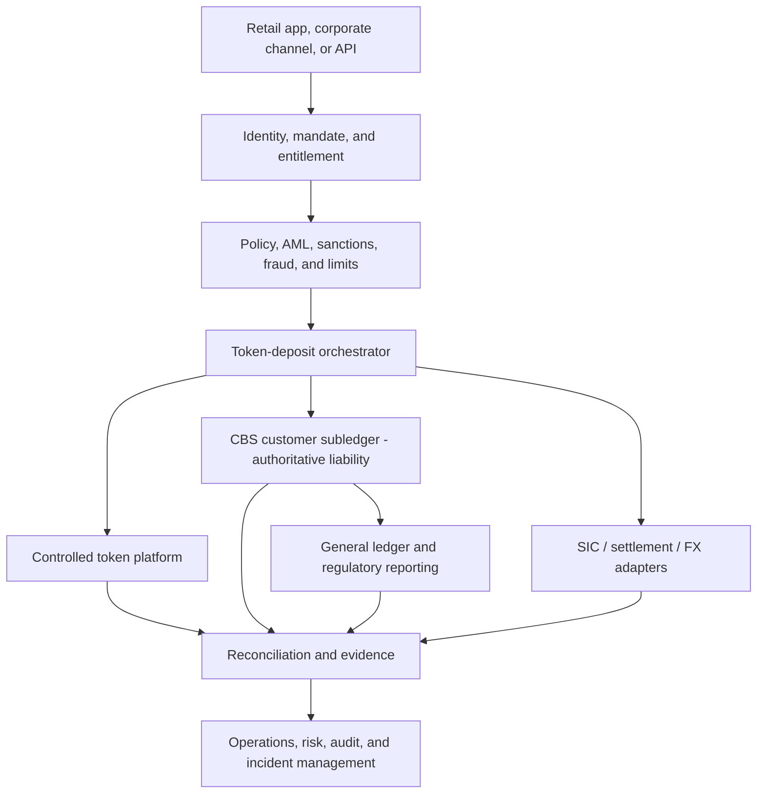
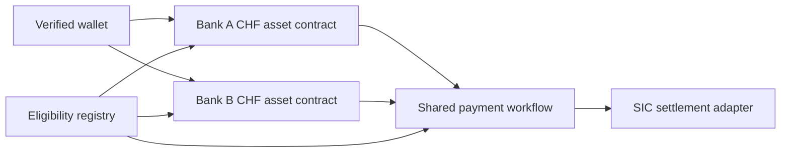
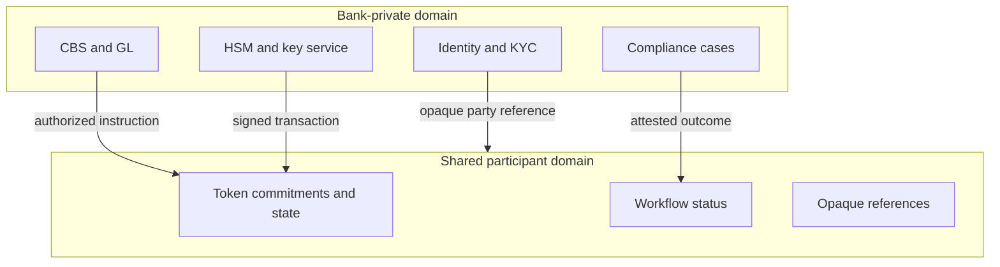
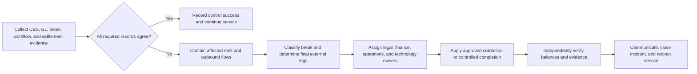

# Tokenized-Deposit System Architecture and Ledger Records

**Research cut-off:** 24 August 2026 
**Recommended starting model:** CBS-authoritative mirrored tokenized deposits

## 1. Architecture principle

The first implementation should add a controlled token execution surface without creating an uncontrolled second set of bank books. The CBS/customer subledger records the bank's liability; the GL records the financial control position; the token platform executes eligible token movements; and the orchestration layer makes their state changes safe and traceable.

This is a design recommendation. A platform-authoritative model is possible, but it requires a different legal, accounting, operational, and recovery position.

Several systems participate because no single component should perform every regulated function. Customer identity belongs in bank customer systems, legal and accounting balances belong in approved books, token rules belong on the controlled execution platform, and interbank settlement evidence comes from the relevant payment system. The architectural task is to join these responsibilities without allowing any component to create value, infer settlement, or override a legal restriction on its own.

The phrase “source of truth” is therefore too broad. The design needs a source of authority for each fact: who the customer is, how much the bank owes, which token state is valid, whether an instruction is authorized, and whether an external payment has settled. The diagram shows the principal control path and the evidence returned from it.

For an issuance, the channel collects the request, identity and policy services approve it, the CBS reserves or reclassifies the balance, and the orchestrator submits a controlled mint. For a same-bank transfer, the orchestrator coordinates token and CBS changes under one transaction identifier. For an interbank transfer, it also waits for definitive evidence from SIC or another agreed settlement mechanism. Reconciliation then compares the records; it is not a reporting step added after the transaction is finished.

The arrows describe controlled dependencies, not a claim that every component updates simultaneously. The approved lifecycle may place the CBS entry before or after a token transition, provided the commit boundary, customer status, timeout, and repair behavior are explicit.

## 2. Record-of-authority table

Every component will hold some version of the transaction, but it should not independently decide every fact. The table assigns authority by data domain: customer identity belongs in customer systems, the bank liability in the CBS, financial control in the GL, and external settlement in the relevant settlement system.

| Information | Authoritative source in the recommended pilot | Replicated or derived records |
|---|---|---|
| Customer legal identity and relationship | KYC/customer master | Opaque participant and wallet identifiers |
| Customer deposit liability | CBS customer subledger | Token balance, channel display, analytics |
| Financial control balance | General ledger | Reconciliation store and reports |
| Valid token state | Token platform, subject to CBS authorization and reconciliation | Indexed events and customer display |
| Interbank cash settlement | SIC/SNB settlement evidence and binding participant rules | Orchestrator status and audit store |
| Sanctions/AML decision | Bank compliance systems and case record | Minimal decision code and reference |
| Workflow state | Orchestrator, with signed/idempotent ledger and settlement evidence | Operational dashboards |

“Authoritative” does not mean other records can be ignored. It means there is a pre-agreed correction path when records disagree.

### When records disagree

- **CBS CHF 100; token ledger 120 units:** stop affected issuance and outbound movement. Establish whether an unauthorized or duplicated mint occurred and correct the token state through a governed process. Do not increase the bank liability merely to make a faulty token total reconcile.
- **Token transfer succeeds; CBS posting fails:** preserve the ledger evidence and determine whether the transfer had legal effect. The transaction enters repair; a blind retry could transfer the customer liability twice.
- **SIC settles; receiver issuance is incomplete:** the interbank cash movement may already be final. The receiving amount must remain visible in a controlled due-to, suspense, or customer claim state until the approved internal leg completes.
- **Shared workflow has an AML approval code but the case is unavailable:** do not infer that screening occurred correctly. The bank-private compliance record remains the evidence, while the shared ledger should expose only the minimum result and reference.

These examples show why authority and correction are data-domain decisions. “Latest timestamp wins” is not a safe rule when legal finality, customer claims, or externally settled money are involved.

## 3. Architecture options

The following options describe where the authoritative customer balance lives. They are different operating models rather than interchangeable technical configurations.

| Model | How it works | Advantages | Required evidence before adoption |
|---|---|---|---|
| CBS-authoritative mirror | CBS controls liability; token platform mirrors eligible state | Familiar statements, reporting, recovery, and control | Deterministic orchestration, near-real-time reconciliation, no unbooked token creation |
| Platform-authoritative deposit | Shared platform is the primary balance record | Common state and direct programmability | Legal effect of platform entries, production-grade ledger governance, accounting/reporting integration, resolution and recovery plan |
| Token-native/bearer-like | Token possession or private state is central to entitlement | Composability and direct transfer | Holder law, key-loss outcome, custody/segregation, AML perimeter, insolvency, operational support |

Migration between models is a product and regulatory change, not a configuration toggle.

The recommended mirror is appropriate when the bank wants to test programmable workflows while retaining established customer statements, interest, fees, reporting, legal holds, and recovery. A move to platform authority may become rational when several institutions require one common, legally effective balance record and the platform can satisfy bank-grade governance, privacy, audit, resolution, and recovery requirements. Token-native or bearer-like operation should be considered only when direct possession is itself a required product feature and the bank has resolved the associated holder and key-loss consequences.

A design in which both the CBS and platform can independently authorize balances is not a useful compromise. It creates two masters without a deterministic rule for disagreement. Temporary technical replication is unavoidable; dual legal or accounting authority is not.

## 4. Core components

A useful way to read the components is to follow one instruction. Alice authenticates in a channel; identity services confirm that the wallet belongs to her and that she has authority; the policy engine evaluates limits and compliance; the orchestrator obtains the required CBS, token, and settlement results; and the evidence store makes the complete history available to operations and audit. Each component should return a verifiable result rather than a vague success message.

### Channels

- Retail banking application with plain-language status and recovery.
- Corporate portal with mandates, roles, and four-eyes approval.
- APIs for approved platforms and institutional participants.
- Operations console segregated from customer authorization.

### Identity and policy

- Customer, beneficial-owner, and signatory records stay in bank-controlled systems.
- Wallets and addresses map to verified parties and scoped entitlements.
- Policy engine evaluates product eligibility, limits, sanctions, AML, fraud, corridor, and operational status.
- Compliance decisions expose only a result and evidence reference to the ledger workflow.

### Orchestrator

The orchestrator owns the end-to-end state machine. It must:

- assign a global idempotency key;
- reserve or post in the CBS at the approved point;
- submit ledger and settlement instructions;
- consume independently verifiable outcomes;
- enforce timeouts and compensating paths;
- never infer success merely from a missing error;
- produce one audit timeline for every transaction.

### Token platform

The platform enforces valid issuance, transfer, locking, delegation, and burning. Contracts should contain only rules that multiple participants must verify or that protect supply integrity. Customer documents, screening data, and commercial secrets remain off-ledger.

### Settlement adapters

Adapters translate the orchestration state into the supported SIC, RTGS, securities, or FX workflow. They must retain original message identifiers and definitive settlement evidence. [SIX ISO 20022 material](https://www.six-group.com/en/products-services/banking-services/payment-standardization/standards/iso-20022.html) and the current [SNB SIC disclosure](https://www.snb.ch/en/publications/sicsystem-disclosure/sicsystem-disclosure-all/sicsystem_disclosure_2024) are the baseline sources, subject to participant documentation.

### Integration boundaries

The integration layer should expose explicit operations for inquiry, reservation, release, posting, mint, burn, transfer, status, and reconciliation. Every request carries a versioned schema, authenticated actor, correlation identifier, idempotency key, timeout policy, and expected response state. A durable outbox/inbox or equivalent pattern prevents a committed internal event from being lost between systems and supports replay without repeating value movement.

The token platform should not write directly to production GL tables or bypass the CBS service boundary. Controlled services apply product rules, maker-checker requirements, throttles, value dates, accounting recognition, and evidence capture. Interbank messages should use the supported ISO 20022 and SIC participant formats, carrying the token or workflow identifier as a supplementary reference only where the applicable message and rulebook permit it.

An API acknowledgement means that a request was received, not that the economic event settled. Interfaces should return or expose the durable workflow state and the evidence source for any completed ledger, accounting, or settlement leg.

The division of responsibility can be summarized as follows:

- **Orchestration** decides which approved step may be attempted next and owns the end-to-end state.
- **Ledger execution** applies issuer, transfer, lock, and burn rules to token state.
- **Accounting** recognizes the bank's assets, liabilities, income, expenses, and control positions.
- **External settlement** discharges obligations through a rail and rulebook outside the token platform.
- **Reconciliation** proves that these results remain consistent or moves the workflow into controlled exception handling.

## 5. Contract topology

A single global CHF contract looks simple but can hide who owes each unit. Partitioning assets by issuer and currency keeps Bank A's promise separate from Bank B's promise while a shared workflow coordinates their exchange.

The recommended topology separates issuer liabilities and currencies.

| Contract or module | Partition | Responsibility |
|---|---|---|
| Asset contract | Issuing bank + currency + product version | Mint, burn, transfer, lock, supply, status |
| Identity/eligibility registry | Network or issuer domain | Opaque participant/wallet eligibility and revocation |
| Workflow contract | Use case or network | Multi-party sequence, deadlines, approvals, commit/cancel |
| Settlement adapter | Settlement rail/currency | Bind external settlement evidence to workflow |
| Reference-data module | Versioned shared domain | Currency, participant, corridor, holiday, and rule references |

Bank A CHF units and Bank B CHF units should not be collapsed into one undifferentiated asset unless a legal arrangement defines a common issuer, joint liability, or another credible conversion and loss-allocation model.

The diagram therefore shows separate asset contracts connected through a shared workflow. The wallet may display both as CHF, but the asset identifier must preserve the issuing bank because it determines the debtor, credit exposure, redemption route, and potentially depositor-protection treatment.

The shared workflow can coordinate an exchange without becoming the issuer of either asset. It can validate readiness, lock issuer-specific positions, bind SIC evidence, and publish a commit result. It must not silently convert Bank A's promise into Bank B's promise or mint one issuer's liability using another participant's authority.

### Contract-deployment alternatives

Several deployments can use the same audited contract logic while creating different governance and legal concentrations:

| Alternative | Appropriate use | Main benefit | Main concern |
|---|---|---|---|
| One asset contract per bank and currency | Recommended first multi-bank model | Clearest debtor, supply, keys, pause, reconciliation, and depositor-list boundary | More deployments and version coordination |
| Shared multi-issuer contract with hard partitions | Later network with mature common governance | Reuses one deployment while preserving issuer-specific balances | Shared upgrade, operator, defect, and concentration risk |
| One undifferentiated CHF asset | Only if a separate legal structure creates one coherent claim | Maximum apparent fungibility | Debtor, redemption, loss allocation, protection, and default become unclear; not recommended by default |
| Separate deployment by jurisdiction | Where law, settlement, data, access, or central-bank control requires it | Isolates jurisdiction-specific rules and operations | More bridging, liquidity fragmentation, and cross-ledger coordination |

A shared multi-issuer implementation must partition at least by issuer, currency, product terms, and contract version. One issuer must not mint, burn, freeze, recover, or upgrade another issuer's liabilities. A user interface may aggregate values for convenience, but the underlying asset and statement must preserve the debtor.

Jurisdiction is a separate control boundary rather than a substitute for issuer identity. Separate deployments may be necessary because of settlement assets, participant eligibility, governing law, insolvency protection, data localization, regulator access, validators, or emergency powers. They are not automatically necessary merely because a commercial-bank deposit is used cross-border. Central-bank reserve records are more naturally jurisdiction-specific because each central bank controls access to its own currency and settlement rules.

## 6. Minimum data model

The data model connects customer intent to legal, accounting, and technical evidence. The table lists logical objects; it does not require every field to be stored on the shared ledger.

| Object | Required fields |
|---|---|
| Product | Issuer, currency, version, terms reference, eligibility, status |
| Wallet binding | Opaque party ID, wallet/address, roles, effective dates, status, recovery reference |
| Token position | Asset ID, owner/wallet, available, locked, last event |
| Instruction | Global ID, type, amount, parties, purpose/use case, timestamps, channel, expiry |
| Decision | Policy version, outcome, reason code, evidence reference, decision time |
| Settlement leg | Rail, participants, currency, amount, message IDs, state, finality evidence |
| Accounting leg | CBS/GL references, booking date/time, amount, account/control IDs, reversal link |
| Audit event | Actor/service, action, prior state, next state, signature/hash, correlation ID |

Shared contracts normally need only issuer and asset identifiers, opaque participant references, amounts or commitments, permitted state transitions, deadlines, and evidence references. Names, account numbers, beneficial-owner data, screening rationale, contracts, and customer documents should remain in bank-controlled systems. The correlation ID connects the records without turning the shared ledger into a copy of the customer file.

Retention also differs by object. A wallet binding can be revoked while its historical effective period remains auditable. A transaction state can become final while its operational evidence remains subject to banking, AML, accounting, and litigation-retention rules. Deleting a customer-facing wallet must not delete the bank's evidence of prior transactions.

## 7. Trust and privacy boundaries

A trust boundary identifies where a party stops relying on its own controls and begins relying on another system, participant, or attestation. The diagram separates information that stays inside the bank from the minimum state participants need to coordinate a transaction.

Do not place names, account numbers, screening reasons, source-of-funds evidence, documents, or sensitive pricing on a ledger visible to other participants. Hashing personal data does not automatically make it anonymous.

An opaque party reference reduces direct exposure but does not remove all privacy risk. Repeated addresses, timing, amounts, counterparties, and network behavior can be linked to infer a participant's identity or commercial activity. Privacy review must therefore cover metadata, node access, event indexing, operator logs, backup copies, and cross-border support access as well as contract fields.

An attested compliance outcome also has limits. Other participants may rely on a signed “approved” result for the shared workflow, but the originating bank must retain the underlying evidence and remain able to explain or revoke the result under the rulebook. Privacy should minimize shared information without making accountability impossible.

## 8. Reconciliation and controlled correction

In a mirrored model, reconciliation is part of the transaction safety mechanism. It compares the customer liability, token position, GL control, workflow status, and any external settlement leg under one correlation identifier.

Containment should be narrow enough to preserve valid inbound value and unaffected products while preventing the discrepancy from spreading. Correction follows the authoritative record and legal status; it does not automatically mean rolling the token ledger back. Reopening requires independent confirmation that the invariant holds and that the underlying cause has been removed or accepted.

## 9. Architecture invariants

An invariant is a condition that must remain true in every permitted state, including failures. It differs from a business rule such as a customer limit, which can vary by product or customer. Breaching an invariant means the system can no longer prove the integrity of value or authority and should trigger containment.

At all times:

- only the issuer's controlled role can mint or burn its liability;
- token supply never exceeds the approved token-enabled liability;
- every state-changing instruction is idempotent and traceable to an authorized request;
- locked value cannot be spent elsewhere;
- a failed workflow has one deterministic terminal or repair state;
- revoked wallets cannot initiate new transfers;
- operational administrators cannot create customer value;
- reconciliation breaks stop affected flows and produce an incident.

Each invariant needs an automated test, monitoring signal, evidence record, and named response owner. It should be tested against retries, delayed messages, node recovery, contract upgrades, key rotation, end-of-day processing, and restoration from backup—not only against the normal transaction path.

## What this means for the bank

The architecture should make the bank's legal and accounting position visible in system boundaries. If engineers cannot identify the authoritative balance, approved recognition point, and correction path for each event, the design is not ready for a pilot.

Next: [06 - Tokenized-deposit issuance, transfers, redemption, and settlement](06-tokenized-deposit-issuance-transfers-redemption-and-settlement.md).
