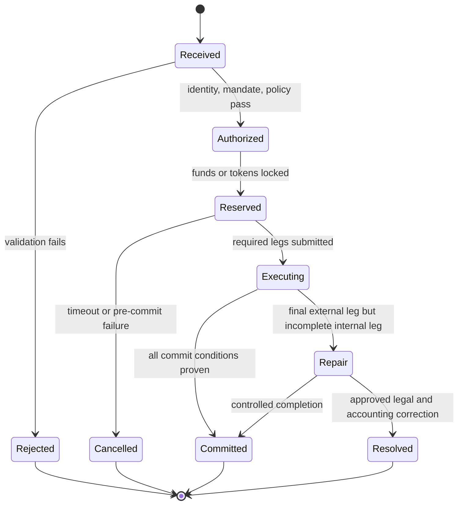
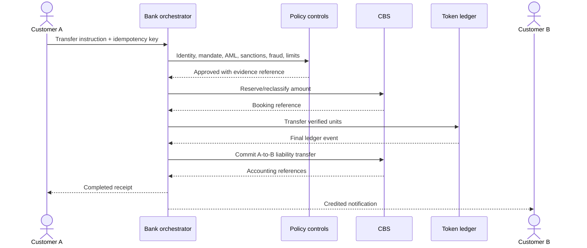
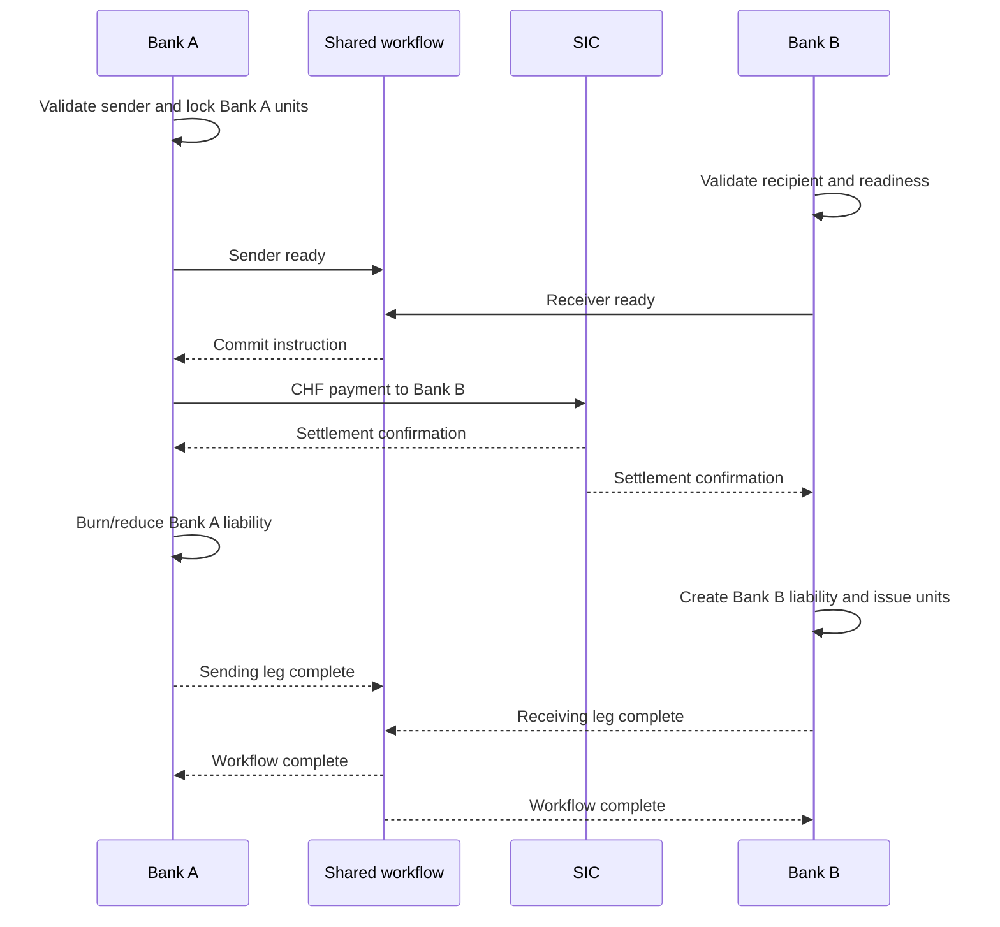
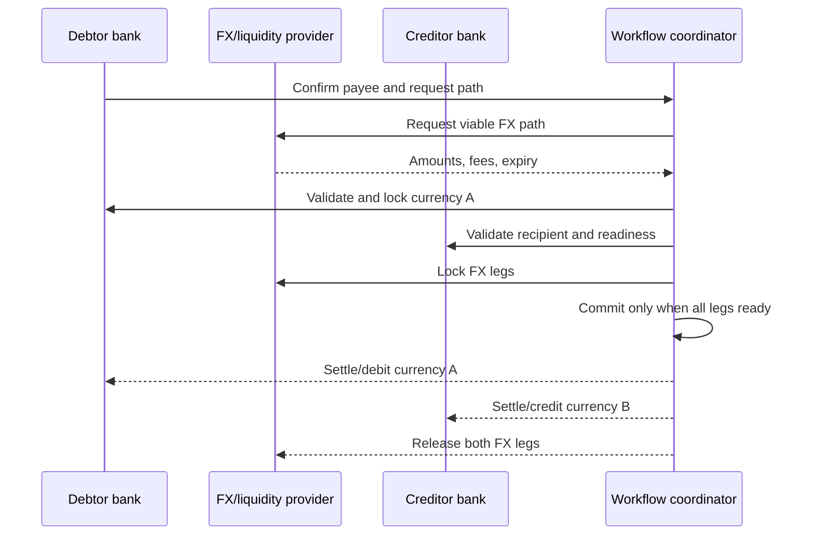

# Tokenized-Deposit Issuance, Transfers, Redemption, and Settlement

**Research cut-off:** 24 August 2026 
**Purpose:** define lifecycle behavior without confusing ledger events with legal settlement

This chapter explains what must happen from the moment a customer requests a tokenized-deposit operation until the bank can prove its outcome. It uses a CBS-authoritative mirrored model as the recommended pilot design, but it also describes interbank alternatives where the legal claim or authoritative record behaves differently.

Four economic events should be distinguished before considering their technical implementation:

- **Issuance** makes an eligible amount of the bank's deposit liability available through the tokenized-deposit product. In the mirrored model, it is a representation or reclassification of an existing claim, not creation of additional customer wealth.
- **Transfer** changes who can use or legally claim the amount. Within one bank, it normally reallocates the same bank liability. Across banks, the design must state whether the original issuer remains debtor or another bank creates a replacement liability.
- **Redemption** removes the token-enabled representation and makes the value available in ordinary deposit form or applies it to an external payment.
- **Settlement** discharges an obligation under the applicable books, contracts, system rules, and law. A ledger event may contribute evidence without being the legal settlement point.

The customer may experience each event as one action. Internally, the bank must coordinate identity, authority, policy, balance reservation, token state, accounting, settlement, notification, and evidence. The lifecycle model exists to ensure that a partial failure cannot create extra spendable value, remove a valid claim, or leave the outcome unowned.

## 1. Canonical state machine

The state machine is the common control vocabulary for issuance, transfer, redemption, and settlement workflows. It does not prescribe one database or smart contract. It specifies the business state that all participating systems must be able to reconstruct from durable evidence.

- `Received`: the bank has accepted the request for processing but has not approved it.
- `Authorized`: identity, mandate, eligibility, compliance, fraud, and limit controls have passed for this stage.
- `Reserved`: the relevant balance or token position is locked against conflicting use.
- `Executing`: at least one required ledger, accounting, or settlement instruction has been submitted.
- `Committed`: every condition for the defined completed outcome has been proven.
- `Rejected`: validation failed before value was reserved.
- `Cancelled`: the workflow ended before the commit boundary and reservations were safely released.
- `Repair`: a leg that cannot simply be undone has completed while another required leg remains incomplete.
- `Resolved`: an approved legal and accounting correction closed the exception without producing the originally intended committed outcome.

Read the diagram from top to bottom for the normal path and across the exception branches for failure handling. “Committed” means the workflow's specified completion condition is satisfied; the product documents must still define which legal and accounting effects that condition represents.

No transaction may remain in an unowned “unknown” state. `Repair` is a controlled exception with an owner, evidence, customer communication rule, and deadline.

On the normal path, a valid request moves from `Received` through authorization and reservation to execution and commitment. If validation fails, the bank rejects it without locking value. If a timeout occurs while non-settlement is proven and the commit boundary has not been crossed, the bank cancels and releases the reservation. If SIC or another final external leg has completed but an internal leg has not, cancellation may be impossible; the workflow enters `Repair` until controlled completion or a separately approved resolution is recorded.

A state name must never be inferred solely from the last API response. For example, a timeout after submission means “outcome unconfirmed,” not “nothing happened.” The orchestrator must query or receive authoritative evidence before choosing cancellation, retry, repair, or completion.

## 2. Issuance

Suppose Alice has CHF 1,000 in an ordinary Bank A deposit and asks to make CHF 200 available in tokenized form. In the recommended mirrored model, Bank A continues to owe Alice the same total amount. The operation changes the product subledger and creates a controlled token representation of CHF 200; it does not add CHF 200 to Alice's wealth or to the bank's total liabilities.

1. Customer requests conversion of an eligible ordinary balance.
2. Bank authenticates the customer and mandate.
3. Policy evaluates product eligibility, limits, AML/sanctions/fraud conditions, and platform status.
4. CBS reserves or reclassifies the amount according to approved accounting policy.
5. Orchestrator submits one idempotent mint instruction.
6. Token platform mints to the verified wallet.
7. Reconciliation validates the CBS, GL control, and token supply.
8. Customer receives a final receipt only after the defined completion condition.

If step 5 or 6 fails, the CBS reservation or reclassification is released or reversed through a pre-approved compensating path.

Three terms should not be confused:

- **Minting** is the technical creation of token units by the issuer's authorized role.
- **Issuance** is the complete legal, accounting, operational, and technical process that makes the product available to the customer.
- **Reservation or reclassification** is the bank-book control that prevents the ordinary balance and token representation from being spendable at the same time.

The customer should see “processing” while the result is reversible or unconfirmed and “available” only after the defined completion condition. If the bank cannot complete the mint, Alice should retain or recover the original CHF 200 claim without needing to understand which internal service failed.

## 3. Redemption

Redemption reverses the product representation, not necessarily the bank liability. If Alice redeems 25 Bank A CHF units to her ordinary Bank A account, Bank A still owes her CHF 25; the amount moves from token-enabled to ordinary available form. If redemption funds an external payment, the liability may instead be reduced when the approved payment and settlement conditions are met.

1. Customer submits a redemption instruction from an eligible wallet.
2. Bank validates ownership, status, balance, limits, and legal holds.
3. Token units are locked against double use.
4. Orchestrator burns the units or moves them to a non-spendable redemption state.
5. CBS makes the ordinary deposit balance available at the approved recognition point.
6. Reconciliation confirms supply reduction and liability classification.

The order of steps 4 and 5 must be designed so neither double value nor customer loss can occur after a partial failure.

Burning, locking, and redemption have different meanings. A lock temporarily prevents use while the workflow remains pending. A burn permanently removes token units under issuer authority. Redemption is the complete customer-facing conversion or payout process. A burn without the corresponding recognized customer value would destroy the representation without satisfying the bank's obligation; a credit without disabling the units could create two spendable forms of the same claim.

## 4. Same-bank transfer

In a same-bank transfer, Bank A is debtor before and after. If Alice sends CHF 50 to Bob, Bank A reduces the amount it owes Alice and increases the amount it owes Bob. Its total deposit liability normally remains unchanged and no interbank settlement asset is needed.

The customer experience can still be simple: Alice sees an authorized payment and Bob sees an available receipt. Internally, however, the bank must coordinate the creditor change in the CBS with the token transition and decide which event is the approved accounting and legal recognition point. The sequence below illustrates a CBS-controlled workflow; its exact ordering is subject to that approved policy.

The exact order can differ, but the design must define what happens if the ledger commits and the CBS commit fails. It may require the CBS transfer first, ledger first with repair, or an atomic internal booking boundary. The approved accounting and legal recognition points control this choice.

If the CBS reservation succeeds but the ledger transfer is never submitted, the bank can normally cancel and release the reservation. If the ledger transfer becomes valid but the CBS creditor transfer fails, the workflow may need repair because Bob may already have an effective token position. Retrying the entire transfer without checking evidence could pay Bob twice. Operations therefore need the original instruction, idempotency key, before-and-after balances, ledger event, and CBS status in one timeline.

## 5. Interbank alternatives

An interbank transfer adds a question that does not exist within one bank: which bank owes the recipient after completion? A token address cannot answer this question. The product terms, issuer partition, settlement model, and receiving-bank acceptance determine whether the Bank A claim is extinguished, coordinated with a new Bank B claim, or continues to circulate.

Central-bank money is relevant when the banks need to discharge the obligation created by replacing one commercial-bank liability with another. It is not the customer's token and is not minted by either commercial bank. The alternatives below are legal and operating models; a network may support one or several, but each transaction must identify which one applies.

### Model A: burn, settle, issue

- Bank A extinguishes or locks the sender's Bank A tokenized claim.
- Bank A pays Bank B in central-bank money through SIC.
- Bank B creates its own deposit liability and token units for the recipient.

Advantages:

- each bank issues only its own liability;
- interbank exposure is discharged through the established settlement rail;
- customer claims are easy to attribute after completion.

Limitations:

- requires coordinated multi-system repair;
- end-to-end completion is not a single ledger update;
- settlement cut-offs and liquidity matter.

### Model B: coordinated pending/shared instruction

- Both banks validate and reserve their required positions.
- A shared workflow records readiness and a commit decision.
- SIC settlement and issuer-specific token changes execute under that decision.

Advantages:

- common workflow visibility;
- supports commit/cancel discipline and richer conditionality.

Limitations:

- requires a binding rulebook and trusted coordinator or contract;
- external ledger updates may still be asynchronous;
- legal effect of the shared trigger must be defined.

### Model C: Bank A's claim continues

- Recipient receives or controls a token that remains a liability of Bank A.
- Bank B may provide the wallet, custody, interface, or agency service without replacing the issuer.

Advantages:

- direct transfer can avoid immediate burn-and-reissue.

Limitations:

- recipient retains Bank A credit risk;
- custody, customer relationship, AML responsibility, depositor protection, reporting, and liquidity become more complex;
- network concentration and other-bank holdings require prudential analysis.

No model is a universal FINMA requirement. Selection belongs in the legal, accounting, liquidity, and network rulebook decisions.

| Question | Model A: burn, settle, issue | Model B: coordinated instruction | Model C: Bank A claim continues |
|---|---|---|---|
| Recipient's completed claim | Deposit against Bank B | Defined by the coordinated issuer and acceptance rules | Deposit or token claim against Bank A |
| Interbank settlement | Normally central-bank money through SIC | Normally linked to the shared commit decision | May be deferred, netted, or absent from the immediate transfer |
| Main strength | Clear replacement of debtor | Common readiness and commit view | Direct circulation of the original claim |
| Main risk | Partial failure across bank and settlement systems | Rulebook and coordinator effect | Issuer credit, custody, AML, reporting, and concentration complexity |

Model A is often easiest to explain because the recipient ends with a familiar deposit at its own bank. Model B can improve coordination but does not eliminate the need to define the legal effect of each participant's readiness and the external settlement leg. Model C avoids immediate replacement of the issuer, but the recipient must understand that Bank A—not the wallet provider or receiving interface—remains debtor.

### Gross settlement and netting

The liability model and the settlement convention are separate choices. A scheme may create individual customer obligations immediately while settling the banks' resulting positions one by one, in periodic batches, or on a net basis.

Suppose Bank A owes Bank B CHF 100 from completed customer instructions and Bank B owes Bank A CHF 60. Gross settlement would settle both obligations, moving CHF 160 in total. An enforceable bilateral netting arrangement could settle only Bank A's CHF 40 net obligation. Netting can reduce liquidity use, but it leaves unsettled obligations and replacement exposure until the net cycle completes and requires rules for limits, collateral, default, unwinding, cut-off, and the legal effect of netting.

SIC's RTGS service settles eligible payment instructions individually in central-bank money under its rules. A separate token network should not describe a deferred batch or scheme net position as SIC-final merely because it expects a later SIC payment. The customer status, bank exposure, liquidity reservation, and failure behavior must reflect whether the underlying obligation has actually settled ([SNB SIC disclosure](https://www.snb.ch/en/publications/sicsystem-disclosure/sicsystem-disclosure-all/sicsystem_disclosure_2024)).

## 6. Interbank burn-settle-issue sequence

The sequence below is a worked example of Model A. It is not a universal tokenized-deposit workflow or a FINMA-mandated order. It assumes both banks have approved the parties, Bank A's units are locked against reuse, SIC provides the interbank CHF settlement evidence, and Bank B creates its own liability for the recipient.

The shared workflow coordinates readiness and records completion, but it does not itself create Bank A's liability, Bank B's liability, or SIC money. Each participant remains responsible for its own books and evidence.

If SIC settles but Bank B cannot issue, the transaction enters `Repair`; the central-bank payment must not be treated as safely reversible without confirming SIC rules and legal finality.

Failure handling depends on where the sequence stopped:

- **Before SIC submission:** if Bank A units are only locked and Bank B has not created value, the workflow can normally cancel after proving no settlement instruction was accepted. The lock is released and the customer claim remains at Bank A.
- **After SIC settlement but before Bank B issuance:** the banks have an externally completed cash leg but an incomplete customer outcome. Bank B records the amount in the approved controlled state and completes or resolves the customer credit under the rulebook. A generic reversal is unsafe.
- **After Bank B issuance but before workflow confirmation:** the recipient may already hold a valid Bank B claim. The coordinator must recover the existing result using the same idempotency key rather than instruct Bank B to issue again.

The customer-facing status should reflect these distinctions. “Failed” is insufficient when the original funds may be locked, the interbank payment may be final, or the recipient may already have value.

## 7. Cross-border and FX/PvP

A cross-border transfer adds at least one foreign legal and operational perimeter and often an FX exchange. The debtor bank and creditor bank may use different currencies, central-bank settlement systems, operating hours, data rules, and finality concepts. A payment-versus-payment (PvP) workflow seeks to ensure that one currency leg is released only if the other required leg can also complete, reducing principal risk.

Tokenization can support several cross-border operating models. They should not be presented as stages of one universal design:

| Model | What tokenization coordinates | Settlement and claim outcome | Principal limitation |
|---|---|---|---|
| Enhanced correspondent payment | Payee confirmation, data, route, compliance, FX quote, and status | Existing nostro/vostro, correspondent, and domestic payment-system legs remain | Multiple hand-offs, prefunding, operating-hour and principal-risk windows remain |
| Interoperable tokenized deposits with PvP | Issuer-specific deposits and two currency legs are locked under one workflow | Claims and settlement follow the participating banks' and systems' rules | Requires compatible identity, liquidity, legal-finality, and default arrangements |
| Central-bank settlement or wCBDC model | Commercial-bank payment is coordinated with traditional or tokenized central-bank money | Eligible institutions settle the wholesale cash leg in central-bank money | Depends on central-bank access, supported platforms, currencies, and operating rules |
| Bridge, wrapped token, or stablecoin route | A source asset is locked or exchanged and a representation or intermediate asset moves elsewhere | Holder may depend on a bridge, custodian, attestor, reserve, or separate issuer | Adds key, contract, reserve, redemption, insolvency, fragmentation, and compliance risk |

The first model can improve coordination without replacing existing correspondent relationships. The second is closest to the Agorá-style programmable workflow described below. The third concerns the banks' settlement asset, not transformation of a retail deposit into central-bank money. The fourth creates an additional trust layer and should not be described as a cross-border transfer of the original deposit unless the legal claim and redemption chain support that conclusion.

For a bridge, the source and destination states must be reconciled independently. If Bank A units remain locked while wrapped units circulate, bridge failure can prevent redemption even though Bank A remains solvent. If the source units are burned and a separate destination claim is issued, the terms must identify the new debtor and the event that extinguished the original claim. This is not recommended as the first bank-to-bank corridor where identified institutions and conventional settlement rails are available.

A cross-border workflow adds:

- originator and beneficiary information across jurisdictions;
- sanctions and local AML rules;
- participant and corridor eligibility;
- FX rate source, validity window, and fee disclosure;
- two currencies and potentially two central-bank settlement systems;
- time-zone and operating-hour mismatches;
- governing law and dispute allocation.

The workflow below uses an FX or liquidity provider to quote and reserve the two currency legs. “Lock” means the relevant participant has made the amount unavailable for conflicting use under agreed rules. The coordinator should commit only while the quote remains valid and every required bank, compliance, and settlement dependency reports readiness.

The diagram represents workflow atomicity. It does not prove simultaneous technical updates or legal finality across jurisdictions.

From the payer's perspective, the desired result is a known amount, fee, expiry, and completed beneficiary credit. The participating institutions need considerably more evidence: verified parties, a valid path, two amounts, two funding positions, sanctions and payment-information compliance, lock status, ledger results, settlement references, and receiving-bank acceptance. If one jurisdiction's final payment cannot be reversed while another leg is incomplete, the rulebook needs a funded repair and loss-allocation mechanism.

## 8. Four kinds of finality

“Final” is useful only when the speaker identifies what has become final and under which rule. The four layers below can occur at different times and be evidenced by different systems.

| Kind | Meaning | Evidence |
|---|---|---|
| Workflow completion | Coordinator reached its defined commit state | Signed workflow event and complete leg set |
| Ledger finality | Ledger protocol/governance treats event as irreversible | Node/consensus evidence and rulebook |
| Accounting finality | Bank books recognize the completed event | CBS/GL postings and approved policy |
| Legal settlement finality | Obligations are discharged and protected under applicable law/rules | Statute, system rules, contracts, legal opinion |

For example, a shared workflow may record `Committed` after receiving all required confirmations. The token ledger may have treated its state as irreversible seconds earlier. The CBS and GL may post the recognized customer liability at another point, while SIC rules and applicable law determine when the interbank obligation is legally discharged. The product must describe these events precisely rather than call the entire sequence “instant final settlement.”

Workflow atomicity is still valuable. It can ensure that the coordinator does not deliberately release one conditional leg without the others. It cannot guarantee that independent ledgers mutate in the same instant, that every legal system recognizes the same timestamp, or that a post-finality operational failure can be rolled back.

## 9. Idempotency, timeouts, and recovery

Distributed workflows regularly lose responses even when the underlying instruction succeeds. A customer or service may therefore retry because it cannot see the result. Idempotency ensures that the retry retrieves or continues the original transaction instead of moving the value again.

- Every external instruction receives a globally unique key retained across retries.
- Repeating a request returns the original result or current state; it never repeats value movement.
- Timeouts are stage-specific and distinguish “not submitted,” “submitted but unconfirmed,” and “final but internally incomplete.”
- Cancellation is allowed only before the defined commit boundary.
- Locked funds release automatically only when non-settlement is proven.
- A compensating entry references the original event and never erases its audit history.
- Operations can pause workflows, but no operator role can create value or unilaterally declare external settlement.

Suppose Alice submits CHF 50 and her app times out after the ledger commits. If the app retries with the original key, the bank returns the existing transaction and current state. If it submits a new request with a new key, the bank could interpret it as a second payment unless duplicate and behavioral controls detect it. Channels should therefore preserve the original identifier across safe retries and clearly distinguish “try again to learn the result” from “make a new payment.”

Recovery procedures should tell operations what can be automated and what requires legal, finance, compliance, or participant involvement. They should also define customer communication: whether funds are available, locked, credited, or awaiting repair is more useful than a generic technical error code.

## What this means for the bank

The transaction model must be written as a state machine before contracts or APIs are built. Each transition needs a legal meaning, accounting consequence, evidence source, timeout, and recovery owner.

Next: [07 - Tokenized-deposit risks, controls, and operational resilience](07-tokenized-deposit-risks-controls-and-operational-resilience.md).
