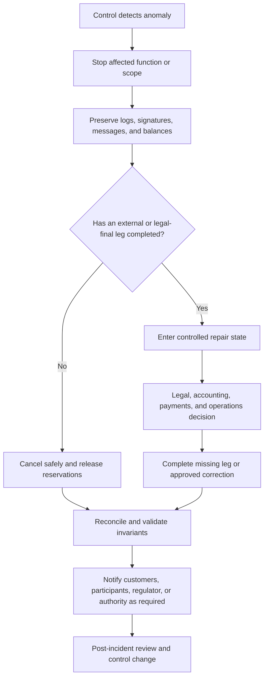

# Tokenized-Deposit Risks, Controls, and Operational Resilience

**Research cut-off:** 24 August 2026 
**Purpose:** define how a bank prevents, detects, responds to, and recovers from tokenized-deposit failures

## 1. Risk changes, even when the liability does not

Keeping the product legally and economically close to an ordinary deposit does not make the operating risk ordinary. Tokenization adds keys, smart contracts, shared infrastructure, new participants, and tightly coupled settlement steps. It can also make value move continuously while the CBS, compliance tools, or payment rails have narrower operating windows.

FINMA's 2025 Risk Monitor treats AML, sanctions, outsourcing, cyberattacks, liquidity/funding, and ICT complexity as principal risks. This is supervisory context rather than a token-specific rule, but it aligns closely with the control areas a tokenized-deposit pilot must evidence ([FINMA Risk Monitor 2025](https://www.finma.ch/en/news/2025/11/20251117-mm-risikomonitor/)).

The terms used in this chapter have distinct meanings:

- A **threat** is a potential cause of harm, such as credential theft or a malicious contract upgrade.
- A **risk event** is the occurrence being controlled, such as an unauthorized transfer or unavailable settlement service.
- An **exposure** is the customer value, legal obligation, data, liquidity, or service affected by that event.
- A **control** changes the probability or impact of the event.
- **Control evidence** demonstrates that the control operated for the relevant transaction, period, or test.
- **Residual risk** is the risk remaining after controls and must be accepted, reduced further, transferred, or avoided by changing the product.

## 2. Control model

The lifecycle uses four layers of control:

- **Prevent:** stop an invalid instruction or unsafe configuration from entering the workflow.
- **Detect:** identify a policy, ledger, accounting, settlement, or security deviation quickly.
- **Respond:** contain the event, preserve evidence, protect customers, and assign ownership.
- **Recover:** restore correct balances and service through a tested, legally approved process.

| Risk | Prevent | Detect | Respond | Recover |
|---|---|---|---|---|
| Unauthorized mint/burn | HSM-backed issuer keys; four-eyes approval; contract role separation; supply limits | Real-time supply and role monitoring | Pause affected asset contract; revoke role; incident escalation | Reconstruct authorized state from CBS and signed event log |
| Duplicate or replayed payment | Global idempotency key; nonce; signed instruction; expiry | Duplicate correlation and message detection | Return original outcome; block conflicting request | Reconcile and reverse only through approved correction process |
| AML/sanctions breach | Verified parties; wallet allow-list; screening; corridor and product restrictions | Combined CBS/token monitoring; behavioral analytics; case alerts | Freeze or reject as legally permitted; investigate; report/escalate | Controlled release or permanent restriction with full evidence |
| Key compromise | HSM/MPC; least privilege; transaction limits; device binding | Anomalous signing and access telemetry | Revoke keys/wallets; pause high-risk flows; notify stakeholders | Re-bind entitlement and rotate keys without creating value |
| CBS/ledger mismatch | Orchestrated posting; supply invariants; no manual mint | Continuous and end-of-day reconciliation | Stop affected mint/transfer/redemption; open incident | Apply legally approved repair from authoritative records |
| Smart-contract defect | Minimal code; independent review; test vectors; staged upgrade | Runtime events, invariant monitors, abnormal revert/latency alerts | Pause affected functions; isolate version | Controlled migration or patched version with state proof |
| Settlement-leg failure | Pre-validation; liquidity check; deadlines; explicit commit boundary | Rail acknowledgements and timeout classification | Cancel before commit or enter repair after final settlement | Release locks or complete the missing bank leg under runbook |
| Provider outage/insolvency | Due diligence; exit plan; data and key portability; service levels | Availability, concentration, financial and control monitoring | Invoke continuity arrangement; limit functions | Rebuild or migrate from bank-controlled records and keys |

The table is a control catalogue, not a complete risk assessment. Each pilot use case must map these controls to named systems, owners, evidence, thresholds, and test results.

The four layers work together. For a duplicate payment, the idempotency key prevents a second execution, monitoring detects conflicting identifiers or unusual retries, the response returns the existing state and contains ambiguity, and recovery reconciles the original instruction to every resulting record. For a compromised issuer key, HSM policy and dual control prevent misuse where possible, telemetry detects abnormal signing, the response revokes the scoped authority and pauses affected contracts, and recovery proves the valid supply before service resumes.

## 3. AML, sanctions, and transaction monitoring

Token transfers should not form a surveillance blind spot separate from account activity. The monitoring model needs one customer and transaction picture across ordinary accounts, token-enabled balances, wallets, counterparties, devices, corridors, and redemptions.

The product risk assessment should explicitly decide:

- allowed customer segments and excluded segments;
- allowed countries and corridors;
- whether unhosted or externally controlled wallets are permitted;
- transaction, balance, velocity, and cumulative limits;
- pass-through and rapid mint-transfer-redeem scenarios;
- mixing, layering, mule, and sanctions-evasion indicators;
- originator and beneficiary data exchanged with participants;
- alert ownership and maximum investigation time.

FINMA Guidance 04/2026 emphasizes explicit risk tolerance aligned with customer segments, products, services, and countries ([FINMA](https://www.finma.ch/en/news/2026/06/20260604-mm-am-04-26/)). This means “existing bank AML controls apply” is not sufficient evidence; the analysis must show how the new transfer and wallet features affect the bank's actual risk profile.

## 4. Retail and wholesale onboarding

Both products require verified identity and current authority, but the evidence and recovery process differ. Retail onboarding focuses on the individual and devices; wholesale onboarding must continuously connect the legal entity, beneficial ownership, signatories, corporate mandates, and technical participant roles.

| Control question | Retail approach | Wholesale/corporate approach |
|---|---|---|
| Identity | Existing verified customer; device and wallet bound to relationship | Verified entity, beneficial owners, authorized signatories, participant ID |
| Authority | Customer authentication and delegated-access rules | Role-based mandates, transaction classes, four-eyes approval |
| Wallet | Bank-issued/recoverable by default | Bank or approved institutional custody with documented operators |
| Change | Step-up authentication and cooling-off for sensitive changes | Dual approval, updated corporate authority evidence, controlled effective date |
| Exit | Redeem, revoke wallet, retain required records | Settle obligations, revoke participant roles, retain rulebook evidence |

The practical difference is not simply higher wholesale limits. Corporate authority can change independently of wallet keys, while retail support must handle lost devices, coercion, incapacity, and customers who do not understand irreversible key operations. Entitlements therefore remain a bank record rather than being inferred solely from a signature.

For a retail customer who loses a phone, the safe process suspends the lost endpoint, verifies the customer through approved recovery controls, binds a replacement credential, and preserves the same legal balance. For a company whose signatory has left, the corporate mandate can revoke that person's authority even if the old key still produces a technically valid signature. The policy engine must evaluate current entitlement, not signature validity alone.

## 5. Key and wallet controls

The bank must know whether it, the customer, or a third party has actual power to dispose of value. That answer drives custody, liability, recovery, and outsourcing analysis.

Minimum controls include:

- issuer keys separated from customer transaction keys;
- HSM or equivalent protected signing for issuer and operator actions;
- dual control for mint, burn, pause, upgrade, and emergency recovery;
- rotation and revocation without changing the economic balance;
- transaction intent displayed before signature;
- address allow-listing or verified-address policy;
- tested lost-key, compromised-key, death, and legal-freeze procedures;
- no provider-only key or data dependency that defeats exit.

FINMA Guidance 01/2026 highlights technological, provider, foreign-law, and bankruptcy risks in cryptoasset custody and states that authorized institutions retain responsibility when using such providers ([FINMA](https://www.finma.ch/en/news/2026/01/20260112-mm-am-01-26/)). Its exact legal scope must be assessed, but its operational lessons are relevant whenever a third party controls keys or asset access.

A key-recovery process must not become an alternate minting process. Re-binding a wallet changes the authorized technical endpoint while preserving the creditor and balance; it should not create a new position before the old one is disabled. Emergency recovery, legal freeze, and customer support roles should also be separated from issuer roles that can change total supply.

## 6. Outsourcing and third-party risk

A DLT node, cloud service, key provider, smart-contract operator, or managed integration layer may perform a critical function even when the vendor describes it as generic infrastructure. The bank must apply current outsourcing and operational-resilience requirements to the actual dependency.

The due-diligence pack should cover:

- service and data locations;
- subcontractor chain;
- bank, auditor, and FINMA access;
- incident notification and evidence;
- recovery objectives and tested failover;
- key, code, configuration, and data portability;
- smart-contract upgrade authority;
- concentration and simultaneous-provider outage;
- orderly exit and emergency transition.

FINMA Guidance 03/2024 reports recurring cyber weaknesses involving outsourced services and clarifies cyber reporting and scenario-based exercises ([FINMA](https://www.finma.ch/en/news/2024/06/20240607-mm-am-cyberrisiken/)). This supports testing the provider chain as part of the bank's critical business service rather than testing only the ledger node.

FINMA Guidance 05/2026 addresses risks from cryptographically relevant quantum computing. It identifies measures including an institution-specific risk analysis, a cryptographic inventory, protection against “harvest now, decrypt later,” provider involvement, a migration roadmap, and crypto-agility ([FINMA, 9 July 2026](https://www.finma.ch/en/news/2026/07/20260709-mm-am-05-26/)). It is not specific to tokenized deposits, but it is particularly relevant where long-lived signatures, encrypted transaction data, HSMs, smart contracts, and shared-network dependencies may be difficult to replace.

For example, a managed DLT service can remain technically available while its signing provider, cloud identity service, or event indexer is unavailable. The product may still be unable to authorize, observe, or prove a transaction safely. Resilience tests should therefore follow the complete customer service and include the bank's ability to operate with provider dashboards unavailable, obtain raw evidence, rotate credentials, and execute the exit plan.

## 7. Service continuity, RTO, RPO, and degraded modes

Availability targets should be expressed in business terms rather than inherited from a ledger vendor. The **recovery time objective (RTO)** is the target time to restore a service or critical capability. The **recovery point objective (RPO)** is the maximum acceptable loss of data measured in time or events. A third measure, the maximum age of a pending or repair state, limits how long customer value can remain unresolved even when systems are technically available.

FINMA Circular 2023/1 requires operational-risk and resilience arrangements proportionate to the institution and its critical functions; it does not prescribe one universal token-platform RTO or RPO. The bank should derive objectives from a business-impact analysis covering customer harm, liquidity, legal deadlines, settlement cut-offs, regulatory reporting, and the ability to reconstruct balances ([FINMA Circular 2023/1](https://www.finma.ch/en/~/media/finma/dokumente/dokumentencenter/myfinma/rundschreiben/finma-rs-2023-01-20221207.pdf)).

For a CBS-authoritative mirrored product:

- authoritative customer balances, transaction identifiers, and accepted event evidence should be designed for no unaccounted data loss;
- a safe read-only or manual-support mode should show the last proven balance and transaction status without permitting unsupported movement;
- no customer-visible finality should be declared while controlling settlement or accounting evidence is unavailable;
- reservations and pending states need maximum durations, expiry behavior, customer communication, and escalation;
- restoration must reconcile the CBS, GL, token ledger, wallet registry, and settlement evidence before affected outbound service resumes.

Resilience tests should include the complete dependency chain: channels, CBS, GL, orchestrator, token nodes, HSM/MPC, identity, AML and sanctions services, message gateway, SIC or correspondents, cloud, telecommunications, monitoring, and support providers. Severe-but-plausible scenarios should include mass redemption, data corruption, duplicate replay, provider loss, key compromise, contract defect or fork, sanctions outage, and participant default.

## 8. Reconciliation and supply integrity

Reconciliation is not an end-of-day clerical control. In a mirrored model it is part of the safety mechanism.

At minimum, compare:

- total issued supply by issuer, currency, and contract version;
- available and locked token positions;
- customer token subledger balances;
- GL control accounts and suspense accounts;
- mint, burn, transfer, fee, and correction events;
- SIC and other external settlement evidence;
- pending transactions by state and age.

A material break should stop new issuance and affected transfers automatically. Operations must not “make the numbers match” through an unexplained manual token or accounting adjustment.

If the CBS shows CHF 10 million of token-enabled liabilities while valid token supply is CHF 10.01 million, the CHF 10,000 difference is not merely an accounting inconvenience. It may represent unauthorized value, a duplicated event, a contract-version error, or a missing booking. Containment should prevent the excess from moving while preserving valid inbound transfers and customer evidence. Investigation then determines the authoritative state and the legally permitted correction.

## 9. Failure ownership

A failure state needs one accountable owner even when several teams contribute to resolution. The table identifies the first protective action and primary owner; detailed runbooks should add consulted functions, escalation deadlines, financial authority, and regulatory-notification decisions.

| Failure state | Immediate action | Accountable owner | Customer/participant message |
|---|---|---|---|
| Policy service unavailable before reservation | Reject or queue without locking value | Compliance/technology service owner | Not processed; no debit |
| CBS unavailable | Stop mint, redeem, and authoritative transfers | CBS service owner | Temporarily unavailable; balance unchanged or reserved status shown |
| Token platform unavailable before commit | Retain or release CBS reservation according to deadline | Token platform owner | Pending with expiry, then cancelled if safe |
| SIC unavailable before settlement | Keep bounded lock or cancel before cut-off | Payments/treasury | Pending or cancelled; no receiver credit |
| SIC final, receiver issuance incomplete | Enter repair; protect evidence and receiver entitlement | Payments plus receiving bank operations | Settled externally; completion under controlled repair |
| Reconciliation breach | Freeze affected product/corridor | Finance/operations incident commander | Transfers limited while balances are validated |
| Suspected key compromise | Revoke and pause scoped access | Security incident commander | Access restricted; recovery process initiated |

The most dangerous ambiguity occurs after one legally or operationally final leg has completed. Those cases cannot be resolved by generic retry logic; they need an agreed claim, accounting treatment, and participant runbook.

## 10. Incident and recovery flow

The diagram describes the response to an event that may have affected balances, authority, or settlement. The first objective is to limit propagation without destroying evidence. The second is to determine whether an external or legally effective leg has already completed, because that decision separates safe cancellation from controlled repair.

Containment can be scoped to one issuer, contract version, corridor, wallet, or transaction type rather than shutting down every service. Once evidence is preserved, legal, finance, payments, compliance, security, and operations determine the customer claim and the status of any final leg. Recovery may mean releasing a reservation, completing a missing credit, posting a correction, migrating a contract, or re-binding credentials. It does not always mean rolling the ledger back.

Customer and participant communication should use economic states—available, reserved, settled externally, credited, or under controlled repair—rather than expose ambiguous component errors. Regulatory, authority, and insurer notifications follow the applicable incident type and reporting rules.

## 11. Evidence required for production

Production evidence must prove both design and operation. Policy owners approve the control objective, system owners demonstrate implementation, independent reviewers challenge critical controls, and business and risk owners accept the remaining exposure.

- threat model and architecture risk assessment;
- product-specific AML and sanctions risk analysis;
- key-management ceremony and recovery evidence;
- independent contract and configuration review;
- reconciliation specification and break simulations;
- third-party due diligence and exit test;
- cyber and operational-resilience scenario results;
- incident-notification decision tree;
- customer and participant communications;
- audit replay from instruction to ledger, CBS, GL, and settlement.

The evidence should include failed tests and their resolution, not only successful demonstrations. Any residual risk that can create unrecognized value, lose a customer claim, bypass a legal restriction, or leave a final settlement leg unowned remains a launch blocker unless the product is changed to remove the exposure.

## What this means for the bank

The objective is not to eliminate every failure. It is to ensure that a failure cannot create hidden value, destroy a valid customer claim, bypass screening, or leave an unowned settlement state. Recovery is part of the product design, not a later operations document.

Next: [08 - Project Agorá and cross-border tokenized deposits](08-project-agora-and-cross-border-tokenized-deposits.md).
