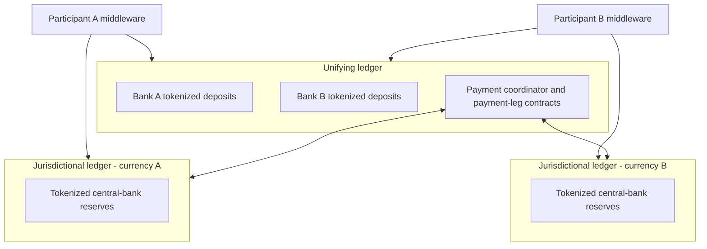
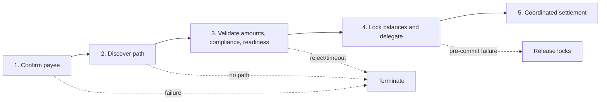

# Project Agorá and Cross-Border Tokenized Deposits

**Research cut-off:** 24 August 2026 
**Primary source:** BIS Innovation Hub, *Project Agorá: A shared programmable platform for wholesale cross-border payments*, May 2026 ([local report](sources/bis/project-agora-2026.pdf))

## 1. Why Agorá matters

Project Agorá is the most relevant large-scale public-private prototype in this research because it combines tokenized commercial-bank deposits with tokenized central-bank reserves in cross-border workflows. Seven central banks, including the SNB, and more than 40 private-sector institutions participated ([report, page 6](sources/bis/project-agora-2026.pdf#page=6)).

It should be used as evidence about architecture and workflow feasibility, not as proof that a Swiss bank's production legal, prudential, or operating model is settled. The report deliberately separates prototype findings from future governance, legal, integration, performance, and resilience work.

## 2. Two-layer architecture

Agorá uses two connected ledger layers:

- a **unifying ledger** holding tokenized commercial-bank deposits and the common payment workflow;
- **jurisdictional ledgers** holding tokenized central-bank reserves for eligible institutions in each currency area.

The ledgers expose common smart-contract interfaces, while participant-operated middleware performs institution-specific checks and consumes ledger events. The architecture therefore does not put the whole payment process or all customer information into one global contract.

## 3. Authority model: the critical difference

Agorá's prototype treats balances and transactions recorded on its platform as the authoritative “golden source” for tokenized deposits. Participants reconcile their internal systems to the platform ([report, page 15](sources/bis/project-agora-2026.pdf#page=15)).

That is materially different from the CBS-authoritative recommendation in this research:

| Question | Agorá prototype | Recommended first Swiss-bank pilot |
|---|---|---|
| Authoritative tokenized balance | Project Agorá platform | Bank CBS/customer subledger |
| Internal books | Reconciled to platform | Authorize and control token representation |
| Shared workflow | Central design element | Added only where multiple parties need shared state |
| Production rulebook | Future work | Required before external participant pilot |
| Migration significance | Prototype architecture choice | Moving authority to DLT is a separate product and regulatory decision |

The difference does not mean one architecture is universally better. It means controls, legal terms, accounting recognition, error correction, and resolution cannot be copied between them without redesign.

## 4. Participants and assets

Direct participants are limited to central banks and commercial banks. The platform design also contemplates initiation service providers and indirect participants; tokenized commercial-bank deposits are held for wholesale/corporate or financial-institution activity rather than individual retail users ([report, page 61](sources/bis/project-agora-2026.pdf#page=61)).

The report treats tokenized deposits as ordinary commercial-bank deposits represented on the platform, with the legal relationship grounded in issuer account records and agreements. This supports the core proposition that token technology does not itself create a new kind of issuer.

## 5. Five-stage payment workflow

Agorá structures payments into five stages ([report, pages 25 and 28](sources/bis/project-agora-2026.pdf#page=25)):

1. **Confirmation of payee:** the creditor institution verifies beneficiary information before the payment proceeds.
2. **Path discovery:** participants identify a viable route, potentially including intermediary banks and FX providers.
3. **Validation:** each institution performs its own compliance, operational, amount, and readiness checks.
4. **Locking and delegation:** required balances are reserved and narrowly scoped settlement authority is delegated.
5. **Settlement:** payment-leg contracts execute after all required conditions are satisfied.

This sequencing is valuable because expensive locking occurs only after identity, path, amount, and readiness checks. It also makes failures explicit rather than leaving each bank to infer the state of other participants.

## 6. Smart-contract and middleware layers

Agorá separates shared coordination logic from participant-private execution. The table shows why not every check or commercial decision belongs in a common smart contract even when all participants rely on the resulting workflow.

| Layer | Function | Information placement |
|---|---|---|
| Asset contracts | Issue, redeem, transfer, lock, and delegate tokenized deposits/reserves | Minimal asset state and commitments |
| Payment coordinator | Authoritative workflow state, deadlines, participant readiness, outcome | Shared workflow status |
| Payment-leg contracts | Execute scoped settlement legs | Leg state and settlement events |
| Reference contracts | Participants, assets, currencies, and configuration | Shared reference data |
| Participant middleware | Confirmation of payee, pathfinding, compliance, pricing, amount calculation, readiness | Institution-private data and logic |

The coordinator enforces sequencing but does not itself perform each bank's customer or compliance checks. It consumes endorsed outcomes. This separation is directly reusable: a bank should not disclose raw KYC files or sanctions reasoning merely to prove that a check passed.

## 7. Privacy architecture

Agorá combines two mechanisms:

- **Noto** uses an issuer-backed/notary, commitment-based UTXO-style model for token-level privacy ([report, pages 40–41](sources/bis/project-agora-2026.pdf#page=40)).
- **Pente** provides privacy-group-scoped workflow execution and ephemeral EVM mechanics for participant-specific coordination ([report, pages 40 and 42](sources/bis/project-agora-2026.pdf#page=42)).

The design shows that shared verification does not require all participants to see every customer, path, amount calculation, or compliance input. It does not remove the need for lawful information exchange, regulatory access, data governance, or analysis of metadata leakage.

## 8. Atomic settlement and legal finality

In the prototype, “atomic” means the coordinated workflow reaches a complete settlement outcome or terminates according to its rules. It does not necessarily mean every ledger is updated at the same physical instant.

The legal analysis contemplates giving an atomic settlement trigger on the unifying ledger legal significance through jurisdiction-specific rulebooks, while actual ledger updates may occur asynchronously ([report, pages 70–71](sources/bis/project-agora-2026.pdf#page=70)). This is a proposal for a legally supported rulebook mechanism, not proof that technical consensus alone creates legal finality.

## 9. Demonstrated use cases

The report illustrates:

- an urgent financial-services payment between Mexico and the United States;
- a same-day Swiss-Korean corporate payment using path discovery and a vehicle currency;
- cross-border GBP/JPY liquidity balancing with payment-versus-payment.

These examples show how confirmation of payee, path discovery, private validation, amount agreement, locking, and coordinated settlement can reduce sequential hand-offs. They do not establish production cost savings or legal availability in every corridor.

## 10. What the prototype did not establish

The report expressly identifies production work still needed, including performance and scalability benchmarking ([report, page 90](sources/bis/project-agora-2026.pdf#page=90)) and governance/rulebook design ([report, page 91](sources/bis/project-agora-2026.pdf#page=91)). It did not establish:

- production cybersecurity posture;
- operational resilience, failover, or disaster recovery;
- throughput and latency under real load;
- liquidity optimization;
- live integration with production CBS and RTGS systems;
- production monitoring and support;
- final operating governance and liability allocation;
- definitive legal opinions for every implementation detail.

Those limitations matter because the hardest bank risks often arise outside the happy-path smart contract: operating a key service, repairing an externally final payment, maintaining 24/7 support, or resolving a participant insolvency.

## 11. Adopt, adapt, or do not infer

The prototype offers patterns at different levels of maturity. The following classification distinguishes ideas that can be reused directly as research patterns, ideas that require adaptation to the Swiss CBS-authoritative pilot, and conclusions the prototype does not support.

| Pattern | Decision | Swiss-bank interpretation |
|---|---|---|
| Five-stage workflow | Adopt | Strong model for pre-validation, readiness, locking, and commit/cancel |
| Participant middleware | Adopt | Keep institution-specific compliance and pricing private |
| Minimal shared data | Adopt | Use attestations and opaque references, subject to regulatory access |
| Asset/workflow/reference contract separation | Adopt | Supports clear responsibilities and upgrades |
| Platform as golden source | Adapt later | First prove CBS-authoritative model; migrate only with legal/accounting approval |
| Jurisdictional reserve ledgers | Adapt | Begin with current SIC integration; study tokenized reserves as infrastructure evolves |
| Privacy mechanisms | Evaluate | Reuse principles; select technology after threat, legal, and support assessment |
| Atomicity claim | Qualify | Describe workflow, ledger, accounting, and legal finality separately |
| Production readiness | Do not infer | Prototype success is not evidence of scale, resilience, governance, or regulatory approval |

The table is a bridge, not a procurement decision. Agorá offers strong design patterns, but the Swiss pilot should preserve the bank's chosen authority model and use existing settlement infrastructure until the legal and operational case for deeper integration is proven.

## 12. Agorá, Helvetia, SIC, and the SBA proof of concept

These initiatives are related but answer different questions. Treating them as one Swiss tokenized-money model would obscure which asset, ledger, participant, and settlement mechanism each one tests.

| Initiative or infrastructure | Principal question | Money or instruction involved | What it does not establish |
|---|---|---|---|
| SIC | How eligible participants settle CHF payment obligations through the Swiss payment system | Sight deposits at the SNB; current payment-system messages and rules | It does not issue or operate the customer's tokenized deposit |
| Project Helvetia | How tokenized assets can settle in central-bank money through integrated wCBDC or a synchronized RTGS link | Wholesale CBDC on the SIX Digital Asset Platform or traditional central-bank money through SIC | It is not a retail CBDC or a commitment to permanent wCBDC |
| Project Agorá | How multiple currencies and jurisdictions can coordinate wholesale cross-border payments on programmable ledgers | Platform-authoritative tokenized commercial-bank deposits and tokenized central-bank reserves | The prototype does not provide production resilience, live integration, or a final Swiss legal rulebook |
| SBA Deposit Token PoC | Whether tokenized payment instructions can trigger legally meaningful off-chain bank-account payments and programmable escrow-like workflows | On-chain payment instructions linked to off-chain bank deposits and mirror-account movements | It did not make the instruction token a native on-chain deposit claim |

The SNB currently describes Helvetia as covering both integrated settlement with wCBDC and synchronized settlement through an RTGS link, with the project running until at least June 2028. It also states that the pilot is not a commitment to introduce wCBDC permanently ([SNB Helvetia FAQ](https://www.snb.ch/en/services-events/digital-services/faq-overview/qas_helvetia)).

For the proposed bank pilot, SIC is the existing settlement baseline, the SBA PoC is the closest Swiss evidence for tokenized payment instructions and lightweight CBS interaction, Helvetia informs the central-bank-money settlement leg for tokenized assets, and Agorá supplies the most developed cross-border programmable-workflow pattern. None of them removes the need to choose the bank's own claim and record-authority model.

## What this means for the bank

Agorá supports the feasibility of coordinated cross-border workflows and privacy-preserving shared state. Its most reusable result is the separation of private institutional decisions from deterministic shared orchestration. Its most important warning is that architecture, legal finality, and production operations must be developed together.

Next: [09 - Tokenized-deposit implementation roadmap and vendor assessment](09-tokenized-deposit-implementation-roadmap-and-vendor-assessment.md).
