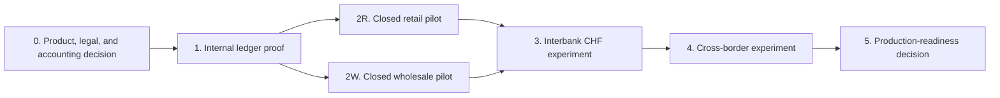

# Tokenized-Deposit Implementation Roadmap and Vendor Assessment

**Research cut-off:** 24 August 2026 
**Purpose:** turn the research into staged evidence without committing prematurely to a vendor or production model

## 1. Delivery principle

The project should retire its largest uncertainties in the order they can invalidate later work. Legal claim and accounting recognition come before ledger selection; same-bank controls come before interbank coordination; production integration comes before broad customer reach.

The ordering is deliberate. If the bank cannot identify the creditor or recognition point, a working token contract proves the wrong thing. If same-bank issuance and recovery are not deterministic, adding SIC or another participant multiplies rather than resolves the ambiguity. Cross-border work comes later because it adds currency, jurisdiction, data, liquidity, sanctions, and operating-hour dependencies to a lifecycle that should already be understood domestically.

The roadmap is not a promise that every stage will be reached. Each gate can produce one of three outcomes: **proceed** with the stated scope, **rework** a defined gap and repeat the evidence, or **stop** because the benefit does not justify the legal, financial, or operating model.

Parallel retail and wholesale pilots should share the same issuance, ledger, reconciliation, key, and incident foundations. They should differ in customer journeys, mandates, limits, protection, and use-case logic rather than becoming two separate technology stacks.

## 2. Stages and gates

Each gate asks whether the previous stage produced reliable evidence, not whether the project team completed a list of activities. A stage can end with a decision to stop if tokenization adds no benefit or if claim, settlement, or recovery questions remain unresolved.

| Stage | Entry criteria | Evidence to produce | Exit decision |
|---|---|---|---|
| 0. Classification | Defined product variants and target users | Legal memo, accounting position, prudential map, AML risk assessment, regulator/auditor questions | One bounded product model approved for technical proof |
| 1. Internal ledger proof | Authority and journal model agreed | Mint/transfer/burn state machine, reconciliation, key controls, injected-failure results | Same-bank invariants proven |
| 2R. Closed retail pilot | Retail terms, support, fraud and recovery ready | Comprehension, access recovery, exception handling, privacy and performance evidence | Retail value and protection acceptable |
| 2W. Closed wholesale pilot | Corporate mandates and workflow use case ready | Conditional-payment automation, four-eyes control, audit replay, liquidity evidence | Wholesale value and control acceptable |
| 3. Interbank CHF | Two banks, rulebook, SIC design, liability model agreed | End-to-end settlement, repair cases, liquidity, participant exit, legal-finality analysis | Interbank model viable |
| 4. Cross-border | Named corridor, currencies, regulated partners, legal/AML analysis | Payee confirmation, path/FX, PvP, data, sanctions, time-zone and failure evidence | Corridor-specific case proven |
| 5. Production decision | All control owners accept evidence | Operating model, service levels, audit, regulatory feedback, vendor exit, financial case | Go, rework, or stop |

Passing a technical demonstration is never enough to pass a gate. Each gate requires evidence from legal, compliance, finance, treasury, operations, security, technology, and the product owner.

Completion of activities and retirement of uncertainty are different. A team may have built every planned interface yet still lack evidence that a partial settlement failure preserves the correct customer claim. Conversely, a stage can succeed by demonstrating that tokenization has no material advantage over an account API, allowing the bank to stop before incurring external-network cost.

## 3. Stage 0: decision package

Before building, approve:

- issuer, holder, debtor, and creditor for each flow;
- CBS-authoritative versus platform-authoritative model;
- retail and wholesale eligibility;
- token legal role and transfer effect;
- accounting recognition and reversal points;
- depositor-protection position;
- interbank model to test first;
- permitted wallets and custody arrangements;
- FMI and outsourcing perimeter;
- regulator, counsel, and auditor engagement plan.

The output should be versioned. A change in transferable holder, external wallet access, record authority, interbank liability, or settlement asset reopens the relevant approvals.

### Decision ledger

The decision ledger is the approval spine of the project. An issue is not closed because a meeting occurred or code was built; it is closed when the named approver records the decision, assumptions, evidence, residual risk, effective product version, and review trigger.

| Field | Required content |
|---|---|
| Decision ID and title | Stable identifier and one precise question |
| Status | Open, evidence in progress, proposed, approved with conditions, rejected, or superseded |
| Owner and approver | Person preparing the decision and function with authority to approve it |
| Product/version and scope | Model, customers, wallets, flows, entities, currencies, and corridor affected |
| Evidence required | Exact legal text/opinion, accounting memo, test, measurement, rulebook, or authority response |
| Dependencies | Other decisions that must close first |
| Decision and rationale | Selected position, rejected alternatives, and reason |
| Residual risk and conditions | Remaining exposure, limits, monitoring, expiry, and stop trigger |
| Dates | Opened, due, last reviewed, approved, and next review |
| Links | Chapters, claims, source IDs, tests, minutes, and signed artefacts |

Seed the ledger with the decisions that can invalidate the pilot:

| ID | Decision | Owner | Approver | Blocks |
|---|---|---|---|---|
| DL-01 | Is the product a payment instruction, CBS-authoritative mirrored deposit, or platform-authoritative deposit? | Product and Swiss counsel | Executive sponsor / legal | Terms, architecture, accounting |
| DL-02 | Which record and event change the creditor for each permitted flow? | Legal and operations | General counsel | Transfer, finality, recovery |
| DL-03 | What are the approved recognition, suspense, correction, interest, fee, and disclosure treatments? | Finance policy | CFO / external auditor as applicable | Pilot accounting and reporting |
| DL-04 | Which data may enter shared state, where may it be processed, and how are bank secrecy and foreign access controlled? | Privacy, legal, security | Data owner / general counsel | Network and provider design |
| DL-05 | Who owns and operates the scheme, and who can admit, suspend, upgrade, pause, or terminate participants and contracts? | Strategy and network governance | Executive sponsor / governing body | Multi-party pilot |
| DL-06 | What liquidity is reserved, available after hours, and funded during mass redemption or partial settlement? | Treasury and payments | Treasurer / ALCO | Interbank and 24/7 service |
| DL-07 | How do depositor protection, recovery, resolution, and customer statements treat token-enabled balances? | Legal and finance | General counsel / CFO | External customer pilot |
| DL-08 | Does the measured use case outperform CBS automation, API, SIC instant payment, or escrow after full operating cost and risk? | Product finance | Business sponsor | Continue, narrow, or stop |
| DL-09 | What operator/FMI, outsourcing, AML, tax, and regulatory perimeter applies? | Legal, compliance, tax | Relevant accountable executives | External network and production |
| DL-10 | Which party funds and owns every partial-failure state and participant default? | Operations, payments, legal | Scheme governing body | Interbank and cross-border pilot |

The detailed open questions remain in [chapter 10](10-tokenized-deposit-sources-and-regulatory-watch.md#5-decision-ledger). Chapter 10 is the maintained control record; this chapter defines how decisions gate delivery.

## 4. Internal proof and pilot scenarios

### Internal ledger proof

The internal proof uses simulated or controlled customers to establish the value invariant and lifecycle. The expected outcome is not a polished wallet. It is evidence that every mint, transfer, lock, release, burn, retry, pause, and correction produces the approved CBS, GL, token, and audit result.

Implement only:

- verified test customers;
- CHF 1:1 issuance and redemption;
- same-bank transfer;
- one conditional lock/release;
- idempotency and deterministic failure recovery;
- three-way CBS/GL/token reconciliation;
- controlled pause and key rotation.

Avoid external chains, cross-bank assets, yield, public access, or complex DeFi integration at this stage. They add perimeter questions before the core deposit model is proven.

The proof should inject at least one lost response, duplicate request, ledger outage, CBS outage, key rotation, and reconciliation mismatch. Exit evidence includes a replayable timeline and an independently verified return to the correct balances.

### Closed retail pilot

Use a controlled conditional merchant payment:

- low limits;
- bank-managed recoverable wallet;
- approved merchants;
- one objective release condition;
- expiry and refund path;
- plain-language statements and support.

The pilot should test whether customers understand that the value remains a claim on the issuing bank, especially while funds are locked or a transaction is pending.

A representative journey begins when a verified customer reserves a low CHF amount for an approved merchant. The release condition succeeds, expires, or is disputed; the customer then recovers access after a simulated lost device. The gate considers comprehension, support demand, false positives, privacy, reconciliation, and economic benefit as well as technical completion.

### Closed wholesale pilot

Use a same-bank corporate conditional payment:

- two or more verified corporates;
- role-based authority and four-eyes release;
- shared workflow state;
- bank-private documents and compliance;
- measurable reduction in manual coordination.

This proves programmable business workflow without making SIC or another bank part of every failure scenario.

A representative journey has two corporate customers approve a conditional payment under current mandates, reserve liquidity, satisfy an objective milestone, and replay the complete evidence to their finance teams. The pilot also removes one signatory during a pending workflow and injects a failed release to prove that corporate entitlement and recovery do not depend solely on wallet keys.

## 5. Scheme governance and operating model

A multi-bank tokenized-deposit arrangement needs an identifiable operator and binding rules even if its execution logic is decentralized. Software can enforce a permitted transition, but it cannot approve participants, allocate an uninsured loss, answer a regulator, amend governing law, or fund a repair state by itself.

| Governance domain | Decision required before interbank pilot | Minimum evidence |
|---|---|---|
| Legal form and ownership | Operator entity, owners, governing law, purpose, authority and regulatory perimeter | Formation documents, legal/FMI analysis, ownership and conflicts register |
| Governing body | Board or committee composition, reserved matters, voting, quorum, public-interest and participant representation | Charter, delegation matrix, minutes and escalation route |
| Participation | Eligibility, admission, due diligence, technical certification, limits, suspension, termination and re-entry | Participant rulebook, admission test and appeal process |
| Money and liabilities | Permitted issuers, currencies, holder classes, authority model, redemption, settlement asset and debtor transformation | Product schedules, legal opinions and accounting policies by issuer |
| Change and software governance | Proposal, testing, approval, notice, activation, emergency pause, rollback/migration and version support | Release policy, multi-party test evidence, signing/key ceremony and change log |
| Risk and default | Limits, collateral/prefunding, liquidity shortfall, participant default, loss allocation, unwind/close-out and recovery | Default rules, funded resources, simulation and treasury approval |
| Operations and service | Service hours, support, monitoring, incident command, repair ownership, RTO/RPO and degraded modes | Operating manual, service levels, rota, exercises and participant contacts |
| Data and access | Shared fields, confidentiality, regulatory/audit access, node rights, logs, retention and foreign support | Data-governance schedule, access matrix, privacy/outsourcing assessment |
| Assurance | Control ownership, independent review, audit rights, reporting, metrics and regulator engagement | Control framework, audit plan, evidence format and reporting calendar |
| Commercial and exit | Fees, cost allocation, IP, vendor concentration, portability, participant exit and scheme wind-down | Financial model, contracts, export/rebuild test and wind-down plan |

The CPMI identifies legal setup, ownership, operational structure, governing body and stakeholder engagement as core governance decisions for cross-border payment interlinking. Its tokenisation work likewise states that benefits depend on sound governance and risk management ([CPMI governance report](https://www.bis.org/cpmi/publ/d223.htm); [CPMI tokenisation report](https://www.bis.org/cpmi/publ/d225.htm)). These sources are not Swiss scheme approval; they provide a structured governance baseline to apply with Swiss law, FINMA expectations, system rules and participant contracts.

The recommended first same-bank pilot can remain under the bank's existing product and technology governance, with named internal ownership. The table becomes a binding multi-party workstream when another bank, shared operator, external settlement asset, or common contract can affect customer value.

## 6. Vendor assessment method

Do not ask whether a vendor “supports blockchain” or “supports digital assets.” Ask the vendor to demonstrate the exact bank-liability workflow and provide evidence under failure.

| Capability | Evidence requested | Red flag |
|---|---|---|
| CBS posting and reservation | Real-time, idempotent API; booking references; reversal behavior | Batch-only integration or untraceable shadow balance |
| Record authority | Documented source of truth and mismatch process | Vendor assumes its ledger is authoritative without bank approval |
| Issuance controls | Role separation, limits, HSM/MPC, approval workflow | Administrator can mint directly |
| Identity and privacy | Opaque identifiers, entitlement integration, selective disclosure | Personal/customer data replicated to all nodes |
| Settlement integration | Original ISO 20022/SIC references, state model, timeout handling | “Atomic” claimed without external settlement evidence |
| Reconciliation | Supply, locked value, subledger, GL, settlement comparison | End-of-day total only; no event-level proof |
| Recovery | Tested partial-failure and state-rebuild process | Retry is the only recovery strategy |
| Observability | Correlated logs, signed events, metrics, audit export | Provider-only dashboards or inaccessible logs |
| Upgrade/governance | Versioning, approvals, rollback/migration, participant notice | Unilateral contract change or opaque managed upgrade |
| Portability and exit | Exportable state, code/config, keys, runbooks, transition test | Proprietary state cannot be reconstructed outside provider |

Cryptographic portability should include an inventory of algorithms, keys, certificates, signatures, encrypted data, hardware dependencies, and participant interfaces. The vendor should explain how cryptographic components can be rotated or migrated without losing the ability to validate historical evidence or access current balances.

The score should reflect demonstrated evidence, not roadmap promises. A feature marked “available” but untested against the bank's recognition points and recovery states should score as unproven.

The vendor demonstration should include prescribed tasks rather than a free-form product presentation:

1. submit the same payment twice with one idempotency key and prove that value moves once;
2. lose the response after a successful ledger event and recover the original result;
3. rotate a customer or operator key without changing the economic balance;
4. introduce a CBS/token mismatch and demonstrate containment, evidence, and correction;
5. export state, configuration, audit events, and keys or key-control evidence in a usable form;
6. rebuild or migrate the service without relying on the provider's normal dashboard.

## 7. Capability scorecard

Score each area from 0 to 4:

- **0 - absent:** no credible capability.
- **1 - claimed:** presentation or roadmap only.
- **2 - demonstrated:** controlled demonstration, not bank-integrated.
- **3 - evidenced:** integrated test with failure and audit evidence.
- **4 - production proven:** comparable regulated operation with contractual support.

| Area | Weight | Minimum before external pilot |
|---|---:|---:|
| CBS/GL integrity and idempotency | 20% | 3 |
| Supply, contract, and key controls | 15% | 3 |
| Reconciliation and audit | 15% | 3 |
| Failure recovery and resilience | 15% | 3 |
| Identity, AML, sanctions, and privacy integration | 15% | 3 |
| Settlement adapters | 10% | 2 for same-bank; 3 for interbank |
| Governance, portability, and exit | 10% | 3 |

A weighted total cannot compensate for a critical zero. CBS integrity, unauthorized value creation, regulatory access, data portability, and deterministic recovery are pass/fail capabilities.

The scorecard supports comparison; it does not replace judgment. A vendor with strong programmability but no credible state-rebuild or regulatory-access model is not suitable for the pilot. Scores should cite the demonstration, document, test result, contractual commitment, and limitation that support them.

## 8. Quantitative business case and evidence

The business case compares the complete service against the best non-token alternative. It should measure the same use case, volumes, service window, risk boundary and customer outcome before and during the pilot. No benefit is claimed until both baseline and pilot evidence exist.

| Measure | Baseline to capture | Pilot target method | Do not omit |
|---|---|---|---|
| End-to-end completion | Median and tail time from accepted instruction to usable beneficiary value | Same timestamps and percentile definition | Time spent pending, under review, or in repair |
| Cut-off and availability failures | Transactions delayed/rejected by operating hours or unavailable dependencies | Reduction attributable to the new workflow | Treasury, compliance, support and settlement-rail hours |
| Exceptions and investigations | Rate, age, cause and staff minutes per case | Lower rate or faster controlled resolution | False positives, customer contacts and unresolved cases |
| Reconciliation effort | Systems compared, breaks, manual touches and time to close | Event-level automated match and bounded breaks | New ledger, node, provider and cross-network reconciliations |
| Liquidity usage | Peak and average prefunding, intraday credit, locked value and lock duration | Lower requirement or shorter lock without more settlement risk | Weekend buffers, FX legs, stress and participant-default funding |
| Collateral usage | Amount, haircut, opportunity cost and substitutions | Reduction or improved mobilization | New margin, guarantee or scheme-default resources |
| Fraud and operational loss | Loss, prevented attempts, recovery and customer reimbursement | No weaker outcome; quantified improvement if observed | Novel wallet, key, contract, bridge and social-engineering losses |
| Operating capacity | FTE hours by operations, support, treasury, compliance, finance and technology | Net time removed after new controls and on-call duties | 24/7 coverage, incident exercises and specialist dependency |
| Integration and run cost | Build, licences, nodes, vendors, controls, assurance and change cost | Total cost at pilot and credible scaled volumes | Duplicated infrastructure, exit, audit and regulatory work |
| Customer/participant value | Success, comprehension, support demand, adoption, willingness to use and avoided delay | Pre-agreed improvement with no material protection regression | Selection bias and incentives used to recruit pilot users |

Use a small number of transparent calculations:

- **Net annual benefit** = avoided operational, failure, liquidity and collateral cost + evidenced revenue or loss reduction - incremental run and governance cost.
- **Pilot investment case** = expected risk-adjusted benefit over the approved horizon - build, integration, assurance, migration and exit cost.
- **Break-even volume** = fixed annual incremental cost / contribution or avoided cost per successful transaction.
- **Liquidity benefit** = baseline peak or time-weighted liquidity cost - pilot result, measured under comparable stress and service hours.

Each input needs an owner, source system, observation period, unit, population, confidence/limitation, baseline date and approval. Benefits should be reported as ranges where adoption, scale, loss avoidance or liquidity pricing is uncertain. Safety invariants—no duplicate value, unexplained supply, or lost claim—remain pass/fail conditions and are never monetized to excuse a control failure.

### Safety and correctness

- unexplained supply or reconciliation breaks: zero;
- duplicate value movements: zero;
- transactions without complete authorization evidence: zero;
- recovery tests completed within objective;
- percentage of events replayable end to end.

### Customer and business value

- end-to-end completion time;
- manual steps and reconciliations removed;
- transaction rejection and exception rate;
- liquidity locked and duration;
- customer comprehension and support contacts;
- total fee and FX transparency;
- cost per successful transaction at realistic scale.

### Resilience

- availability by critical service;
- recovery time and recovery point achieved;
- age and volume of pending/repair states;
- provider and network concentration;
- time to detect and contain key or contract incidents.

The project should set numeric targets at each gate based on use-case needs. This chapter defines what to measure; it does not invent production service levels before volumes and legal obligations are known.

Every value KPI needs a baseline. “Settlement completed in five seconds” is not evidence of benefit if the existing account API completes in two seconds or if manual exception work increases. Safety metrics are different: zero unexplained supply breaks and zero duplicate value movements are invariants, not benefits that can be traded against speed or revenue.

A pilot can therefore be technically successful and commercially unsuccessful. If it preserves balances and recovers correctly but customers do not understand it, counterparties will not join, or operating cost exceeds the eliminated reconciliation cost, the appropriate gate decision may be to stop or narrow the use case.

## 9. Production-readiness decision

Production requires affirmative sign-off on:

- product and legal classification;
- accounting and prudential policy;
- FINMA engagement or ruling where needed;
- AML/sanctions model;
- customer and participant terms;
- cybersecurity and operational resilience;
- reconciliation and incident operations;
- vendor and network governance;
- capacity and financial case;
- recovery, resolution, and exit.

Any unresolved issue affecting the identity of the creditor, amount of the bank liability, settlement finality, or ability to recover customer value is a no-go, not a post-launch enhancement.

Sign-off should identify the accountable executive, control owners, accepted residual risks, conditions, expiry dates, and stop authority. A production decision is tied to the approved product version. Adding external wallets, new jurisdictions, a different authoritative ledger, or broader participant access reopens the relevant gates rather than inheriting the previous approval automatically.

## What this means for the bank

The roadmap is an evidence funnel. It deliberately delays the expensive and risky external network work until the bank can prove that its own books, token supply, customer rights, and recovery process remain correct under failure.

Next: [10 - Tokenized-deposit sources and regulatory watch](10-tokenized-deposit-sources-and-regulatory-watch.md).
