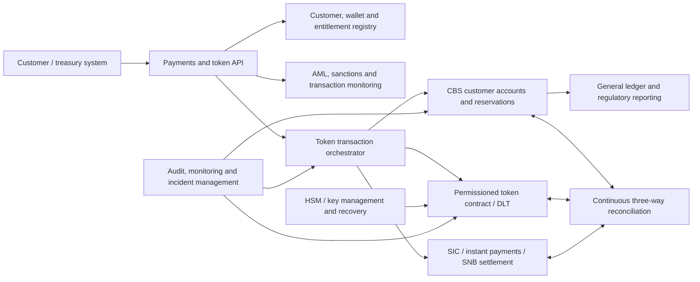

# 99 — Archived starter note

> This file is retained for research history. The current, expanded documentation is in [the deep dive](01-swiss-tokenized-deposits-deep-dive.md), [the legal/regulatory framework](02-legal-regulatory-framework.md), [the booking/accounting note](03-booking-accounting-prudential.md), [the CBS/operations note](04-cbs-operations-and-vendor-assessment.md), and [the executive summary](00-executive-summary.md).

## Archived content: tokenized deposits in a Swiss bank

## Starter note: booking model, FINMA framing and core banking systems

**Research date:** 13 August 2026  
**Scope assumed:** a FINMA-licensed Swiss bank issuing CHF-denominated tokenized commercial-bank deposits to identified customers.

> This is a design and research note, not a legal or accounting opinion. FINMA has not published a prescribed chart of accounts or journal-entry model for tokenized deposits. The legal contract, the identity of the debtor and creditor, settlement finality, and which ledger is authoritative must be confirmed with Swiss legal counsel, the bank's external auditor and FINMA before production.

## 1. Executive conclusion

For a first implementation, the cleanest model is a **tokenized-deposit subledger with the core banking system (CBS) and general ledger remaining authoritative**.

- The customer's conventional deposit is reclassified into a dedicated tokenized-deposit liability or customer-specific mirror account.
- The bank mints exactly the same nominal amount on the controlled token ledger.
- Minting, burning and transfers are allowed only for identified and permissioned wallets.
- A customer can never spend both the conventional balance and the token balance.
- The total on-chain supply must equal the corresponding CBS tokenized-deposit control balance at all times.
- Interbank transfers settle through central-bank money (normally SIC/SNB sight deposits), with the sending bank extinguishing its liability and the receiving bank creating a new liability.

This preserves today's banking balance-sheet logic. Tokenization changes the representation and payment rail, not the economic nature of the deposit. The Swiss Bankers Association's 2025 proof of concept used an even less intrusive version: the token represented a **payment instruction**, while customer deposits stayed off-chain in CBS mirror accounts. The SBA explicitly says deeper CBS integration and accounting-framework integration remain future work.

## 2. First decision: what exactly is the token?

This must be fixed before selecting the booking model.

| Model | Legal/economic meaning | Authoritative record | Initial assessment |
|---|---|---|---|
| **A. Payment-instruction token** | Token instructs an off-chain payment; it is not itself the deposit | CBS | Lowest-impact pilot. This is the 2025 SBA PoC approach. Limited benefit if every transfer immediately becomes a conventional payment. |
| **B. Mirrored tokenized deposit** | Token represents a customer's claim on the issuing bank; the same liability is controlled in CBS | CBS, with DLT as tightly reconciled subledger | Recommended production starting point, subject to legal confirmation. Good control and reporting fit. |
| **C. Native on-chain deposit** | DLT balance is the authoritative deposit record | DLT, with CBS/GL receiving summarized postings | Long-term model with stronger programmability, but substantially harder for legal finality, recovery, operations, reporting and CBS integration. |
| **D. Non-bank stablecoin backed or guaranteed by a bank** | Holder has a claim against a separate issuer, possibly supported by bank assets or a default guarantee | Issuer ledger | Not the same as a bank's own tokenized deposit. FINMA Guidance 06/2024 focuses substantially on this structure and its risks. |

The name used in marketing does not determine the regulatory treatment. FINMA applies a technology-neutral, substance-over-form analysis.

## 3. Recommended balance-sheet and booking model

Assume both conventional customer deposits and tokenized customer deposits are liabilities of the same bank. The token is denominated in CHF and redeemable at par.

### 3.1 Chart-of-accounts structure

At general-ledger level:

- **Customer deposits – conventional** (liability)
- **Customer deposits – tokenized** (liability; ideally a separate management subcategory mapped to the appropriate FINMA financial-statement line)
- **Token settlement pending / clearing** (temporary liability or asset, depending on direction)
- **SNB sight deposit / SIC settlement account** (asset)
- **Due from / due to banks** (temporary interbank items where settlement is not immediate)
- **Fee income / interest expense** as applicable

At subledger level, maintain at least:

- customer ID and beneficial owner;
- deposit account ID;
- wallet address and wallet status;
- issuing bank and token contract/version;
- available, reserved, frozen and pending balances;
- transaction ID linking CBS, payment message and DLT transaction hash;
- mint, burn, transfer, freeze and recovery events;
- legal timestamp and finality status.

### 3.2 Journal entries

The entries below show the bank's books. Debit and credit treatment follows bank accounting: reducing a deposit liability is a debit; increasing it is a credit.

#### Conversion from a conventional deposit to a tokenized deposit

| Debit | Credit | Effect |
|---|---|---|
| Customer deposits – conventional | Customer deposits – tokenized / mirror account | Liability reclassification only; no new asset and no P&L |

Only after the CBS amount is successfully reserved/reclassified should the same amount be minted to the customer's approved wallet.

#### Redemption / burn

| Debit | Credit | Effect |
|---|---|---|
| Customer deposits – tokenized / mirror account | Customer deposits – conventional | Reverse of minting |

The token should be irrevocably burned or disabled before the conventional balance becomes spendable. The process needs compensating steps if either side fails.

#### Transfer between two customers of the same bank

| Debit | Credit | Effect |
|---|---|---|
| Payer's tokenized-deposit liability | Payee's tokenized-deposit liability | No change in total bank liabilities or assets |

The on-chain transfer and customer-subledger transfer should become final together, using a controlled state machine rather than two independent postings.

#### Transfer from Bank A to Bank B, with immediate central-bank-money settlement

**Bank A (sending bank)**

| Debit | Credit |
|---|---|
| Customer's tokenized-deposit liability | SNB sight-deposit / SIC settlement asset |

**Bank B (receiving bank)**

| Debit | Credit |
|---|---|
| SNB sight-deposit / SIC settlement asset | Recipient's tokenized-deposit liability |

The Bank A token must be extinguished and Bank B must issue its own deposit claim to the recipient. This avoids treating one bank's liability as if it were transferable unchanged onto another bank's balance sheet. It also follows the BIS model for preserving the “singleness of money”: private bank liabilities change while interbank settlement occurs in central-bank money.

If settlement is not immediate, use tightly controlled **due-to/due-from-bank or settlement-pending accounts**, with limits and timeouts. Do not show an incoming customer token balance as final and spendable before the receiving bank has accepted the customer/wallet and settlement is final.

#### Interest and fees

- Interest credited to the tokenized deposit: **Dr interest expense / Cr tokenized-deposit liability**.
- Fee collected from the token balance: **Dr tokenized-deposit liability / Cr fee income** (plus tax payable if applicable).
- A freeze, lien, key loss or wallet recovery normally changes availability or control status, not the balance sheet, unless the legal claim itself changes.

### 3.3 Reconciliation equations

At minimum, enforce continuously:

1. `Total valid token supply = total tokenized-deposit customer subledger = tokenized-deposit GL control balance`
2. For every customer, `available + reserved + frozen + pending = customer tokenized-deposit balance`
3. Every DLT event maps to one unique CBS event and is idempotent; replaying a message must not create a second posting.
4. Supply by issuer must be separated. A multi-bank token contract must not conceal which bank owes which holder.
5. Deposit-protection aggregation must be by verified customer across all eligible deposits at the same bank, not by wallet.

Any mismatch should stop new minting and outbound transfers automatically, while allowing controlled recovery actions.

## 4. Core banking system target architecture

### CBS responsibilities

- Hold the contractual customer account and deposit product.
- Apply value dates, interest, fees, limits, tax and statements.
- Reserve funds before minting or transfer.
- Post final double-entry accounting and feed financial/regulatory reporting.
- Aggregate all of a customer's eligible balances for deposit-protection purposes.
- Support freezes, estates, powers of attorney, court orders and resolution processes.

### Token platform responsibilities

- Maintain approved-wallet balances and smart-contract state.
- Permit only authorised banks and roles to mint, burn, freeze or recover.
- Support conditional execution such as delivery-versus-payment.
- Expose immutable event identifiers for reconciliation and audit.
- Prevent anonymous or uncontrolled transfers if required by the legal/compliance model.

### Orchestration responsibilities

CBS, DLT and SIC cannot safely be treated as one database transaction. Use a durable state machine such as:

`REQUESTED → FUNDS_RESERVED → COMPLIANCE_APPROVED → DLT_PENDING → CASH_SETTLED → FINAL`

Failure states should include `REJECTED`, `EXPIRED`, `REPAIR_REQUIRED` and `REVERSED`. Define exactly which states are revocable and which are legally final. A transaction must not be displayed as final merely because it has blockchain confirmations if the legal transfer or cash settlement is still incomplete.

### Control requirements for a CBS/vendor assessment

- Real-time balance reservation and 24/7 posting
- Idempotent APIs and immutable correlation IDs
- Event streaming or equivalent reliable outbound posting
- Customer-specific mirror or token subaccounts
- Separate available, pending, reserved and frozen balances
- Intraday and end-of-day three-way reconciliation
- ISO 20022 integration, especially SIC payment messages
- Multi-entity, multi-currency and value-date support
- HSM/MPC key control, segregation of duties and emergency pause
- Wallet allow-listing and customer/wallet lifecycle management
- Transaction monitoring before and after transfer
- Resolution, recovery, rollback and ledger-rebuild procedures
- Full audit evidence and regulatory data extraction
- Capacity and liquidity controls for 24/7 rapid outflows

### CBS market scan: how to use it

Swiss banks use a mixture of established integrated cores and newer composable platforms. Examples worth including in a discovery exercise are Avaloq, Finnova, Finstar, Temenos Transact and ERI OLYMPIC; a wider international scan can include API-first platforms such as Mambu. This is a **research list, not a recommendation or a claim that these systems natively support deposit tokens**.

The useful question is not “does the CBS support blockchain?” It is whether the bank's installed version and operating model can safely provide the primitives above. Official materials show, for example, that [Avaloq describes API and data-streaming integration](https://www.avaloq.com/platform/integration), [Temenos publishes core-banking APIs and event interfaces](https://developer.temenos.com/transact-apis), and [Finstar provides an OpenAPI integration layer](https://www.finstar.ch/en/products/api/). Any vendor assessment should be demonstrated with the bank's proposed mint, burn, same-bank transfer, cross-bank SIC transfer, failed transaction and ledger-rebuild scenarios. Brochure-level “digital asset” support is not sufficient evidence.

## 5. What FINMA material says—and does not say

### Directly relevant FINMA positions

1. In [FINMA Guidance 06/2024](https://www.finma.ch/en/~/media/finma/dokumente/dokumentencenter/myfinma/4dokumentation/finma-aufsichtsmitteilungen/20240726-finma-aufsichtsmitteilung-06-2024.pdf), stablecoin holders normally have a payment claim against the issuer. Such claims are usually classified as deposits under banking law or as a collective investment scheme, depending on who bears the risk of the underlying assets. AMLA is almost always relevant.
2. For issuance by supervised institutions, FINMA states that all holders must be adequately identified by the issuer or an appropriately supervised financial intermediary, and that contractual and technological transfer restrictions are required to address AML risks.
3. FINMA treats public deposits as liabilities owed to customers. Its guidance on bank default guarantees mainly concerns stablecoins issued by third parties; it should not be confused with a bank issuing its own deposit liability.
4. [FINMA Circular 2023/1](https://www.finma.ch/en/~/media/finma/dokumente/dokumentencenter/myfinma/rundschreiben/finma-rs-2023-01-20221207.pdf) requires management of ICT, cyber, critical-data, business-continuity and operational-resilience risks. A token platform and its CBS integration would fall squarely into this control environment.
5. FINMA's [depositor-protection overview](https://www.finma.ch/en/supervision/banks-and-securities-firms/depositor-protection/) states that eligible deposits are protected up to CHF 100,000 per client at an authorised institution. Whether a particular token itself qualifies depends on the legal structure; the amount should not be assumed to apply separately per wallet.
6. The [FINMA Accounting Ordinance and Circular 2020/1](https://www.finma.ch/en/news/2019/11/20191114-mm-rechnungslegung/) provide the recognition and disclosure framework for Swiss banks, but do not prescribe a tokenized-deposit ledger model.

### Important limitation

FINMA Guidance 06/2024 concerns stablecoins and bank guarantees, not a complete accounting design for a bank's own tokenized deposits. It is useful because it shows FINMA's functional approach and AML expectations, but it is not approval of any booking model described in this note.

## 6. Swiss market work to study

### Swiss Bankers Association Deposit Token PoC (2025)

The [SBA results report](https://www.swissbanking.ch/_Resources/Persistent/7/9/e/a/79ea024daa9834c99fc299db5d5f69c4317525a2/20250916_Ergebnisbericht%20PoC%20Deposit%20Token_EN_FINAL.pdf) is the most concrete Swiss source for CBS mechanics.

- The client account is debited and a customer-specific mirror account is credited before minting.
- Burning reverses the mirror-account transfer.
- Cross-bank payments use SIC settlement and compliance checks by both banks.
- The PoC token legally represented a payment instruction, not the deposit itself.
- The report says the underlying deposits remain subject to ordinary deposit protection, while a payment-instruction token held without automatic off-chain settlement may not itself be protected.
- CBS integration was lightweight; deeper integration and accounting treatment remain open work.

The earlier [SBA Deposit Token white paper (2023)](https://www.swissbanking.ch/_Resources/Persistent/9/4/1/1/941178de59b98030206fc15ac8c99012f65df30b/SBA_The_Deposit_Token_EN_2023.pdf) compares alternative issuance models and is useful for economic, legal and technical framing.

### SNB Project Helvetia

[Project Helvetia](https://www.snb.ch/en/services-events/digital-services/faq-overview/qas_helvetia) concerns settlement of tokenized assets using central-bank money, including wholesale CBDC on the SIX Digital Asset Platform and an RTGS-link approach. Wholesale CBDC is an SNB liability available to eligible financial institutions; it is not a commercial-bank tokenized deposit. The project is nevertheless important for the interbank cash-settlement leg and currently runs until at least June 2028.

### BIS model

The BIS explains why tokenized deposits that settle in central-bank money are more compatible with the singleness of money than bearer-style stablecoins. Its [2025 next-generation monetary-system chapter](https://www.bis.org/publ/arpdf/ar2025e3.htm) illustrates an interbank payment by deleting Bank 1's private-money token, creating Bank 2's token and moving central-bank reserves at the same time. The shorter [BIS Bulletin 73](https://www.bis.org/publ/bisbull73.htm) sets out the tokenized-deposit versus stablecoin distinction.

## 7. Current Swiss regulatory development

The Federal Council opened a consultation in October 2025 on new licence categories for payment-instrument institutions and crypto-institutions. The proposal would explicitly regulate a type of stable crypto-based payment instrument, remove the CHF 100 million cap for the successor to the FinTech licence and introduce segregation of accepted client funds. The consultation ended on 6 February 2026; the official timetable said a dispatch to Parliament would follow in the second half of 2026 at the earliest. As of this research date, no later official outcome was located. This proposal is especially relevant to non-bank stablecoin issuers and should be monitored; it does not eliminate the need to analyse a bank-issued deposit token under banking law. See the [SIF announcement and source documents](https://www.sif.admin.ch/en/newnsb/x4TMWQ1SWofNoFx7XyHhY).

## 8. Questions to resolve before design approval

### Legal and regulatory

1. Is the token the deposit claim, a ledger-based security, a payment instruction or only a technical trigger?
2. Who is the debtor after each intra- and interbank transfer?
3. When is the payment irrevocable and legally final?
4. Are self-custodied wallets allowed? If so, how are every holder and beneficial owner identified continuously?
5. Which transfers are technically restricted, frozen or reversed, and on what authority?
6. Is the arrangement a payment system or other financial market infrastructure under FinMIA?
7. How do insolvency, resolution and deposit protection work while a transaction is pending?
8. Does the proposed activity constitute a material change requiring prior FINMA approval?

### Accounting, prudential and treasury

9. Which financial-statement line and regulatory-reporting fields contain tokenized deposits?
10. Is the internal GL treatment a reclassification within customer deposits or a separate liability category?
11. How are tokens of another bank treated for credit risk, large exposures, liquidity and leverage?
12. How do 24/7 convertibility and faster transfers affect deposit-behaviour assumptions, LCR/NSFR and intraday liquidity?
13. How are interest, fees, negative interest, withholding tax and dormant assets handled?
14. How is the CHF 100,000 protection limit aggregated across conventional and tokenized balances?

### CBS, operations and controls

15. Which ledger is legally and operationally authoritative?
16. Can the CBS reserve and post balances continuously, including weekends and outages?
17. What are the exact journal entries and transaction states for every failure scenario?
18. How are forks, smart-contract upgrades, lost keys, compromised keys and erroneous transfers handled?
19. What automatic action occurs when on-chain supply, subledger and GL do not reconcile?
20. What are recovery-time and recovery-point objectives for mint, burn, transfer and redemption?
21. Who controls administrative keys, emergency pause, upgrades and wallet recovery?
22. Can auditors reproduce the complete chain from customer instruction to CBS entry, SIC settlement and DLT event?

## 9. Suggested work plan

1. **Define the product legally:** select model A, B or C and document the claim, parties, transfer and finality.
2. **Obtain an accounting position paper:** journal entries, financial-statement mapping, regulatory reporting, interest and fees.
3. **Map regulation:** BA/BO, AMLA/AMLO-FINMA, FinMIA, FINMA accounting rules, operational resilience, outsourcing, data protection, bank secrecy, deposit protection and resolution.
4. **Engage early:** external auditor, Swiss counsel and FINMA/authorisation contact with a concise product and flow description.
5. **Assess CBS capabilities:** reservations, token subaccounts, real-time posting, 24/7 processing, event APIs, reconciliation and ISO 20022.
6. **Prototype the safest flow:** same-bank mint, transfer and burn first; then cross-bank transfer with SIC settlement; then conditional DvP.
7. **Test adverse scenarios:** partial failure, chain outage, CBS outage, SIC closed/unavailable, sanctions hit, compromised key, bank resolution and mass redemption.
8. **Prepare governance:** scheme rulebook, liability allocation, limits, incident response, change control and audit evidence.

## 10. Source register

| Source | Why it matters |
|---|---|
| [FINMA Guidance 06/2024 – Stablecoins](https://www.finma.ch/en/~/media/finma/dokumente/dokumentencenter/myfinma/4dokumentation/finma-aufsichtsmitteilungen/20240726-finma-aufsichtsmitteilung-06-2024.pdf) | Classification, AML, holder identification, transfer restrictions and default-guarantee risks |
| [FINMA digitalisation review 2024](https://www.finma.ch/en/documentation/dossier/dossier-fintech/entwicklung-der-digitalisierung-im-finanzbereich---2024/) | FINMA supervisory expectations and stablecoin risk summary |
| [FINMA Circular 2023/1](https://www.finma.ch/en/~/media/finma/dokumente/dokumentencenter/myfinma/rundschreiben/finma-rs-2023-01-20221207.pdf) | ICT, critical data, cyber, BCM and operational resilience |
| [FINMA depositor protection](https://www.finma.ch/en/supervision/banks-and-securities-firms/depositor-protection/) | CHF 100,000 protection framework for eligible deposits |
| [FINMA bank legal basis](https://www.finma.ch/en/documentation/legal-basis/laws-and-ordinances/banks/) | Current Banking Act, ordinances, accounting and prudential source map |
| [SBA Deposit Token PoC report 2025](https://www.swissbanking.ch/_Resources/Persistent/7/9/e/a/79ea024daa9834c99fc299db5d5f69c4317525a2/20250916_Ergebnisbericht%20PoC%20Deposit%20Token_EN_FINAL.pdf) | Concrete mirror-account, mint/burn, SIC and CBS model plus unresolved issues |
| [SBA Deposit Token white paper 2023](https://www.swissbanking.ch/_Resources/Persistent/9/4/1/1/941178de59b98030206fc15ac8c99012f65df30b/SBA_The_Deposit_Token_EN_2023.pdf) | Swiss conceptual variants and legal/economic framing |
| [SNB Project Helvetia FAQ](https://www.snb.ch/en/services-events/digital-services/faq-overview/qas_helvetia) | Tokenized-asset settlement in central-bank money and project status |
| [BIS Annual Economic Report 2025, Chapter III](https://www.bis.org/publ/arpdf/ar2025e3.htm) | Interbank tokenized-deposit settlement and unified-ledger model |
| [BIS Bulletin 73](https://www.bis.org/publ/bisbull73.htm) | Tokenized deposits versus bearer-style stablecoins |
| [SIF stablecoin and crypto consultation](https://www.sif.admin.ch/en/newnsb/x4TMWQ1SWofNoFx7XyHhY) | Pending Swiss legislative development |
